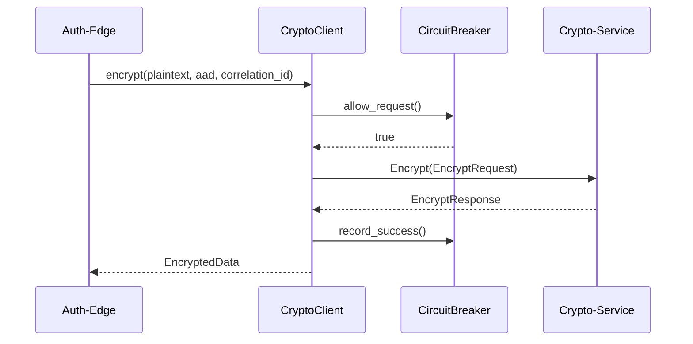
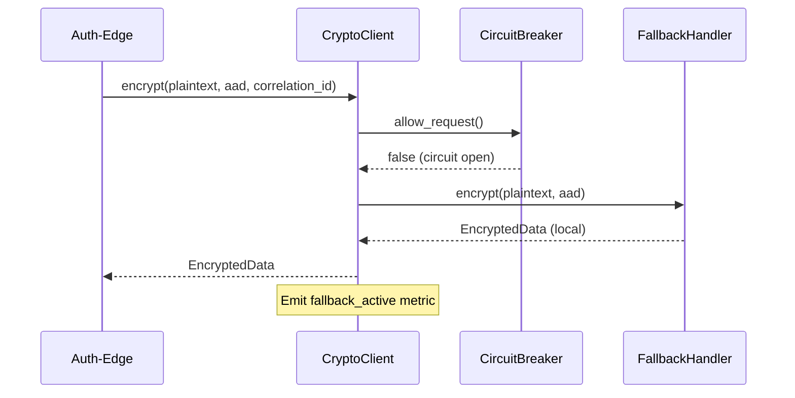
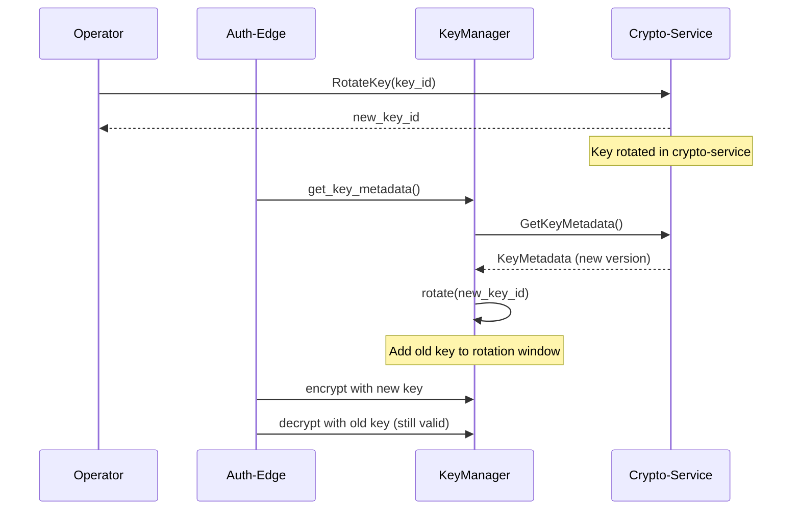

# Design Document: Auth-Edge Crypto-Service Integration

## Overview

Este documento descreve o design para integrar o serviço `auth-edge` (Rust) com o `crypto-service` (C++) centralizado. A integração elimina a criptografia local no `auth-edge`, delegando todas as operações criptográficas para o `crypto-service` via gRPC, com fallback local para resiliência.

### Goals

1. Centralizar operações criptográficas no `crypto-service`
2. Habilitar rotação de chaves sem restart do `auth-edge`
3. Manter alta disponibilidade com fallback local
4. Garantir observabilidade completa das operações criptográficas

### Non-Goals

- Modificar a API do `crypto-service`
- Alterar a validação JWT (continua usando `jsonwebtoken` localmente)
- Implementar HSM/KMS no `auth-edge`

## Architecture

```
┌─────────────────────────────────────────────────────────────────────┐
│                         auth-edge (Rust)                             │
├─────────────────────────────────────────────────────────────────────┤
│  ┌─────────────────┐  ┌─────────────────┐  ┌─────────────────────┐  │
│  │  JwtValidator   │  │  JwkCache       │  │  CacheClient        │  │
│  │  (unchanged)    │  │  (unchanged)    │  │  (modified)         │  │
│  └─────────────────┘  └────────┬────────┘  └──────────┬──────────┘  │
│                                │                       │             │
│                                │         ┌─────────────▼───────────┐ │
│                                │         │    CryptoClient        │ │
│                                │         │  ┌───────────────────┐ │ │
│                                │         │  │ EncryptionService │ │ │
│                                │         │  │ KeyManager        │ │ │
│                                │         │  │ FallbackHandler   │ │ │
│                                │         │  └───────────────────┘ │ │
│                                │         │  CircuitBreaker        │ │
│                                │         │  Metrics               │ │
│                                │         └──────────┬─────────────┘ │
└────────────────────────────────┼────────────────────┼───────────────┘
                                 │                    │
                                 │                    │ gRPC + mTLS
                                 │                    │
                                 ▼                    ▼
                    ┌────────────────────┐  ┌────────────────────┐
                    │   Cache_Service    │  │   Crypto_Service   │
                    │   (gRPC :50060)    │  │   (gRPC :50051)    │
                    └────────────────────┘  └────────────────────┘
```

## Components and Interfaces

### 1. CryptoClient

Novo módulo em `src/crypto/` que encapsula a comunicação com o `crypto-service`.

```rust
/// Configuration for CryptoClient
#[derive(Debug, Clone)]
pub struct CryptoClientConfig {
    /// gRPC endpoint URL
    pub service_url: Url,
    /// Key namespace for isolation
    pub key_namespace: String,
    /// Enable local fallback when service unavailable
    pub fallback_enabled: bool,
    /// Circuit breaker configuration
    pub circuit_breaker: CircuitBreakerConfig,
    /// Request timeout
    pub timeout: Duration,
}

/// CryptoClient for centralized cryptographic operations
pub struct CryptoClient {
    /// gRPC client for crypto-service
    grpc_client: CryptoServiceClient<Channel>,
    /// Circuit breaker for resilience
    circuit_breaker: Arc<CircuitBreaker>,
    /// Key manager for KEK/DEK handling
    key_manager: Arc<KeyManager>,
    /// Fallback handler for degraded mode
    fallback: Option<FallbackHandler>,
    /// Metrics collector
    metrics: CryptoMetrics,
    /// Configuration
    config: CryptoClientConfig,
}

impl CryptoClient {
    /// Creates a new CryptoClient with the given configuration
    pub async fn new(config: CryptoClientConfig) -> Result<Self, AuthEdgeError>;
    
    /// Encrypts data using the crypto-service
    pub async fn encrypt(
        &self,
        plaintext: &[u8],
        aad: Option<&[u8]>,
        correlation_id: &str,
    ) -> Result<EncryptedData, AuthEdgeError>;
    
    /// Decrypts data using the crypto-service
    pub async fn decrypt(
        &self,
        encrypted: &EncryptedData,
        aad: Option<&[u8]>,
        correlation_id: &str,
    ) -> Result<Vec<u8>, AuthEdgeError>;
    
    /// Triggers key rotation
    pub async fn rotate_key(&self, correlation_id: &str) -> Result<KeyId, AuthEdgeError>;
    
    /// Gets current key metadata
    pub async fn get_key_metadata(&self, correlation_id: &str) -> Result<KeyMetadata, AuthEdgeError>;
    
    /// Checks if operating in fallback mode
    pub fn is_fallback_active(&self) -> bool;
}

/// Encrypted data structure
#[derive(Debug, Clone, Serialize, Deserialize)]
pub struct EncryptedData {
    pub ciphertext: Vec<u8>,
    pub iv: Vec<u8>,
    pub tag: Vec<u8>,
    pub key_id: KeyId,
    pub algorithm: String,
}

/// Key identifier
#[derive(Debug, Clone, Serialize, Deserialize)]
pub struct KeyId {
    pub namespace: String,
    pub id: String,
    pub version: u32,
}
```

### 2. KeyManager

Gerencia o ciclo de vida das chaves (KEK/DEK).

```rust
/// Manages encryption keys lifecycle
pub struct KeyManager {
    /// Current active key ID
    active_key: ArcSwap<KeyId>,
    /// Previous key IDs for rotation window
    previous_keys: Arc<RwLock<Vec<KeyId>>>,
    /// Cached DEK for fallback mode
    cached_dek: Arc<RwLock<Option<CachedDek>>>,
    /// Key rotation window duration
    rotation_window: Duration,
}

impl KeyManager {
    /// Initializes key manager, requesting KEK from crypto-service
    pub async fn initialize(
        client: &CryptoServiceClient<Channel>,
        namespace: &str,
        correlation_id: &str,
    ) -> Result<Self, AuthEdgeError>;
    
    /// Gets the current active key ID
    pub fn active_key(&self) -> KeyId;
    
    /// Rotates to a new key version
    pub async fn rotate(&self, new_key: KeyId) -> Result<(), AuthEdgeError>;
    
    /// Checks if a key ID is valid (current or in rotation window)
    pub fn is_valid_key(&self, key_id: &KeyId) -> bool;
    
    /// Gets cached DEK for fallback mode
    pub fn get_fallback_dek(&self) -> Option<Vec<u8>>;
    
    /// Caches DEK for fallback mode (encrypted locally)
    pub fn cache_dek(&self, dek: Vec<u8>) -> Result<(), AuthEdgeError>;
}

/// Cached DEK with expiration
struct CachedDek {
    encrypted_dek: Vec<u8>,
    expires_at: Instant,
    key_version: u32,
}
```

### 3. FallbackHandler

Gerencia o modo degradado quando `crypto-service` está indisponível.

```rust
/// Handles fallback encryption when crypto-service is unavailable
pub struct FallbackHandler {
    /// Local AES-GCM cipher
    cipher: Aes256Gcm,
    /// Pending operations queue
    pending_ops: Arc<RwLock<VecDeque<PendingOperation>>>,
    /// Maximum pending operations
    max_pending: usize,
}

impl FallbackHandler {
    /// Creates fallback handler with cached DEK
    pub fn new(dek: &[u8]) -> Result<Self, AuthEdgeError>;
    
    /// Encrypts data locally
    pub fn encrypt(&self, plaintext: &[u8], aad: Option<&[u8]>) -> Result<EncryptedData, AuthEdgeError>;
    
    /// Decrypts data locally
    pub fn decrypt(&self, encrypted: &EncryptedData, aad: Option<&[u8]>) -> Result<Vec<u8>, AuthEdgeError>;
    
    /// Queues a pending operation for retry
    pub fn queue_operation(&self, op: PendingOperation) -> Result<(), AuthEdgeError>;
    
    /// Processes pending operations when service recovers
    pub async fn process_pending(&self, client: &CryptoClient) -> Result<usize, AuthEdgeError>;
}

/// Pending operation for retry
#[derive(Debug)]
pub enum PendingOperation {
    KeyRotation { correlation_id: String, requested_at: Instant },
}
```

### 4. Modified CacheClient Integration

O `CacheClient` existente será modificado para usar `CryptoClient`:

```rust
/// Enhanced CacheClient with CryptoClient integration
pub struct CacheClient {
    // ... existing fields ...
    
    /// Optional CryptoClient for centralized encryption
    crypto_client: Option<Arc<CryptoClient>>,
}

impl CacheClient {
    /// Creates cache client with crypto-service integration
    pub async fn with_crypto_client(
        config: CacheClientConfig,
        crypto_client: Arc<CryptoClient>,
    ) -> Result<Self, PlatformError>;
    
    /// Encrypts value before storage
    async fn encrypt_value(&self, value: &[u8], key: &str) -> Result<Vec<u8>, PlatformError> {
        let aad = self.build_aad(key);
        let correlation_id = generate_correlation_id();
        
        if let Some(ref crypto) = self.crypto_client {
            // Use centralized crypto-service
            let encrypted = crypto.encrypt(value, Some(&aad), &correlation_id).await?;
            Ok(serde_json::to_vec(&encrypted)?)
        } else {
            // Fallback to local encryption
            self.local_encrypt(value)
        }
    }
    
    /// Decrypts value after retrieval
    async fn decrypt_value(&self, encrypted: &[u8], key: &str) -> Result<Vec<u8>, PlatformError> {
        let aad = self.build_aad(key);
        let correlation_id = generate_correlation_id();
        
        if let Some(ref crypto) = self.crypto_client {
            let encrypted_data: EncryptedData = serde_json::from_slice(encrypted)?;
            crypto.decrypt(&encrypted_data, Some(&aad), &correlation_id).await
                .map_err(|e| PlatformError::from(e))
        } else {
            self.local_decrypt(encrypted)
        }
    }
    
    /// Builds AAD from namespace and key
    fn build_aad(&self, key: &str) -> Vec<u8> {
        format!("{}:{}", self.config.namespace, key).into_bytes()
    }
}
```

## Data Models

### Configuration

```rust
/// Extended Config for auth-edge with crypto integration
#[derive(Debug, Clone)]
pub struct Config {
    // ... existing fields ...
    
    /// Crypto service URL
    pub crypto_service_url: Url,
    /// Crypto key namespace
    pub crypto_key_namespace: String,
    /// Enable fallback when crypto-service unavailable
    pub crypto_fallback_enabled: bool,
    /// Crypto service timeout
    pub crypto_timeout_secs: u64,
}
```

### Metrics

```rust
/// Crypto client metrics
pub struct CryptoMetrics {
    /// Total requests counter
    pub requests_total: IntCounterVec,
    /// Request latency histogram
    pub latency_seconds: HistogramVec,
    /// Fallback mode gauge
    pub fallback_active: IntGauge,
    /// Key rotation counter
    pub key_rotations_total: IntCounter,
    /// Errors by type
    pub errors_total: IntCounterVec,
}
```

## Correctness Properties

*A property is a characteristic or behavior that should hold true across all valid executions of a system—essentially, a formal statement about what the system should do. Properties serve as the bridge between human-readable specifications and machine-verifiable correctness guarantees.*

### Property 1: Encryption Round-Trip

*For any* valid plaintext data and AAD, encrypting with CryptoClient then decrypting SHALL produce the original plaintext data.

**Validates: Requirements 2.1, 2.2, 7.6**

### Property 2: Correlation ID Propagation

*For any* request made to Crypto_Service, the correlation_id provided to the CryptoClient method SHALL be present in the gRPC request metadata.

**Validates: Requirements 1.4**

### Property 3: Circuit Breaker Behavior

*For any* sequence of 5 consecutive failures to Crypto_Service, the circuit breaker SHALL transition to open state, and subsequent requests SHALL use fallback mode without calling Crypto_Service.

**Validates: Requirements 1.6, 4.3, 4.4**

### Property 4: Fallback Encryption Consistency

*For any* data encrypted in fallback mode (when Crypto_Service is unavailable), decryption SHALL succeed using the locally cached DEK, producing the original data.

**Validates: Requirements 2.4, 4.1**

### Property 5: Key Rotation Continuity

*For any* data encrypted with a previous key version, decryption SHALL succeed during the rotation window, and the system SHALL seamlessly transition to the new key for new encryptions.

**Validates: Requirements 2.5, 3.3, 3.4**

### Property 6: AAD Binding

*For any* encryption operation, the AAD (namespace:key) SHALL be cryptographically bound to the ciphertext, and decryption with different AAD SHALL fail.

**Validates: Requirements 2.6**

### Property 7: No Key Material Exposure

*For any* error message, log entry, or trace span generated by the system, the actual key material (DEK bytes, KEK bytes) SHALL NOT be present.

**Validates: Requirements 3.2, 5.5**

### Property 8: Configuration Validation

*For any* invalid configuration value (malformed URL, empty namespace, invalid boolean), the system SHALL fail at startup with a descriptive error before processing any requests.

**Validates: Requirements 5.1, 5.2, 5.3, 5.4**

### Property 9: Trace Context Propagation

*For any* request to Crypto_Service, the W3C Trace Context headers (traceparent, tracestate) SHALL be propagated from the incoming request context.

**Validates: Requirements 6.4**

### Property 10: Structured Error Logging

*For any* error that occurs during crypto operations, the log entry SHALL be structured JSON containing at minimum: correlation_id, error_code, timestamp, and operation name.

**Validates: Requirements 6.5**

### Property 11: Degraded Mode Metrics

*For any* transition to or from fallback mode, the crypto_client_fallback_active gauge SHALL accurately reflect the current state (1 for active, 0 for normal).

**Validates: Requirements 6.3**

## Error Handling

### Error Types

```rust
/// Crypto-specific errors extending AuthEdgeError
#[non_exhaustive]
#[derive(Error, Debug)]
pub enum CryptoError {
    /// Crypto service unavailable
    #[error("Crypto service unavailable: {reason}")]
    ServiceUnavailable { reason: String },
    
    /// Encryption failed
    #[error("Encryption failed: {reason}")]
    EncryptionFailed { reason: String },
    
    /// Decryption failed
    #[error("Decryption failed: {reason}")]
    DecryptionFailed { reason: String },
    
    /// Key not found
    #[error("Key not found: {key_id}")]
    KeyNotFound { key_id: String },
    
    /// Key rotation failed
    #[error("Key rotation failed: {reason}")]
    RotationFailed { reason: String },
    
    /// Invalid configuration
    #[error("Invalid crypto configuration: {reason}")]
    InvalidConfig { reason: String },
    
    /// Fallback not available
    #[error("Fallback encryption not available")]
    FallbackUnavailable,
}
```

### Error Handling Strategy

1. **Transient errors** (network, timeout): Retry with exponential backoff via circuit breaker
2. **Service unavailable**: Switch to fallback mode, emit metrics
3. **Key errors**: Log with correlation_id, return appropriate error to caller
4. **Configuration errors**: Fail fast at startup

## Testing Strategy

### Unit Tests

- Mock gRPC responses for CryptoClient methods
- Test KeyManager state transitions
- Test FallbackHandler encryption/decryption
- Test configuration parsing and validation
- Test error handling and conversion

### Property-Based Tests

Using `proptest` with minimum 100 iterations per property:

1. **Round-trip property**: Generate random plaintext, encrypt, decrypt, verify equality
2. **Circuit breaker property**: Generate failure sequences, verify state transitions
3. **AAD binding property**: Generate random AAD, verify decryption fails with wrong AAD
4. **Configuration property**: Generate random config values, verify validation
5. **Key rotation property**: Generate encryption sequences across rotation, verify decryption

### Integration Tests

- Test with real crypto-service instance
- Test fallback behavior with service shutdown
- Test key rotation end-to-end
- Test metrics emission

### Test Configuration

```rust
// Property test configuration
proptest! {
    #![proptest_config(ProptestConfig::with_cases(100))]
    
    #[test]
    fn prop_encryption_round_trip(plaintext in prop::collection::vec(any::<u8>(), 0..10000)) {
        // Feature: auth-edge-crypto-integration, Property 1: Encryption Round-Trip
        // ...
    }
}
```

## Sequence Diagrams

### Normal Encryption Flow



### Fallback Flow



### Key Rotation Flow



## File Structure

```
services/auth-edge/src/
├── crypto/
│   ├── mod.rs              # Module exports
│   ├── client.rs           # CryptoClient implementation
│   ├── key_manager.rs      # KeyManager implementation
│   ├── fallback.rs         # FallbackHandler implementation
│   ├── metrics.rs          # CryptoMetrics
│   ├── config.rs           # CryptoClientConfig
│   └── error.rs            # CryptoError types
├── config.rs               # Extended with crypto config
└── ...

services/auth-edge/tests/
├── property/
│   └── crypto_properties.rs  # Property-based tests
├── unit/
│   └── crypto/
│       ├── client.rs
│       ├── key_manager.rs
│       └── fallback.rs
└── integration/
    └── crypto_integration.rs
```

## Migration Plan

1. **Phase 1**: Add CryptoClient module (no behavior change)
2. **Phase 2**: Add configuration options (disabled by default)
3. **Phase 3**: Enable for new deployments
4. **Phase 4**: Migrate existing deployments with key rotation
5. **Phase 5**: Remove local-only encryption code path
