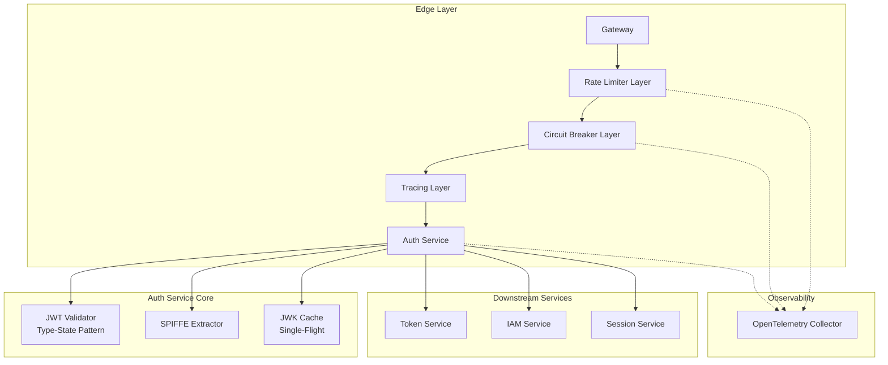

# Design Document: Auth Edge Service Modernization

## Overview

Este documento detalha o design para modernização do `auth-edge-service` para padrões Rust 2025, incluindo Generics avançados, Type-State patterns, Tower middleware, e observabilidade com OpenTelemetry.

## Architecture



## Components and Interfaces

### 1. Generic Circuit Breaker

```rust
/// Generic Circuit Breaker with type-safe state transitions
pub struct CircuitBreaker<S, Req, Res>
where
    S: Service<Req, Response = Res>,
{
    inner: S,
    state: Arc<RwLock<CircuitState>>,
    config: CircuitBreakerConfig,
    metrics: CircuitBreakerMetrics,
}

/// Type-safe configuration with const generics
pub struct CircuitBreakerConfig<
    const FAILURE_THRESHOLD: u32 = 5,
    const SUCCESS_THRESHOLD: u32 = 3,
    const TIMEOUT_SECS: u64 = 30,
> {
    name: String,
    _phantom: PhantomData<()>,
}

impl<S, Req, Res> Service<Req> for CircuitBreaker<S, Req, Res>
where
    S: Service<Req, Response = Res> + Clone + Send + 'static,
    Req: Send + 'static,
    Res: Send + 'static,
    S::Error: Into<AuthEdgeError>,
    S::Future: Send,
{
    type Response = Res;
    type Error = AuthEdgeError;
    type Future = BoxFuture<'static, Result<Res, AuthEdgeError>>;
    
    fn poll_ready(&mut self, cx: &mut Context<'_>) -> Poll<Result<(), Self::Error>> {
        // Check circuit state before accepting requests
    }
    
    fn call(&mut self, req: Req) -> Self::Future {
        // Execute with circuit breaker logic
    }
}
```

### 2. Type-State JWT Validation

```rust
/// Marker traits for JWT validation states (sealed)
mod private {
    pub trait Sealed {}
}

pub trait TokenState: private::Sealed {}

/// Unvalidated token - just parsed, not verified
pub struct Unvalidated;
impl private::Sealed for Unvalidated {}
impl TokenState for Unvalidated {}

/// Signature validated - cryptographic verification passed
pub struct SignatureValidated;
impl private::Sealed for SignatureValidated {}
impl TokenState for SignatureValidated {}

/// Fully validated - signature + claims verified
pub struct Validated;
impl private::Sealed for Validated {}
impl TokenState for Validated {}

/// Type-state token wrapper
pub struct Token<State: TokenState> {
    raw: String,
    header: Header,
    claims: Option<Claims>,  // Only populated after validation
    _state: PhantomData<State>,
}

impl Token<Unvalidated> {
    /// Parse raw JWT string into unvalidated token
    pub fn parse(raw: &str) -> Result<Token<Unvalidated>, AuthEdgeError> {
        // Zero-copy header parsing
    }
    
    /// Validate signature, transitioning to SignatureValidated state
    pub async fn validate_signature(
        self,
        cache: &JwkCache,
    ) -> Result<Token<SignatureValidated>, AuthEdgeError> {
        // Cryptographic verification
    }
}

impl Token<SignatureValidated> {
    /// Validate claims, transitioning to Validated state
    pub fn validate_claims(
        self,
        required: &[&str],
    ) -> Result<Token<Validated>, AuthEdgeError> {
        // Claims validation
    }
}

impl Token<Validated> {
    /// Access claims - only available on validated tokens
    pub fn claims(&self) -> &Claims {
        self.claims.as_ref().unwrap()
    }
    
    pub fn subject(&self) -> &str {
        &self.claims().sub
    }
}
```

### 3. Tower Middleware Stack

```rust
/// Rate Limiter as Tower Layer
pub struct RateLimiterLayer {
    config: RateLimitConfig,
    limiter: Arc<AdaptiveRateLimiter>,
}

impl<S> Layer<S> for RateLimiterLayer {
    type Service = RateLimiterService<S>;
    
    fn layer(&self, inner: S) -> Self::Service {
        RateLimiterService {
            inner,
            limiter: self.limiter.clone(),
        }
    }
}

/// Composable service stack
pub fn build_service_stack<S>(
    inner: S,
    config: &Config,
) -> impl Service<Request<Body>, Response = Response<Body>, Error = Infallible>
where
    S: Service<Request<Body>, Response = Response<Body>> + Clone + Send + 'static,
{
    ServiceBuilder::new()
        .layer(TraceLayer::new_for_grpc())
        .layer(TimeoutLayer::new(Duration::from_secs(config.timeout_secs)))
        .layer(RateLimiterLayer::new(config.rate_limit.clone()))
        .layer(CircuitBreakerLayer::new(config.circuit_breaker.clone()))
        .service(inner)
}
```

### 4. Type-Safe Error Handling

```rust
/// Non-exhaustive error enum for forward compatibility
#[non_exhaustive]
#[derive(Error, Debug)]
pub enum AuthEdgeError {
    #[error("Token missing from request")]
    TokenMissing,

    #[error("Token signature invalid")]
    TokenInvalid,

    #[error("Token expired at {expired_at}")]
    TokenExpired { expired_at: DateTime<Utc> },

    #[error("Token malformed: {reason}")]
    TokenMalformed { reason: String },

    #[error("Required claims missing: {claims:?}")]
    ClaimsInvalid { claims: Vec<String> },

    #[error("Service unavailable: {service}")]
    ServiceUnavailable { 
        service: String,
        retry_after: Duration,
    },

    #[error("Rate limited")]
    RateLimited { retry_after: Duration },

    #[error(transparent)]
    Internal(#[from] anyhow::Error),
}

/// Error response with correlation ID
pub struct ErrorResponse {
    pub code: ErrorCode,
    pub message: String,
    pub correlation_id: Uuid,
    pub retry_after: Option<Duration>,
}

impl AuthEdgeError {
    /// Convert to gRPC Status with sanitization
    pub fn to_status(&self, correlation_id: Uuid) -> Status {
        let (code, message) = match self {
            Self::TokenMissing => (Code::Unauthenticated, "Token required"),
            Self::TokenInvalid => (Code::Unauthenticated, "Invalid token"),
            Self::TokenExpired { .. } => (Code::Unauthenticated, "Token expired"),
            Self::ServiceUnavailable { .. } => (Code::Unavailable, "Service temporarily unavailable"),
            Self::RateLimited { .. } => (Code::ResourceExhausted, "Rate limit exceeded"),
            // Sanitize internal errors
            Self::Internal(_) => (Code::Internal, "Internal error"),
            _ => (Code::Unknown, "Unknown error"),
        };
        
        Status::new(code, format!("{} [{}]", message, correlation_id))
    }
}
```

### 5. Single-Flight JWK Cache

```rust
/// JWK Cache with single-flight refresh pattern
pub struct JwkCache {
    cache: ArcSwap<CacheEntry>,
    jwks_url: String,
    ttl: Duration,
    /// Single-flight coordinator
    inflight: Arc<Mutex<Option<Shared<BoxFuture<'static, Result<CacheEntry, AuthEdgeError>>>>>>,
}

impl JwkCache {
    /// Get key with single-flight refresh
    pub async fn get_key(&self, kid: &str) -> Result<DecodingKey, AuthEdgeError> {
        // Check cache first
        if let Some(key) = self.try_get_cached(kid) {
            return Ok(key);
        }
        
        // Single-flight refresh
        self.refresh_single_flight().await?;
        
        self.try_get_cached(kid)
            .ok_or_else(|| AuthEdgeError::JwkCacheError { 
                reason: format!("Key {} not found", kid) 
            })
    }
    
    async fn refresh_single_flight(&self) -> Result<(), AuthEdgeError> {
        let mut inflight = self.inflight.lock().await;
        
        // Check if refresh already in progress
        if let Some(fut) = inflight.as_ref() {
            let fut = fut.clone();
            drop(inflight);
            fut.await?;
            return Ok(());
        }
        
        // Start new refresh
        let fut = self.do_refresh().boxed().shared();
        *inflight = Some(fut.clone());
        drop(inflight);
        
        let result = fut.await;
        
        // Clear inflight
        self.inflight.lock().await.take();
        
        result.map(|_| ())
    }
}
```

### 6. Builder Pattern with Compile-Time Validation

```rust
/// Type-state builder for Config
pub struct ConfigBuilder<Host = (), Port = (), JwksUrl = ()> {
    host: Host,
    port: Port,
    jwks_url: JwksUrl,
    // Optional fields with defaults
    timeout_secs: u64,
    circuit_breaker_threshold: u32,
}

impl ConfigBuilder<(), (), ()> {
    pub fn new() -> Self {
        ConfigBuilder {
            host: (),
            port: (),
            jwks_url: (),
            timeout_secs: 30,
            circuit_breaker_threshold: 5,
        }
    }
}

impl<Port, JwksUrl> ConfigBuilder<(), Port, JwksUrl> {
    pub fn host(self, host: String) -> ConfigBuilder<String, Port, JwksUrl> {
        ConfigBuilder {
            host,
            port: self.port,
            jwks_url: self.jwks_url,
            timeout_secs: self.timeout_secs,
            circuit_breaker_threshold: self.circuit_breaker_threshold,
        }
    }
}

impl<Host, JwksUrl> ConfigBuilder<Host, (), JwksUrl> {
    pub fn port(self, port: u16) -> ConfigBuilder<Host, u16, JwksUrl> {
        ConfigBuilder {
            host: self.host,
            port,
            jwks_url: self.jwks_url,
            timeout_secs: self.timeout_secs,
            circuit_breaker_threshold: self.circuit_breaker_threshold,
        }
    }
}

impl<Host, Port> ConfigBuilder<Host, Port, ()> {
    pub fn jwks_url(self, url: String) -> ConfigBuilder<Host, Port, String> {
        ConfigBuilder {
            host: self.host,
            port: self.port,
            jwks_url: url,
            timeout_secs: self.timeout_secs,
            circuit_breaker_threshold: self.circuit_breaker_threshold,
        }
    }
}

// Only buildable when all required fields are set
impl ConfigBuilder<String, u16, String> {
    pub fn build(self) -> Config {
        Config {
            host: self.host,
            port: self.port,
            jwks_url: self.jwks_url,
            timeout_secs: self.timeout_secs,
            circuit_breaker_threshold: self.circuit_breaker_threshold,
        }
    }
}
```

## Data Models

### Claims with Validation

```rust
#[derive(Debug, Clone, Serialize, Deserialize)]
pub struct Claims {
    pub iss: String,
    pub sub: String,
    #[serde(deserialize_with = "deserialize_audience")]
    pub aud: Audience,
    pub exp: i64,
    pub iat: i64,
    #[serde(skip_serializing_if = "Option::is_none")]
    pub nbf: Option<i64>,
    pub jti: String,
    #[serde(skip_serializing_if = "Option::is_none")]
    pub session_id: Option<String>,
    #[serde(skip_serializing_if = "Option::is_none")]
    pub scopes: Option<Scopes>,
    #[serde(flatten)]
    pub custom: HashMap<String, Value>,
}

/// Type-safe audience (single or multiple)
#[derive(Debug, Clone, Serialize, Deserialize)]
#[serde(untagged)]
pub enum Audience {
    Single(String),
    Multiple(Vec<String>),
}

impl Audience {
    pub fn contains(&self, aud: &str) -> bool {
        match self {
            Audience::Single(s) => s == aud,
            Audience::Multiple(v) => v.contains(&aud.to_string()),
        }
    }
}

/// Type-safe scopes
#[derive(Debug, Clone, Serialize, Deserialize)]
#[serde(transparent)]
pub struct Scopes(Vec<String>);

impl Scopes {
    pub fn has(&self, scope: &str) -> bool {
        self.0.contains(&scope.to_string())
    }
    
    pub fn iter(&self) -> impl Iterator<Item = &str> {
        self.0.iter().map(|s| s.as_str())
    }
}
```

## Correctness Properties

*A property is a characteristic or behavior that should hold true across all valid executions of a system-essentially, a formal statement about what the system should do. Properties serve as the bridge between human-readable specifications and machine-verifiable correctness guarantees.*

### Property 1: Error Conversion Round-Trip
*For any* AuthEdgeError variant, converting to gRPC Status and back should preserve the error category (authentication, availability, rate limiting).
**Validates: Requirements 1.2**

### Property 2: Error Response Sanitization
*For any* internal error containing sensitive information (stack traces, internal IPs, credentials), the sanitized response should not contain any sensitive patterns.
**Validates: Requirements 1.3, 1.4**

### Property 3: Timeout Enforcement
*For any* configured timeout duration and operation that exceeds it, the operation should be cancelled and return a timeout error within tolerance.
**Validates: Requirements 2.2, 3.4**

### Property 4: Circuit Open Fail-Fast
*For any* circuit breaker in Open state, all requests should immediately return ServiceUnavailable without attempting the downstream call.
**Validates: Requirements 2.4**

### Property 5: Single-Flight Cache Refresh
*For any* N concurrent cache refresh requests, exactly one HTTP fetch should be made to the JWKS endpoint.
**Validates: Requirements 7.2**

### Property 6: Concurrent Request Consistency
*For any* sequence of concurrent requests, the JWK cache should remain in a consistent state (no partial updates, no lost keys).
**Validates: Requirements 7.4**

### Property 7: Error Event Attributes
*For any* error that occurs during request processing, the recorded error event should contain correlation_id, error_type, and timestamp attributes.
**Validates: Requirements 8.2**

### Property 8: Rate Limit Header Presence
*For any* response (allowed or denied), the rate limit headers (X-RateLimit-Remaining, X-RateLimit-Reset) should be present and valid.
**Validates: Requirements 8.4**

### Property 9: JWT Validation Round-Trip
*For any* valid JWT token, parsing then re-encoding the claims should produce a token that validates with the same claims.
**Validates: Requirements 10.1**

### Property 10: Circuit Breaker State Machine
*For any* sequence of success/failure events, the circuit breaker state transitions should follow: Closed→Open (on threshold failures), Open→HalfOpen (on timeout), HalfOpen→Closed (on success), HalfOpen→Open (on failure).
**Validates: Requirements 10.2**

### Property 11: Rate Limiter Enforcement
*For any* rate limit configuration (limit L, window W) and request sequence, exactly L requests should be allowed within any window W.
**Validates: Requirements 10.3**

### Property 12: SPIFFE ID Round-Trip
*For any* valid SPIFFE ID, parsing then formatting should produce the original URI string.
**Validates: Requirements 10.4**

## Error Handling

### Error Categories

| Category | gRPC Code | HTTP Status | Retry |
|----------|-----------|-------------|-------|
| TokenMissing | UNAUTHENTICATED | 401 | No |
| TokenInvalid | UNAUTHENTICATED | 401 | No |
| TokenExpired | UNAUTHENTICATED | 401 | No (refresh) |
| ClaimsInvalid | PERMISSION_DENIED | 403 | No |
| ServiceUnavailable | UNAVAILABLE | 503 | Yes |
| RateLimited | RESOURCE_EXHAUSTED | 429 | Yes |
| Internal | INTERNAL | 500 | Maybe |

### Correlation ID Propagation

```rust
/// Middleware for correlation ID
pub struct CorrelationIdLayer;

impl<S> Layer<S> for CorrelationIdLayer {
    type Service = CorrelationIdService<S>;
    
    fn layer(&self, inner: S) -> Self::Service {
        CorrelationIdService { inner }
    }
}

impl<S, Req> Service<Req> for CorrelationIdService<S>
where
    S: Service<Req>,
{
    fn call(&mut self, req: Req) -> Self::Future {
        let correlation_id = extract_or_generate_correlation_id(&req);
        let span = tracing::info_span!("request", correlation_id = %correlation_id);
        self.inner.call(req).instrument(span)
    }
}
```

## Testing Strategy

### Dual Testing Approach

O projeto utilizará tanto testes unitários quanto property-based tests:

- **Unit Tests**: Verificam exemplos específicos e edge cases
- **Property Tests**: Verificam propriedades universais usando `proptest`

### Property-Based Testing Framework

- **Library**: `proptest` 1.4+
- **Minimum iterations**: 100 por propriedade
- **Annotation format**: `**Feature: auth-edge-service-code-review, Property N: Name**`

### Test Organization

```
tests/
├── property_tests.rs      # All property-based tests
├── unit_tests.rs          # Unit tests for specific cases
└── integration_tests.rs   # Integration tests with mocks
```

### Property Test Examples

```rust
proptest! {
    #![proptest_config(ProptestConfig::with_cases(100))]
    
    /// **Feature: auth-edge-service-code-review, Property 12: SPIFFE ID Round-Trip**
    /// **Validates: Requirements 10.4**
    #[test]
    fn prop_spiffe_roundtrip(
        trust_domain in "[a-z][a-z0-9-]*\\.[a-z]{2,}",
        path in "[a-z0-9/]{0,50}",
    ) {
        let uri = format!("spiffe://{}/{}", trust_domain, path);
        let parsed = SpiffeId::parse(&uri)?;
        let formatted = parsed.to_uri();
        prop_assert_eq!(uri, formatted);
    }
}
```

