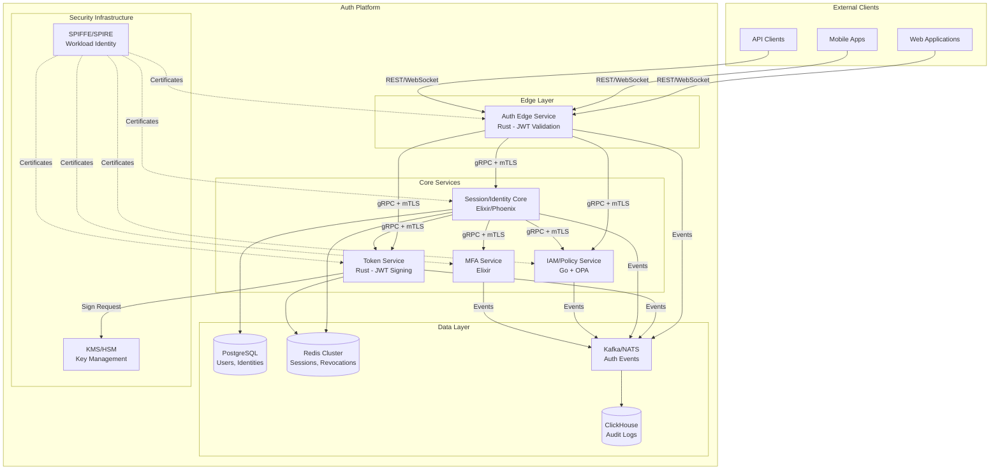
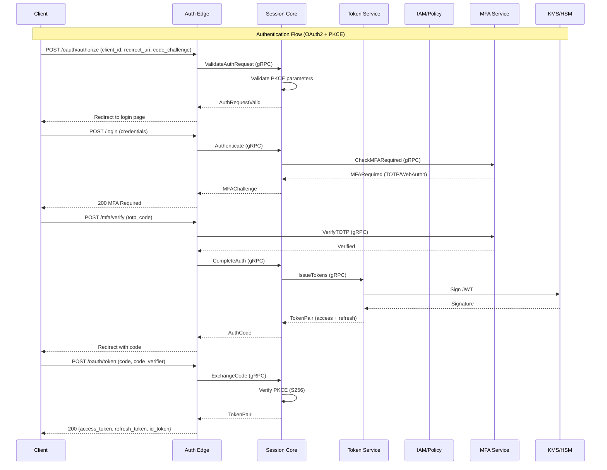

# Design Document: Auth Microservices Platform

## Overview

This document describes the architecture and design of a state-of-the-art Authentication and Authorization Microservices Platform. The platform implements Zero Trust security principles with five independent microservices communicating via gRPC with mTLS (SPIFFE/SPIRE).

### Key Design Principles

- **Zero Trust**: Every request is verified; no implicit trust between services
- **Defense in Depth**: Multiple security layers (mTLS, JWT, policy evaluation)
- **Stateless Edge**: Auth Edge and Token services are stateless for horizontal scaling
- **Stateful Core**: Session management uses Elixir/OTP for fault-tolerant state
- **External Key Management**: Private keys never stored locally; all signing via KMS/HSM
- **Observability First**: Structured logging, distributed tracing, metrics built-in

### Technology Stack

| Service | Language | Framework | Rationale |
|---------|----------|-----------|-----------|
| Auth Edge Service | Rust | Tokio, Tonic | Ultra-low latency, memory safety, zero-cost abstractions |
| Token Service | Rust | Tokio, Tonic | Cryptographic performance, KMS integration |
| Session/Identity Core | Elixir | Phoenix, OTP | Fault tolerance, real-time WebSockets, actor model |
| IAM/Policy Service | Go | gRPC, OPA | OPA native integration, excellent concurrency |
| MFA Service | Elixir | Phoenix | WebAuthn complexity, push notification handling |

## Architecture

### System Architecture Diagram



### Request Flow Diagram



## Components and Interfaces

### Auth Edge Service (Rust)

**Responsibilities:**
- JWT signature validation with JWK caching
- Token introspection and claims extraction
- mTLS certificate validation and SPIFFE ID extraction
- Request routing to internal services
- Ultra-low latency (<1ms p99)

**Key Components:**
```
auth-edge-service/
├── src/
│   ├── main.rs
│   ├── config.rs
│   ├── jwt/
│   │   ├── mod.rs
│   │   ├── validator.rs      # JWT signature validation
│   │   ├── claims.rs         # Claims extraction and validation
│   │   └── jwk_cache.rs      # Atomic JWK cache with TTL
│   ├── mtls/
│   │   ├── mod.rs
│   │   ├── spiffe.rs         # SPIFFE ID extraction
│   │   └── verifier.rs       # Certificate chain validation
│   ├── grpc/
│   │   ├── mod.rs
│   │   ├── client.rs         # gRPC client pool
│   │   └── interceptors.rs   # mTLS interceptors
│   └── metrics/
│       └── mod.rs            # Prometheus metrics
├── proto/
│   └── auth_edge.proto
└── Cargo.toml
```

**gRPC Interface:**
```protobuf
service AuthEdgeService {
  rpc ValidateToken(ValidateTokenRequest) returns (ValidateTokenResponse);
  rpc IntrospectToken(IntrospectRequest) returns (IntrospectResponse);
  rpc GetServiceIdentity(IdentityRequest) returns (IdentityResponse);
}

message ValidateTokenRequest {
  string token = 1;
  repeated string required_claims = 2;
}

message ValidateTokenResponse {
  bool valid = 1;
  string subject = 2;
  map<string, string> claims = 3;
  string error_code = 4;
  string error_message = 5;
}
```

### Token Service (Rust)

**Responsibilities:**
- JWT signing via KMS/HSM (RS256, ES256)
- Refresh token generation and rotation
- Token family tracking for replay detection
- JWKS endpoint publishing
- Key rotation management

**Key Components:**
```
token-service/
├── src/
│   ├── main.rs
│   ├── config.rs
│   ├── jwt/
│   │   ├── mod.rs
│   │   ├── builder.rs        # JWT construction
│   │   ├── signer.rs         # KMS signing interface
│   │   └── serializer.rs     # JWT serialization/parsing
│   ├── refresh/
│   │   ├── mod.rs
│   │   ├── generator.rs      # Secure token generation
│   │   ├── rotator.rs        # Rotation logic
│   │   └── family.rs         # Token family tracking
│   ├── jwks/
│   │   ├── mod.rs
│   │   └── publisher.rs      # JWKS endpoint
│   ├── kms/
│   │   ├── mod.rs
│   │   ├── aws.rs            # AWS KMS integration
│   │   ├── gcp.rs            # GCP Cloud KMS
│   │   └── azure.rs          # Azure Key Vault
│   └── storage/
│       └── redis.rs          # Redis for revocation list
├── proto/
│   └── token_service.proto
└── Cargo.toml
```

**gRPC Interface:**
```protobuf
service TokenService {
  rpc IssueTokenPair(IssueTokenRequest) returns (TokenPairResponse);
  rpc RefreshTokens(RefreshRequest) returns (TokenPairResponse);
  rpc RevokeToken(RevokeRequest) returns (RevokeResponse);
  rpc RevokeAllUserTokens(RevokeAllRequest) returns (RevokeResponse);
  rpc GetJWKS(Empty) returns (JWKSResponse);
  rpc RotateSigningKey(RotateKeyRequest) returns (RotateKeyResponse);
}

message IssueTokenRequest {
  string user_id = 1;
  string session_id = 2;
  repeated string scopes = 3;
  map<string, string> custom_claims = 4;
  int32 access_token_ttl_seconds = 5;
  int32 refresh_token_ttl_seconds = 6;
}

message TokenPairResponse {
  string access_token = 1;
  string refresh_token = 2;
  string id_token = 3;
  int64 expires_at = 4;
  string token_type = 5;
}

message RefreshRequest {
  string refresh_token = 1;
  repeated string scopes = 2;
}
```

### Session/Identity Core (Elixir/Phoenix)

**Responsibilities:**
- User session lifecycle management
- OAuth 2.0/OIDC authorization flows
- PKCE validation
- Real-time WebSocket notifications
- Device trust and risk scoring
- MFA orchestration

**Key Components:**
```
session_identity_core/
├── lib/
│   ├── session_identity_core/
│   │   ├── application.ex
│   │   ├── sessions/
│   │   │   ├── session.ex           # Session schema
│   │   │   ├── session_manager.ex   # GenServer for session state
│   │   │   └── session_store.ex     # Redis-backed storage
│   │   ├── oauth/
│   │   │   ├── authorization.ex     # Auth code generation
│   │   │   ├── pkce.ex              # PKCE validation
│   │   │   ├── client.ex            # OAuth client management
│   │   │   └── token_exchange.ex    # Code-to-token exchange
│   │   ├── identity/
│   │   │   ├── user.ex              # User schema
│   │   │   ├── authenticator.ex     # Credential verification
│   │   │   └── risk_scorer.ex       # Anomaly detection
│   │   ├── devices/
│   │   │   ├── device.ex            # Device schema
│   │   │   ├── fingerprint.ex       # Device fingerprinting
│   │   │   └── trust_manager.ex     # Trust level management
│   │   └── grpc/
│   │       ├── server.ex            # gRPC server
│   │       └── handlers/
│   ├── session_identity_core_web/
│   │   ├── channels/
│   │   │   └── session_channel.ex   # WebSocket channel
│   │   └── endpoint.ex
├── priv/
│   └── repo/migrations/
├── proto/
│   └── session_identity.proto
└── mix.exs
```

**gRPC Interface:**
```protobuf
service SessionIdentityService {
  rpc CreateSession(CreateSessionRequest) returns (SessionResponse);
  rpc GetSession(GetSessionRequest) returns (SessionResponse);
  rpc ListUserSessions(ListSessionsRequest) returns (ListSessionsResponse);
  rpc TerminateSession(TerminateRequest) returns (TerminateResponse);
  rpc AuthorizeOAuth(OAuthAuthorizeRequest) returns (OAuthAuthorizeResponse);
  rpc ExchangeCode(CodeExchangeRequest) returns (TokenPairResponse);
  rpc ValidatePKCE(PKCEValidateRequest) returns (PKCEValidateResponse);
  rpc UpdateRiskScore(RiskScoreRequest) returns (RiskScoreResponse);
}
```

### IAM/Policy Service (Go)

**Responsibilities:**
- RBAC/ABAC policy evaluation
- OPA integration for policy engine
- Role hierarchy resolution
- Permission caching
- Policy hot-reload

**Key Components:**
```
iam-policy-service/
├── cmd/
│   └── server/
│       └── main.go
├── internal/
│   ├── config/
│   │   └── config.go
│   ├── policy/
│   │   ├── engine.go         # OPA wrapper
│   │   ├── loader.go         # Policy loading/reloading
│   │   ├── evaluator.go      # Request evaluation
│   │   └── cache.go          # Decision caching
│   ├── rbac/
│   │   ├── role.go           # Role definitions
│   │   ├── hierarchy.go      # Role hierarchy
│   │   └── resolver.go       # Permission resolution
│   ├── abac/
│   │   ├── attributes.go     # Attribute definitions
│   │   └── context.go        # Evaluation context
│   ├── grpc/
│   │   ├── server.go
│   │   └── handlers.go
│   └── audit/
│       └── logger.go         # Decision logging
├── policies/
│   ├── rbac.rego
│   └── abac.rego
├── proto/
│   └── iam_policy.proto
└── go.mod
```

**gRPC Interface:**
```protobuf
service IAMPolicyService {
  rpc Authorize(AuthorizeRequest) returns (AuthorizeResponse);
  rpc BatchAuthorize(BatchAuthorizeRequest) returns (BatchAuthorizeResponse);
  rpc GetUserPermissions(GetPermissionsRequest) returns (PermissionsResponse);
  rpc GetUserRoles(GetRolesRequest) returns (RolesResponse);
  rpc ReloadPolicies(ReloadRequest) returns (ReloadResponse);
}

message AuthorizeRequest {
  string subject_id = 1;
  string resource_type = 2;
  string resource_id = 3;
  string action = 4;
  map<string, string> subject_attributes = 5;
  map<string, string> resource_attributes = 6;
  map<string, string> environment = 7;
}

message AuthorizeResponse {
  bool allowed = 1;
  string policy_id = 2;
  string reason = 3;
  repeated string matched_rules = 4;
}
```

### MFA Service (Elixir)

**Responsibilities:**
- TOTP enrollment and validation
- WebAuthn/Passkey registration and authentication
- Push notification authentication
- Device fingerprinting
- Backup codes management

**Key Components:**
```
mfa_service/
├── lib/
│   ├── mfa_service/
│   │   ├── application.ex
│   │   ├── totp/
│   │   │   ├── generator.ex      # Secret generation
│   │   │   ├── validator.ex      # Code validation
│   │   │   └── provisioning.ex   # URI generation
│   │   ├── webauthn/
│   │   │   ├── registration.ex   # Credential registration
│   │   │   ├── authentication.ex # Assertion verification
│   │   │   ├── challenge.ex      # Challenge generation
│   │   │   └── credential.ex     # Credential storage
│   │   ├── push/
│   │   │   ├── notifier.ex       # Push notification
│   │   │   └── approval.ex       # Approval handling
│   │   ├── device/
│   │   │   ├── fingerprint.ex    # Fingerprint calculation
│   │   │   └── comparator.ex     # Change detection
│   │   └── backup/
│   │       └── codes.ex          # Backup code management
│   └── grpc/
│       └── server.ex
├── proto/
│   └── mfa_service.proto
└── mix.exs
```

**gRPC Interface:**
```protobuf
service MFAService {
  // TOTP
  rpc EnrollTOTP(EnrollTOTPRequest) returns (EnrollTOTPResponse);
  rpc VerifyTOTP(VerifyTOTPRequest) returns (VerifyResponse);
  rpc DisableTOTP(DisableTOTPRequest) returns (DisableResponse);
  
  // WebAuthn
  rpc BeginWebAuthnRegistration(WebAuthnRegisterRequest) returns (WebAuthnChallengeResponse);
  rpc CompleteWebAuthnRegistration(WebAuthnRegisterComplete) returns (WebAuthnCredentialResponse);
  rpc BeginWebAuthnAuthentication(WebAuthnAuthRequest) returns (WebAuthnChallengeResponse);
  rpc CompleteWebAuthnAuthentication(WebAuthnAuthComplete) returns (VerifyResponse);
  
  // Push
  rpc SendPushChallenge(PushChallengeRequest) returns (PushChallengeResponse);
  rpc CheckPushApproval(CheckApprovalRequest) returns (VerifyResponse);
  
  // Device
  rpc RegisterDevice(RegisterDeviceRequest) returns (DeviceResponse);
  rpc CheckDeviceFingerprint(FingerprintRequest) returns (FingerprintResponse);
  
  // Backup Codes
  rpc GenerateBackupCodes(GenerateCodesRequest) returns (BackupCodesResponse);
  rpc VerifyBackupCode(VerifyBackupRequest) returns (VerifyResponse);
}

message EnrollTOTPResponse {
  string secret = 1;
  string provisioning_uri = 2;
  string qr_code_base64 = 3;
  repeated string backup_codes = 4;
}

message WebAuthnChallengeResponse {
  bytes challenge = 1;
  string rp_id = 2;
  string rp_name = 3;
  repeated WebAuthnCredentialDescriptor exclude_credentials = 4;
  string user_verification = 5;
  int64 timeout_ms = 6;
}
```

## Data Models

### User Identity (PostgreSQL)

```sql
CREATE TABLE users (
    id UUID PRIMARY KEY DEFAULT gen_random_uuid(),
    external_id VARCHAR(255) UNIQUE,
    email VARCHAR(255) UNIQUE NOT NULL,
    email_verified BOOLEAN DEFAULT FALSE,
    phone VARCHAR(50),
    phone_verified BOOLEAN DEFAULT FALSE,
    password_hash VARCHAR(255),
    status VARCHAR(20) DEFAULT 'active',
    created_at TIMESTAMPTZ DEFAULT NOW(),
    updated_at TIMESTAMPTZ DEFAULT NOW(),
    last_login_at TIMESTAMPTZ,
    metadata JSONB DEFAULT '{}'
);

CREATE TABLE user_roles (
    user_id UUID REFERENCES users(id) ON DELETE CASCADE,
    role_id UUID REFERENCES roles(id) ON DELETE CASCADE,
    granted_at TIMESTAMPTZ DEFAULT NOW(),
    granted_by UUID REFERENCES users(id),
    expires_at TIMESTAMPTZ,
    PRIMARY KEY (user_id, role_id)
);

CREATE TABLE roles (
    id UUID PRIMARY KEY DEFAULT gen_random_uuid(),
    name VARCHAR(100) UNIQUE NOT NULL,
    description TEXT,
    parent_role_id UUID REFERENCES roles(id),
    permissions JSONB DEFAULT '[]',
    created_at TIMESTAMPTZ DEFAULT NOW()
);

CREATE TABLE oauth_clients (
    id UUID PRIMARY KEY DEFAULT gen_random_uuid(),
    client_id VARCHAR(255) UNIQUE NOT NULL,
    client_secret_hash VARCHAR(255),
    client_type VARCHAR(20) NOT NULL, -- 'public' or 'confidential'
    name VARCHAR(255) NOT NULL,
    redirect_uris TEXT[] NOT NULL,
    allowed_scopes TEXT[] DEFAULT '{}',
    created_at TIMESTAMPTZ DEFAULT NOW(),
    status VARCHAR(20) DEFAULT 'active'
);
```

### Session Data (Redis)

```
# Session structure
session:{session_id} = {
    "user_id": "uuid",
    "device_id": "uuid",
    "ip_address": "string",
    "user_agent": "string",
    "device_fingerprint": "hash",
    "risk_score": 0.0-1.0,
    "mfa_verified": true/false,
    "created_at": "timestamp",
    "last_activity": "timestamp",
    "expires_at": "timestamp"
}
TTL: session duration (e.g., 24 hours)

# User sessions index
user_sessions:{user_id} = SET of session_ids
TTL: max session duration

# Refresh token family tracking
token_family:{family_id} = {
    "user_id": "uuid",
    "session_id": "uuid",
    "current_token_hash": "hash",
    "rotation_count": int,
    "created_at": "timestamp",
    "revoked": false
}
TTL: refresh token duration (e.g., 7 days)

# Token revocation list
revoked_tokens = SET of token_jti
TTL: max token expiration

# JWK cache
jwks:current = JSON JWKS
jwks:previous = JSON JWKS (for rotation)
TTL: configurable (e.g., 1 hour)
```

### MFA Credentials (PostgreSQL)

```sql
CREATE TABLE mfa_totp (
    id UUID PRIMARY KEY DEFAULT gen_random_uuid(),
    user_id UUID REFERENCES users(id) ON DELETE CASCADE,
    secret_encrypted BYTEA NOT NULL,
    algorithm VARCHAR(10) DEFAULT 'SHA1',
    digits INT DEFAULT 6,
    period INT DEFAULT 30,
    verified BOOLEAN DEFAULT FALSE,
    created_at TIMESTAMPTZ DEFAULT NOW(),
    last_used_at TIMESTAMPTZ,
    UNIQUE(user_id)
);

CREATE TABLE mfa_webauthn_credentials (
    id UUID PRIMARY KEY DEFAULT gen_random_uuid(),
    user_id UUID REFERENCES users(id) ON DELETE CASCADE,
    credential_id BYTEA UNIQUE NOT NULL,
    public_key BYTEA NOT NULL,
    sign_count BIGINT DEFAULT 0,
    transports TEXT[],
    attestation_type VARCHAR(50),
    aaguid BYTEA,
    device_name VARCHAR(255),
    created_at TIMESTAMPTZ DEFAULT NOW(),
    last_used_at TIMESTAMPTZ
);

CREATE TABLE mfa_backup_codes (
    id UUID PRIMARY KEY DEFAULT gen_random_uuid(),
    user_id UUID REFERENCES users(id) ON DELETE CASCADE,
    code_hash VARCHAR(255) NOT NULL,
    used BOOLEAN DEFAULT FALSE,
    used_at TIMESTAMPTZ,
    created_at TIMESTAMPTZ DEFAULT NOW()
);

CREATE TABLE devices (
    id UUID PRIMARY KEY DEFAULT gen_random_uuid(),
    user_id UUID REFERENCES users(id) ON DELETE CASCADE,
    fingerprint_hash VARCHAR(255) NOT NULL,
    device_type VARCHAR(50),
    os VARCHAR(100),
    browser VARCHAR(100),
    trust_level VARCHAR(20) DEFAULT 'unknown',
    first_seen_at TIMESTAMPTZ DEFAULT NOW(),
    last_seen_at TIMESTAMPTZ,
    metadata JSONB DEFAULT '{}'
);
```

### Audit Events (ClickHouse)

```sql
CREATE TABLE auth_audit_events (
    event_id UUID,
    timestamp DateTime64(3),
    correlation_id String,
    trace_id String,
    span_id String,
    
    -- Event details
    event_type LowCardinality(String),
    action LowCardinality(String),
    result LowCardinality(String),
    
    -- Actor
    user_id Nullable(UUID),
    session_id Nullable(UUID),
    client_id Nullable(String),
    service_name LowCardinality(String),
    
    -- Context
    ip_address IPv6,
    user_agent String,
    resource_type Nullable(String),
    resource_id Nullable(String),
    
    -- Details
    request_data String, -- JSON
    response_data String, -- JSON
    error_code Nullable(String),
    error_message Nullable(String),
    
    -- Metadata
    duration_ms UInt32,
    metadata String -- JSON
) ENGINE = MergeTree()
PARTITION BY toYYYYMM(timestamp)
ORDER BY (timestamp, event_type, user_id)
TTL timestamp + INTERVAL 2 YEAR;
```

## Correctness Properties

*A property is a characteristic or behavior that should hold true across all valid executions of a system-essentially, a formal statement about what the system should do. Properties serve as the bridge between human-readable specifications and machine-verifiable correctness guarantees.*

Based on the prework analysis, the following correctness properties have been identified and consolidated:

### Property 1: JWT Validation Rejects Invalid Tokens
*For any* JWT with an invalid signature or expired timestamp, the Auth Edge Service should reject the token with appropriate error code (invalid-signature or token-expired).
**Validates: Requirements 1.2, 1.3**

### Property 2: JWT Round-Trip Consistency
*For any* valid token claims, serializing to JWT format and then parsing back should produce claims exactly equal to the original.
**Validates: Requirements 2.7**

### Property 3: Token Pair Issuance Completeness
*For any* successful authentication, the Token Service should issue both an access token (with configured TTL) and a refresh token (with longer TTL), where both tokens are cryptographically signed.
**Validates: Requirements 2.1, 2.2**

### Property 4: Refresh Token Rotation Invalidates Previous
*For any* refresh token that is used, the Token Service should issue a new token pair and the previous refresh token should become invalid for subsequent use.
**Validates: Requirements 2.3**

### Property 5: Refresh Token Replay Detection
*For any* refresh token that has already been rotated, attempting to use it again should revoke all tokens in the family and log a security event.
**Validates: Requirements 2.4**

### Property 6: JWKS Contains Rotation Keys
*For any* key rotation event, the JWKS endpoint should contain both the current and previous signing keys to allow graceful transition.
**Validates: Requirements 2.5**

### Property 7: SPIFFE ID Extraction Accuracy
*For any* valid mTLS certificate with SPIFFE ID, the Auth Edge Service should extract and include the exact SPIFFE ID in the request context.
**Validates: Requirements 1.6**

### Property 8: JWK Cache Atomic Update
*For any* JWK cache update operation, the cache should transition atomically from old to new state without intermediate invalid states.
**Validates: Requirements 1.5**

### Property 9: Session Record Completeness
*For any* successful login, the created session record should contain all required fields: device fingerprint, IP address, and timestamp.
**Validates: Requirements 3.1**

### Property 10: Session List Accuracy
*For any* user with active sessions, the session list should return exactly all active sessions with complete device information and last activity timestamp.
**Validates: Requirements 3.3**

### Property 11: Session Termination Effectiveness
*For any* terminated session, subsequent requests using that session should be rejected and associated tokens should be revoked.
**Validates: Requirements 3.4**

### Property 12: Risk Scoring Triggers Step-Up
*For any* session where risk score exceeds threshold, the system should require step-up authentication before allowing sensitive operations.
**Validates: Requirements 3.5**

### Property 13: OAuth Request Validation
*For any* OAuth authorization request, the system should validate client_id, redirect_uri, and require PKCE code_challenge for public clients.
**Validates: Requirements 4.1, 4.2**

### Property 14: PKCE Verification Correctness
*For any* code_verifier and code_challenge pair, S256(code_verifier) should equal code_challenge for the token exchange to succeed.
**Validates: Requirements 4.4**

### Property 15: OIDC Token Claims Completeness
*For any* OIDC token issuance, the id_token should contain all standard claims: sub, iss, aud, exp, iat, and nonce (if provided).
**Validates: Requirements 4.6**

### Property 16: Policy Evaluation Consistency
*For any* authorization request with defined RBAC or ABAC policy, the IAM/Policy Service should return consistent allow/deny decisions based on role hierarchy and attribute evaluation.
**Validates: Requirements 5.2, 5.3**

### Property 17: Policy Hot Reload Effectiveness
*For any* policy update, subsequent authorization requests should be evaluated against the new policy without service restart.
**Validates: Requirements 5.6**

### Property 18: TOTP Validation Window
*For any* valid TOTP code, the MFA Service should accept codes within the current and adjacent time windows (±1 step) and reject codes outside this window.
**Validates: Requirements 6.2**

### Property 19: WebAuthn Sign Count Monotonicity
*For any* WebAuthn authentication, the sign count should be strictly greater than the stored value, and the stored value should be updated to the new count.
**Validates: Requirements 6.4**

### Property 20: Device Fingerprint Change Detection
*For any* significant change in device fingerprint, the system should require re-authentication and flag the session for review.
**Validates: Requirements 6.6**

### Property 21: mTLS Certificate Validation
*For any* request without valid mTLS certificate or with untrusted SPIFFE identity, the receiving service should reject the request.
**Validates: Requirements 7.3, 7.4**

### Property 22: Audit Log Completeness
*For any* authentication or authorization event, the audit log should contain timestamp, user ID, action, result, and correlation ID.
**Validates: Requirements 8.1, 8.2**

### Property 23: Audit Log Query Filtering
*For any* audit log query with filters, the results should contain only events matching all specified filter criteria.
**Validates: Requirements 8.4**

### Property 24: Token Revocation List Consistency
*For any* revoked token, the revocation list should contain the token with TTL matching the original token expiration.
**Validates: Requirements 9.3**

### Property 25: Circuit Breaker Behavior
*For any* downstream service failure exceeding threshold, the circuit breaker should open and return 503 status with retry guidance.
**Validates: Requirements 9.5**

### Property 26: Error Response Structure
*For any* error condition, the response should contain error code, message, and correlation ID with appropriate HTTP status code.
**Validates: Requirements 10.1, 10.2, 10.3, 10.4, 10.5**

## Error Handling

### Error Response Format

All services return structured error responses:

```json
{
  "error": {
    "code": "AUTH_TOKEN_EXPIRED",
    "message": "The access token has expired",
    "correlation_id": "550e8400-e29b-41d4-a716-446655440000",
    "details": {
      "expired_at": "2025-01-15T10:30:00Z"
    }
  }
}
```

### Error Codes by Service

**Auth Edge Service:**
- `AUTH_TOKEN_MISSING` - No token in Authorization header
- `AUTH_TOKEN_INVALID` - Token signature validation failed
- `AUTH_TOKEN_EXPIRED` - Token has expired
- `AUTH_TOKEN_MALFORMED` - Token format is invalid
- `AUTH_CLAIMS_INVALID` - Required claims missing or invalid

**Token Service:**
- `TOKEN_REFRESH_INVALID` - Refresh token not found or invalid
- `TOKEN_REFRESH_EXPIRED` - Refresh token has expired
- `TOKEN_REFRESH_REUSED` - Refresh token replay detected
- `TOKEN_FAMILY_REVOKED` - Token family has been revoked
- `TOKEN_KMS_ERROR` - KMS signing operation failed

**Session/Identity Core:**
- `SESSION_NOT_FOUND` - Session does not exist
- `SESSION_EXPIRED` - Session has expired
- `SESSION_TERMINATED` - Session was terminated
- `OAUTH_CLIENT_INVALID` - OAuth client not found
- `OAUTH_REDIRECT_INVALID` - Redirect URI not allowed
- `OAUTH_PKCE_REQUIRED` - PKCE required for public clients
- `OAUTH_PKCE_INVALID` - Code verifier does not match challenge
- `AUTH_CREDENTIALS_INVALID` - Invalid username or password
- `AUTH_MFA_REQUIRED` - MFA verification required
- `AUTH_STEP_UP_REQUIRED` - Step-up authentication required

**IAM/Policy Service:**
- `AUTHZ_DENIED` - Authorization denied by policy
- `AUTHZ_POLICY_ERROR` - Policy evaluation error
- `AUTHZ_ROLE_NOT_FOUND` - Role does not exist

**MFA Service:**
- `MFA_TOTP_INVALID` - TOTP code is invalid
- `MFA_TOTP_EXPIRED` - TOTP code has expired
- `MFA_WEBAUTHN_CHALLENGE_INVALID` - WebAuthn challenge invalid
- `MFA_WEBAUTHN_SIGNATURE_INVALID` - WebAuthn signature verification failed
- `MFA_WEBAUTHN_CLONE_DETECTED` - Potential authenticator clone detected
- `MFA_PUSH_TIMEOUT` - Push authentication timed out
- `MFA_PUSH_DENIED` - Push authentication denied by user

### Circuit Breaker Configuration

```yaml
circuit_breaker:
  failure_threshold: 5
  success_threshold: 3
  timeout_seconds: 30
  half_open_requests: 3
  
  # Per-service configuration
  services:
    token_service:
      failure_threshold: 3
      timeout_seconds: 10
    iam_policy_service:
      failure_threshold: 5
      timeout_seconds: 5
    mfa_service:
      failure_threshold: 5
      timeout_seconds: 60
```

## Testing Strategy

### Dual Testing Approach

The platform uses both unit tests and property-based tests:

- **Unit Tests**: Verify specific examples, edge cases, and error conditions
- **Property-Based Tests**: Verify universal properties that should hold across all inputs

### Property-Based Testing Framework

**Rust Services (Auth Edge, Token Service):**
- Framework: `proptest` crate
- Minimum iterations: 100 per property
- Shrinking enabled for failure case minimization

**Elixir Services (Session/Identity Core, MFA Service):**
- Framework: `StreamData` with `ExUnitProperties`
- Minimum iterations: 100 per property
- Custom generators for domain types

**Go Services (IAM/Policy Service):**
- Framework: `gopter`
- Minimum iterations: 100 per property
- Seed-based reproducibility

### Test Organization

```
# Rust services
tests/
├── unit/
│   ├── jwt_validator_test.rsor_test.rs
│   ├── claims_test.rs
│   └── jwk_cache_test.rs
└── property/
    ├── jwt_roundtrip_test.rs      # Property 2
    ├── token_validation_test.rs   # Property 1
    └── spiffe_extraction_test.rs  # Property 7

# Elixir services
test/
├── unit/
│   ├── session_test.exs
│   ├── oauth_test.exs
│   └── pkce_test.exs
└── property/
    ├── session_completeness_test.exs  # Property 9
    ├── pkce_verification_test.exs     # Property 14
    └── totp_window_test.exs           # Property 18

# Go services
internal/
├── policy/
│   ├── evaluator_test.go          # Unit tests
│   └── evaluator_property_test.go # Property 16
└── rbac/
    ├── resolver_test.go
    └── resolver_property_test.go
```

### Property Test Annotation Format

Each property-based test must include a comment referencing the design document:

```rust
// **Feature: auth-microservices-platform, Property 2: JWT Round-Trip Consistency**
// **Validates: Requirements 2.7**
#[test]
fn jwt_roundtrip_preserves_claims() {
    // ...
}
```

```elixir
# **Feature: auth-microservices-platform, Property 14: PKCE Verification Correctness**
# **Validates: Requirements 4.4**
property "S256(verifier) equals challenge" do
  # ...
end
```

## Security Considerations

### Threat Model (STRIDE Analysis)

| Threat | Component | Mitigation |
|--------|-----------|------------|
| **Spoofing** | JWT tokens | RS256/ES256 signatures via KMS; short expiration |
| **Spoofing** | Service identity | mTLS with SPIFFE/SPIRE certificates |
| **Spoofing** | User identity | MFA (TOTP, WebAuthn, Push) |
| **Tampering** | JWT claims | Cryptographic signatures; claim validation |
| **Tampering** | Audit logs | Immutable storage in ClickHouse; append-only |
| **Tampering** | Session data | Redis with TLS; integrity checks |
| **Repudiation** | Auth events | Comprehensive audit logging with correlation IDs |
| **Repudiation** | Policy decisions | Decision logging with full context |
| **Info Disclosure** | Private keys | KMS/HSM; keys never leave secure boundary |
| **Info Disclosure** | User data | Encryption at rest; TLS in transit |
| **Info Disclosure** | Error messages | Generic errors; no user existence leakage |
| **DoS** | Auth endpoints | Rate limiting; circuit breakers |
| **DoS** | Token validation | JWK caching; efficient validation |
| **Elevation** | Authorization | OPA policy evaluation; principle of least privilege |
| **Elevation** | Session hijacking | Device fingerprinting; risk scoring |

### Security Best Practices

1. **Token Security**
   - Access tokens: 15 minutes max expiration
   - Refresh tokens: 7 days max, with rotation
   - JTI (JWT ID) for revocation tracking
   - Audience and issuer validation

2. **Key Management**
   - All signing keys in KMS/HSM
   - Automatic key rotation (90 days)
   - Key versioning for graceful rotation
   - No local key storage

3. **Transport Security**
   - TLS 1.3 for external traffic
   - mTLS for all internal communication
   - Certificate rotation via SPIRE (24h before expiry)
   - Perfect forward secrecy

4. **Authentication Security**
   - Constant-time password comparison
   - Argon2id for password hashing
   - Account lockout after failed attempts
   - No user enumeration in error responses

5. **Session Security**
   - Secure, HttpOnly, SameSite=Strict cookies
   - Session binding to device fingerprint
   - Automatic session expiration
   - Concurrent session limits

6. **API Versioning and Compatibility**
   - Protobuf contracts follow backward compatibility rules (Requirement 7.5)
   - New fields are always optional with defaults
   - Field numbers are never reused or changed
   - Deprecated fields marked with `[deprecated = true]` for at least one version
   - Breaking changes require new service version and migration path

## Observability

### Metrics (Prometheus)

```yaml
# Auth Edge Service
auth_edge_jwt_validations_total{result="success|failure", error_code="..."}
auth_edge_jwt_validation_duration_seconds{quantile="0.5|0.95|0.99"}
auth_edge_jwk_cache_hits_total
auth_edge_jwk_cache_misses_total

# Token Service
token_service_tokens_issued_total{type="access|refresh|id"}
token_service_tokens_revoked_total{reason="logout|rotation|security"}
token_service_kms_sign_duration_seconds{quantile="0.5|0.95|0.99"}
token_service_refresh_rotations_total
token_service_replay_attacks_detected_total

# Session/Identity Core
session_core_sessions_active
session_core_sessions_created_total
session_core_sessions_terminated_total{reason="logout|expiry|security"}
session_core_oauth_authorizations_total{result="success|failure"}
session_core_risk_score_histogram

# IAM/Policy Service
iam_policy_evaluations_total{result="allow|deny"}
iam_policy_evaluation_duration_seconds{quantile="0.5|0.95|0.99"}
iam_policy_cache_hits_total
iam_policy_reloads_total

# MFA Service
mfa_totp_verifications_total{result="success|failure"}
mfa_webauthn_registrations_total
mfa_webauthn_authentications_total{result="success|failure"}
mfa_push_challenges_total{result="approved|denied|timeout"}
```

### Distributed Tracing

All services propagate W3C Trace Context headers:
- `traceparent`: Version, trace-id, parent-id, flags
- `tracestate`: Vendor-specific trace data

Span naming convention:
```
auth-edge.validate_token
token-service.issue_tokens
token-service.kms.sign
session-core.create_session
session-core.oauth.authorize
iam-policy.evaluate
mfa.verify_totp
mfa.webauthn.authenticate
```

### Structured Logging

All logs in JSON format with required fields:
```json
{
  "timestamp": "2025-01-15T10:30:00.123Z",
  "level": "INFO",
  "service": "token-service",
  "correlation_id": "550e8400-e29b-41d4-a716-446655440000",
  "trace_id": "4bf92f3577b34da6a3ce929d0e0e4736",
  "span_id": "00f067aa0ba902b7",
  "message": "Token issued successfully",
  "user_id": "user-123",
  "event_type": "token.issued",
  "duration_ms": 45
}
```
