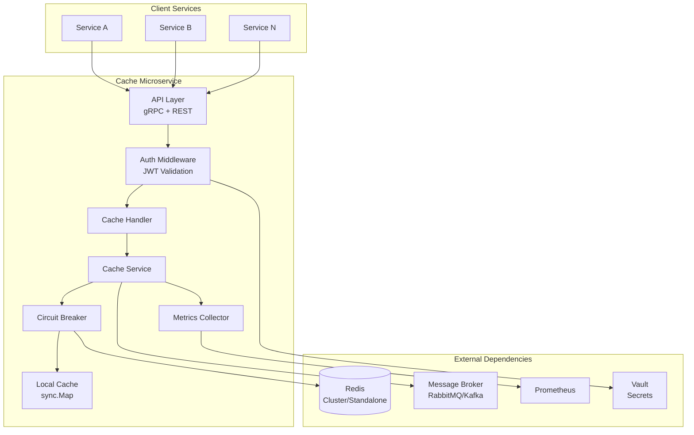
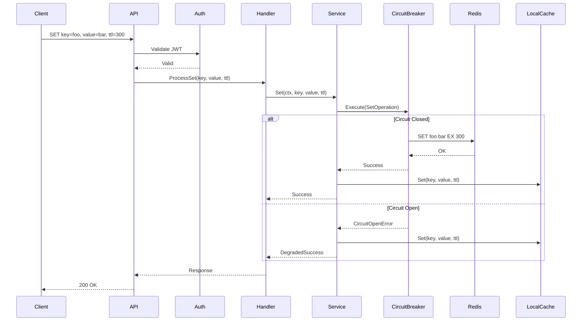

# Design Document: Cache Microservice

## Overview

This document describes the technical design for a distributed cache microservice implemented in Go. The service provides centralized cache management using Redis as the primary storage backend, with optional local in-memory fallback. It exposes both gRPC and REST APIs, supports async cache invalidation via message brokers, and includes comprehensive observability features.

### Key Design Decisions

1. **Go Language**: Chosen for high performance, native concurrency (goroutines/channels), and efficient memory management
2. **Redis Backend**: Primary cache storage with support for standalone and cluster modes
3. **Dual API**: gRPC for high-performance inter-service communication, REST for simpler integrations
4. **Event-Driven Invalidation**: RabbitMQ/Kafka for async cache invalidation across services
5. **Circuit Breaker**: Resilience pattern to handle Redis failures gracefully

## Architecture



### Component Interaction Flow



## Components and Interfaces

### 1. API Layer

#### gRPC Service Definition

```protobuf
syntax = "proto3";

package cache.v1;

service CacheService {
    rpc Get(GetRequest) returns (GetResponse);
    rpc Set(SetRequest) returns (SetResponse);
    rpc Delete(DeleteRequest) returns (DeleteResponse);
    rpc BatchGet(BatchGetRequest) returns (BatchGetResponse);
    rpc BatchSet(BatchSetRequest) returns (BatchSetResponse);
    rpc Health(HealthRequest) returns (HealthResponse);
}

message GetRequest {
    string key = 1;
    string namespace = 2;
}

message GetResponse {
    bool found = 1;
    bytes value = 2;
    CacheSource source = 3;
}

enum CacheSource {
    CACHE_SOURCE_UNSPECIFIED = 0;
    CACHE_SOURCE_REDIS = 1;
    CACHE_SOURCE_LOCAL = 2;
}

message SetRequest {
    string key = 1;
    bytes value = 2;
    int64 ttl_seconds = 3;
    string namespace = 4;
    bool encrypt = 5;
}

message SetResponse {
    bool success = 1;
}

message DeleteRequest {
    string key = 1;
    string namespace = 2;
}

message DeleteResponse {
    bool deleted = 1;
}

message BatchGetRequest {
    repeated string keys = 1;
    string namespace = 2;
}

message BatchGetResponse {
    map<string, bytes> values = 1;
    repeated string missing_keys = 2;
}

message BatchSetRequest {
    map<string, bytes> entries = 1;
    int64 ttl_seconds = 2;
    string namespace = 3;
}

message BatchSetResponse {
    bool success = 1;
    int32 stored_count = 2;
}

message HealthRequest {}

message HealthResponse {
    bool healthy = 1;
    string redis_status = 2;
    string broker_status = 3;
}
```

#### REST API Endpoints

| Method | Endpoint | Description |
|--------|----------|-------------|
| GET | /api/v1/cache/{namespace}/{key} | Get cached value |
| PUT | /api/v1/cache/{namespace}/{key} | Set cached value |
| DELETE | /api/v1/cache/{namespace}/{key} | Delete cached value |
| POST | /api/v1/cache/{namespace}/batch/get | Batch get values |
| POST | /api/v1/cache/{namespace}/batch/set | Batch set values |
| GET | /health | Health check |
| GET | /ready | Readiness check |
| GET | /metrics | Prometheus metrics |

### 2. Core Interfaces

```go
// CacheService defines the main cache operations interface
type CacheService interface {
    Get(ctx context.Context, namespace, key string) (*CacheEntry, error)
    Set(ctx context.Context, namespace, key string, value []byte, ttl time.Duration, opts ...SetOption) error
    Delete(ctx context.Context, namespace, key string) (bool, error)
    BatchGet(ctx context.Context, namespace string, keys []string) (map[string][]byte, []string, error)
    BatchSet(ctx context.Context, namespace string, entries map[string][]byte, ttl time.Duration) (int, error)
}

// CacheEntry represents a cached value with metadata
type CacheEntry struct {
    Value     []byte
    Source    CacheSource
    ExpiresAt time.Time
}

// CacheSource indicates where the value was retrieved from
type CacheSource int

const (
    SourceRedis CacheSource = iota
    SourceLocal
)

// SetOption configures Set operation behavior
type SetOption func(*setOptions)

type setOptions struct {
    encrypt bool
}

func WithEncryption() SetOption {
    return func(o *setOptions) {
        o.encrypt = true
    }
}
```

### 3. Redis Client Interface

```go
// RedisClient abstracts Redis operations for testability
type RedisClient interface {
    Get(ctx context.Context, key string) ([]byte, error)
    Set(ctx context.Context, key string, value []byte, ttl time.Duration) error
    Del(ctx context.Context, keys ...string) (int64, error)
    MGet(ctx context.Context, keys ...string) ([]interface{}, error)
    MSet(ctx context.Context, pairs ...interface{}) error
    Ping(ctx context.Context) error
    Close() error
}
```

### 4. Circuit Breaker Interface

```go
// CircuitBreaker wraps operations with failure protection
type CircuitBreaker interface {
    Execute(ctx context.Context, operation func() error) error
    State() CircuitState
    Reset()
}

type CircuitState int

const (
    StateClosed CircuitState = iota
    StateOpen
    StateHalfOpen
)

// CircuitBreakerConfig defines circuit breaker behavior
type CircuitBreakerConfig struct {
    MaxFailures     int           // Failures before opening
    Timeout         time.Duration // Time before half-open
    HalfOpenMaxReqs int           // Requests allowed in half-open
}
```

### 5. Message Broker Interface

```go
// MessageBroker handles async cache invalidation events
type MessageBroker interface {
    Subscribe(ctx context.Context, topic string, handler InvalidationHandler) error
    Publish(ctx context.Context, topic string, event InvalidationEvent) error
    Close() error
}

// InvalidationHandler processes cache invalidation events
type InvalidationHandler func(event InvalidationEvent) error

// InvalidationEvent represents a cache invalidation message
type InvalidationEvent struct {
    Namespace string   `json:"namespace"`
    Keys      []string `json:"keys"`
    Action    string   `json:"action"` // "delete" or "update"
    Timestamp int64    `json:"timestamp"`
}
```

### 6. Encryption Interface

```go
// Encryptor handles value encryption/decryption
type Encryptor interface {
    Encrypt(plaintext []byte) ([]byte, error)
    Decrypt(ciphertext []byte) ([]byte, error)
}
```

## Data Models

### Configuration Model

```go
// Config holds all service configuration
type Config struct {
    Server   ServerConfig   `env:",prefix=SERVER_"`
    Redis    RedisConfig    `env:",prefix=REDIS_"`
    Broker   BrokerConfig   `env:",prefix=BROKER_"`
    Auth     AuthConfig     `env:",prefix=AUTH_"`
    Cache    CacheConfig    `env:",prefix=CACHE_"`
    Metrics  MetricsConfig  `env:",prefix=METRICS_"`
}

type ServerConfig struct {
    GRPCPort    int    `env:"GRPC_PORT" envDefault:"50051"`
    HTTPPort    int    `env:"HTTP_PORT" envDefault:"8080"`
    GracefulTimeout time.Duration `env:"GRACEFUL_TIMEOUT" envDefault:"30s"`
}

type RedisConfig struct {
    Addresses    []string      `env:"ADDRESSES" envSeparator:","`
    Password     string        `env:"PASSWORD"`
    DB           int           `env:"DB" envDefault:"0"`
    PoolSize     int           `env:"POOL_SIZE" envDefault:"10"`
    ClusterMode  bool          `env:"CLUSTER_MODE" envDefault:"false"`
    TLSEnabled   bool          `env:"TLS_ENABLED" envDefault:"false"`
    DialTimeout  time.Duration `env:"DIAL_TIMEOUT" envDefault:"5s"`
    ReadTimeout  time.Duration `env:"READ_TIMEOUT" envDefault:"3s"`
    WriteTimeout time.Duration `env:"WRITE_TIMEOUT" envDefault:"3s"`
}

type BrokerConfig struct {
    Type     string `env:"TYPE" envDefault:"rabbitmq"` // rabbitmq or kafka
    URL      string `env:"URL"`
    Topic    string `env:"TOPIC" envDefault:"cache-invalidation"`
    GroupID  string `env:"GROUP_ID" envDefault:"cache-service"`
}

type AuthConfig struct {
    JWTSecret     string `env:"JWT_SECRET"`
    JWTIssuer     string `env:"JWT_ISSUER"`
    EncryptionKey string `env:"ENCRYPTION_KEY"`
}

type CacheConfig struct {
    DefaultTTL       time.Duration `env:"DEFAULT_TTL" envDefault:"1h"`
    MaxMemoryMB      int           `env:"MAX_MEMORY_MB" envDefault:"512"`
    EvictionPolicy   string        `env:"EVICTION_POLICY" envDefault:"lru"`
    LocalCacheEnabled bool         `env:"LOCAL_CACHE_ENABLED" envDefault:"true"`
    LocalCacheSize   int           `env:"LOCAL_CACHE_SIZE" envDefault:"10000"`
}

type MetricsConfig struct {
    Enabled bool   `env:"ENABLED" envDefault:"true"`
    Path    string `env:"PATH" envDefault:"/metrics"`
}
```

### Internal Cache Entry Model

```go
// internalEntry represents a cache entry with metadata for local cache
type internalEntry struct {
    Value     []byte
    ExpiresAt time.Time
    Encrypted bool
    CreatedAt time.Time
    AccessedAt time.Time // For LRU tracking
    AccessCount int64    // For LFU tracking
}
```

## Correctness Properties

*A property is a characteristic or behavior that should hold true across all valid executions of a system—essentially, a formal statement about what the system should do. Properties serve as the bridge between human-readable specifications and machine-verifiable correctness guarantees.*

### Property 1: Cache Round-Trip Consistency

*For any* valid key, value, and TTL, if a SET operation succeeds, a subsequent GET operation (before TTL expiration) SHALL return the exact same value.

**Validates: Requirements 1.1, 1.2, 2.1**

### Property 2: Cache Miss for Non-Existent Keys

*For any* key that has never been SET or has been DELETEd, a GET operation SHALL return a Cache_Miss response.

**Validates: Requirements 1.3**

### Property 3: Delete Removes Entries

*For any* key that exists in cache, a DELETE operation SHALL remove it such that subsequent GET returns Cache_Miss.

**Validates: Requirements 1.4**

### Property 4: TTL Expiration

*For any* Cache_Entry with TTL, after the TTL duration has elapsed, GET SHALL return Cache_Miss.

**Validates: Requirements 1.5, 2.2**

### Property 5: Batch Operations Equivalence

*For any* set of key-value pairs, batch SET followed by batch GET SHALL return the same results as individual SET/GET operations for each pair.

**Validates: Requirements 1.6, 1.7**

### Property 6: Eviction Policy Correctness

*For any* cache state where memory exceeds the configured threshold, the configured eviction policy (LRU/LFU) SHALL remove entries according to its algorithm, and eviction metrics SHALL increase accordingly.

**Validates: Requirements 2.3, 2.5, 6.5**

### Property 7: Message Broker Invalidation

*For any* invalidation event received from the message broker, the corresponding cache entries SHALL be removed or updated as specified in the event.

**Validates: Requirements 3.2**

### Property 8: Concurrent Operations Safety

*For any* set of concurrent cache operations, all operations SHALL complete without data corruption or deadlocks.

**Validates: Requirements 3.3**

### Property 9: REST JSON Payload Consistency

*For any* valid REST request with JSON payload, the response SHALL be valid JSON with the expected structure.

**Validates: Requirements 4.4**

### Property 10: JWT Authentication

*For any* request, if the JWT token is valid and not expired, the request SHALL be processed; if invalid or expired, a 401 response SHALL be returned.

**Validates: Requirements 5.1, 5.2**

### Property 11: Encryption Round-Trip

*For any* value stored with encryption enabled, decrypting the stored value SHALL return the original plaintext.

**Validates: Requirements 5.3**

### Property 12: Namespace Isolation

*For any* service with namespace N, it SHALL only be able to access cache entries with namespace prefix N.

**Validates: Requirements 5.5**

### Property 13: Metrics Accuracy

*For any* sequence of cache operations, the hit/miss counters SHALL accurately reflect the actual hits and misses, and latency histograms SHALL record all operation durations.

**Validates: Requirements 6.2, 6.3, 6.4**

### Property 14: Correlation ID Logging

*For any* cache operation, the emitted log entry SHALL contain the correlation ID from the request context.

**Validates: Requirements 6.6**

### Property 15: Degraded Mode Response

*For any* request when Redis is unavailable, the response SHALL indicate degraded status and attempt to serve from local cache if enabled.

**Validates: Requirements 7.1**

### Property 16: Circuit Breaker Behavior

*For any* sequence of Redis failures exceeding the threshold, the circuit SHALL open and subsequent requests SHALL fail fast without attempting Redis calls until the timeout period.

**Validates: Requirements 7.3, 7.4**

### Property 17: Local Cache Consistency

*For any* cache operation when local cache is enabled, the local cache SHALL behave identically to Redis cache with respect to TTL and eviction policies.

**Validates: Requirements 10.1, 10.2, 10.4**

### Property 18: Local Cache Synchronization

*For any* entries in local cache when Redis connection is restored, the local cache SHALL synchronize with Redis to ensure consistency.

**Validates: Requirements 10.3**

### Property 19: Local vs Redis Metrics Distinction

*For any* cache hit, the metrics SHALL correctly distinguish whether the hit came from local cache or Redis.

**Validates: Requirements 10.5**

## Error Handling

### Error Types

```go
// CacheError represents cache-specific errors
type CacheError struct {
    Code    ErrorCode
    Message string
    Cause   error
}

type ErrorCode int

const (
    ErrUnknown ErrorCode = iota
    ErrKeyNotFound
    ErrInvalidKey
    ErrInvalidValue
    ErrTTLInvalid
    ErrRedisUnavailable
    ErrCircuitOpen
    ErrEncryptionFailed
    ErrDecryptionFailed
    ErrUnauthorized
    ErrForbidden
    ErrNamespaceInvalid
    ErrBrokerUnavailable
)
```

### Error Handling Strategy

| Error Type | HTTP Status | gRPC Code | Recovery Action |
|------------|-------------|-----------|-----------------|
| KeyNotFound | 404 | NOT_FOUND | Return cache miss |
| InvalidKey | 400 | INVALID_ARGUMENT | Reject request |
| RedisUnavailable | 503 | UNAVAILABLE | Use local cache fallback |
| CircuitOpen | 503 | UNAVAILABLE | Fail fast, use local cache |
| Unauthorized | 401 | UNAUTHENTICATED | Reject request |
| Forbidden | 403 | PERMISSION_DENIED | Reject request |

## Testing Strategy

### Unit Tests

Unit tests verify individual components in isolation:

- Cache service logic (SET, GET, DELETE, batch operations)
- Circuit breaker state transitions
- JWT validation
- Encryption/decryption
- Configuration parsing
- Error handling

### Property-Based Tests

Property-based tests verify universal properties using the `gopter` library:

- **Minimum 100 iterations per property test**
- Each test references its design document property
- Tag format: `Feature: cache-microservice, Property N: {property_text}`

### Integration Tests

Integration tests verify component interactions:

- Redis client operations
- Message broker pub/sub
- gRPC and REST API endpoints
- Health check endpoints

### Test Configuration

```go
// Property-based testing configuration
const (
    PropertyTestIterations = 100
    PropertyTestSeed       = 12345 // For reproducibility
)
```

### Test Organization

```
platform/cache-service/
├── internal/
│   ├── cache/
│   │   ├── service.go
│   │   └── service_test.go      // Unit tests
│   ├── circuitbreaker/
│   │   ├── breaker.go
│   │   └── breaker_test.go
│   └── ...
├── tests/
│   ├── property/
│   │   └── cache_properties_test.go  // Property-based tests
│   └── integration/
│       ├── redis_test.go
│       └── api_test.go
```
