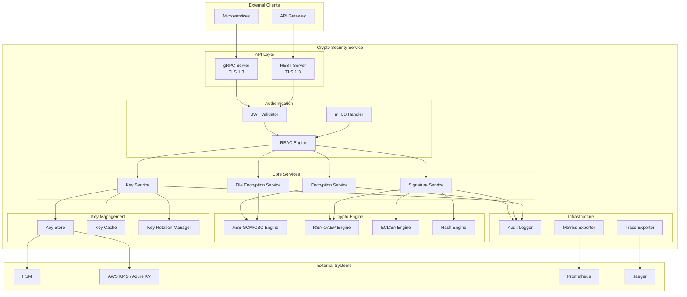

# Design Document: Crypto Security Service

## Overview

The Crypto Security Service is a high-performance C++ microservice providing centralized cryptographic operations for the auth-platform ecosystem. It implements AES-256-GCM symmetric encryption, RSA-OAEP asymmetric encryption, digital signatures (RSA-PSS/ECDSA), and comprehensive key management with HSM integration. The service exposes both gRPC and REST APIs, supports streaming file encryption, and maintains encrypted audit logs for regulatory compliance.

The architecture prioritizes security-first design with zero-trust principles, defense-in-depth key protection, and constant-time cryptographic operations to prevent timing attacks.

## Architecture



## Components and Interfaces

### 1. API Layer

#### gRPC Server
```cpp
// crypto_service.proto
service CryptoService {
    // Symmetric Encryption
    rpc Encrypt(EncryptRequest) returns (EncryptResponse);
    rpc Decrypt(DecryptRequest) returns (DecryptResponse);
    
    // Asymmetric Encryption
    rpc RSAEncrypt(RSAEncryptRequest) returns (RSAEncryptResponse);
    rpc RSADecrypt(RSADecryptRequest) returns (RSADecryptResponse);
    
    // Digital Signatures
    rpc Sign(SignRequest) returns (SignResponse);
    rpc Verify(VerifyRequest) returns (VerifyResponse);
    
    // Key Management
    rpc GenerateKey(GenerateKeyRequest) returns (GenerateKeyResponse);
    rpc RotateKey(RotateKeyRequest) returns (RotateKeyResponse);
    rpc GetKeyMetadata(GetKeyMetadataRequest) returns (GetKeyMetadataResponse);
    rpc DeleteKey(DeleteKeyRequest) returns (DeleteKeyResponse);
    
    // File Operations (streaming)
    rpc EncryptFile(stream FileChunk) returns (stream EncryptedFileChunk);
    rpc DecryptFile(stream EncryptedFileChunk) returns (stream FileChunk);
    
    // Health
    rpc HealthCheck(HealthCheckRequest) returns (HealthCheckResponse);
}
```

#### REST API Endpoints
| Method | Endpoint | Description |
|--------|----------|-------------|
| POST | /v1/encrypt | AES encryption |
| POST | /v1/decrypt | AES decryption |
| POST | /v1/rsa/encrypt | RSA encryption |
| POST | /v1/rsa/decrypt | RSA decryption |
| POST | /v1/sign | Create signature |
| POST | /v1/verify | Verify signature |
| POST | /v1/keys | Generate key |
| POST | /v1/keys/{id}/rotate | Rotate key |
| GET | /v1/keys/{id} | Get key metadata |
| DELETE | /v1/keys/{id} | Delete key |
| POST | /v1/files/encrypt | File encryption |
| POST | /v1/files/decrypt | File decryption |
| GET | /health | Health check |
| GET | /metrics | Prometheus metrics |

### 2. Core Interfaces

```cpp
// IEncryptionService - Symmetric encryption operations
class IEncryptionService {
public:
    virtual ~IEncryptionService() = default;
    
    virtual Result<EncryptResult> encrypt(
        std::span<const uint8_t> plaintext,
        const KeyId& key_id,
        const EncryptOptions& options) = 0;
    
    virtual Result<std::vector<uint8_t>> decrypt(
        std::span<const uint8_t> ciphertext,
        std::span<const uint8_t> iv,
        std::span<const uint8_t> tag,
        const KeyId& key_id,
        const DecryptOptions& options) = 0;
};

// ISignatureService - Digital signature operations
class ISignatureService {
public:
    virtual ~ISignatureService() = default;
    
    virtual Result<std::vector<uint8_t>> sign(
        std::span<const uint8_t> data,
        const KeyId& private_key_id,
        SignatureAlgorithm algorithm) = 0;
    
    virtual Result<bool> verify(
        std::span<const uint8_t> data,
        std::span<const uint8_t> signature,
        const KeyId& public_key_id,
        SignatureAlgorithm algorithm) = 0;
};

// IKeyService - Key management operations
class IKeyService {
public:
    virtual ~IKeyService() = default;
    
    virtual Result<KeyId> generateKey(const KeyGenerationParams& params) = 0;
    virtual Result<KeyId> rotateKey(const KeyId& old_key_id) = 0;
    virtual Result<KeyMetadata> getKeyMetadata(const KeyId& key_id) = 0;
    virtual Result<void> deleteKey(const KeyId& key_id) = 0;
    virtual Result<std::vector<uint8_t>> getKeyMaterial(const KeyId& key_id) = 0;
};

// IKeyStore - Secure key storage backend
class IKeyStore {
public:
    virtual ~IKeyStore() = default;
    
    virtual Result<void> store(const KeyId& id, const EncryptedKey& key) = 0;
    virtual Result<EncryptedKey> retrieve(const KeyId& id) = 0;
    virtual Result<void> remove(const KeyId& id) = 0;
    virtual Result<bool> exists(const KeyId& id) = 0;
};

// IAuditLogger - Audit logging interface
class IAuditLogger {
public:
    virtual ~IAuditLogger() = default;
    
    virtual void logOperation(const AuditEntry& entry) = 0;
    virtual Result<std::vector<AuditEntry>> query(const AuditQuery& query) = 0;
};
```

### 3. Crypto Engine Components

```cpp
// AES Engine - Symmetric encryption implementation
class AESEngine {
public:
    static constexpr size_t GCM_IV_SIZE = 12;  // 96 bits
    static constexpr size_t GCM_TAG_SIZE = 16; // 128 bits
    static constexpr size_t CBC_IV_SIZE = 16;  // 128 bits
    
    Result<EncryptResult> encryptGCM(
        std::span<const uint8_t> plaintext,
        std::span<const uint8_t> key,
        std::span<const uint8_t> aad = {});
    
    Result<std::vector<uint8_t>> decryptGCM(
        std::span<const uint8_t> ciphertext,
        std::span<const uint8_t> key,
        std::span<const uint8_t> iv,
        std::span<const uint8_t> tag,
        std::span<const uint8_t> aad = {});
    
    Result<EncryptResult> encryptCBC(
        std::span<const uint8_t> plaintext,
        std::span<const uint8_t> key);
    
    Result<std::vector<uint8_t>> decryptCBC(
        std::span<const uint8_t> ciphertext,
        std::span<const uint8_t> key,
        std::span<const uint8_t> iv);
};

// RSA Engine - Asymmetric encryption and signatures
class RSAEngine {
public:
    Result<std::vector<uint8_t>> encryptOAEP(
        std::span<const uint8_t> plaintext,
        const RSAPublicKey& public_key);
    
    Result<std::vector<uint8_t>> decryptOAEP(
        std::span<const uint8_t> ciphertext,
        const RSAPrivateKey& private_key);
    
    Result<std::vector<uint8_t>> signPSS(
        std::span<const uint8_t> data,
        const RSAPrivateKey& private_key,
        HashAlgorithm hash_algo);
    
    Result<bool> verifyPSS(
        std::span<const uint8_t> data,
        std::span<const uint8_t> signature,
        const RSAPublicKey& public_key,
        HashAlgorithm hash_algo);
    
    Result<RSAKeyPair> generateKeyPair(size_t key_size);
};

// ECDSA Engine - Elliptic curve signatures
class ECDSAEngine {
public:
    Result<std::vector<uint8_t>> sign(
        std::span<const uint8_t> data,
        const ECPrivateKey& private_key);
    
    Result<bool> verify(
        std::span<const uint8_t> data,
        std::span<const uint8_t> signature,
        const ECPublicKey& public_key);
    
    Result<ECKeyPair> generateKeyPair(ECCurve curve);
};
```

## Data Models

### Key Types and Structures

```cpp
// Key identifier with namespace support
struct KeyId {
    std::string namespace_prefix;  // Service namespace (e.g., "auth", "payment")
    std::string id;                // UUID v4
    uint32_t version;              // Key version for rotation
    
    std::string toString() const;
    static Result<KeyId> parse(std::string_view str);
};

// Key metadata stored alongside encrypted key
struct KeyMetadata {
    KeyId id;
    KeyAlgorithm algorithm;        // AES_128, AES_256, RSA_2048, etc.
    KeyType type;                  // SYMMETRIC, ASYMMETRIC_PUBLIC, ASYMMETRIC_PRIVATE
    KeyState state;                // ACTIVE, DEPRECATED, DESTROYED
    std::chrono::system_clock::time_point created_at;
    std::chrono::system_clock::time_point expires_at;
    std::optional<std::chrono::system_clock::time_point> rotated_at;
    std::optional<KeyId> previous_version;
    std::string owner_service;
    std::vector<std::string> allowed_operations;
    uint64_t usage_count;
};

// Encrypted key storage format
struct EncryptedKey {
    std::vector<uint8_t> encrypted_material;
    std::vector<uint8_t> iv;
    std::vector<uint8_t> tag;
    KeyId kek_id;                  // Key Encryption Key used
    KeyMetadata metadata;
};

// Encryption result with all components
struct EncryptResult {
    std::vector<uint8_t> ciphertext;
    std::vector<uint8_t> iv;
    std::vector<uint8_t> tag;      // For GCM mode
};

// Audit log entry
struct AuditEntry {
    std::string correlation_id;
    std::chrono::system_clock::time_point timestamp;
    AuditOperation operation;      // ENCRYPT, DECRYPT, SIGN, VERIFY, KEY_GENERATE, etc.
    KeyId key_id;
    std::string caller_identity;
    std::string caller_service;
    bool success;
    std::optional<std::string> error_code;
    std::string source_ip;
    std::map<std::string, std::string> metadata;
};

// Enumerations
enum class KeyAlgorithm {
    AES_128_GCM,
    AES_256_GCM,
    AES_128_CBC,
    AES_256_CBC,
    RSA_2048,
    RSA_3072,
    RSA_4096,
    ECDSA_P256,
    ECDSA_P384,
    ECDSA_P521
};

enum class KeyState {
    PENDING_ACTIVATION,
    ACTIVE,
    DEPRECATED,
    PENDING_DESTRUCTION,
    DESTROYED
};

enum class AuditOperation {
    ENCRYPT,
    DECRYPT,
    RSA_ENCRYPT,
    RSA_DECRYPT,
    SIGN,
    VERIFY,
    KEY_GENERATE,
    KEY_ROTATE,
    KEY_DELETE,
    KEY_ACCESS
};
```

### Configuration Model

```cpp
struct CryptoServiceConfig {
    // Server configuration
    struct ServerConfig {
        uint16_t grpc_port = 50051;
        uint16_t rest_port = 8080;
        std::string tls_cert_path;
        std::string tls_key_path;
        std::string tls_ca_path;
        size_t thread_pool_size = std::thread::hardware_concurrency();
    } server;
    
    // Key management configuration
    struct KeyConfig {
        std::string kms_provider;  // "hsm", "aws_kms", "azure_kv", "local"
        std::string hsm_slot_id;
        std::string aws_kms_key_arn;
        std::string azure_kv_url;
        std::string local_key_path;
        std::chrono::seconds key_cache_ttl{300};
        size_t key_cache_max_size = 1000;
    } keys;
    
    // Audit configuration
    struct AuditConfig {
        std::string storage_path;
        std::chrono::hours retention_period{61320};  // 7 years
        bool encrypt_logs = true;
        std::string siem_endpoint;
    } audit;
    
    // Performance configuration
    struct PerformanceConfig {
        size_t file_chunk_size = 65536;  // 64KB
        size_t max_file_size = 10737418240;  // 10GB
        size_t connection_pool_size = 10;
    } performance;
};
```


## Correctness Properties

*A property is a characteristic or behavior that should hold true across all valid executions of a system—essentially, a formal statement about what the system should do. Properties serve as the bridge between human-readable specifications and machine-verifiable correctness guarantees.*


### Property 1: AES Encryption Round-Trip

*For any* valid plaintext data and any valid AES key (128-bit or 256-bit), encrypting the plaintext using AES-GCM or AES-CBC mode and then decrypting the result with the same key SHALL produce the original plaintext byte-for-byte.

**Validates: Requirements 1.1, 1.2, 1.3, 1.4, 1.8**

### Property 2: AES IV Uniqueness

*For any* two encryption operations using AES-GCM mode, even with identical plaintext and key, the generated IVs SHALL be different.

**Validates: Requirements 1.5**

### Property 3: AES AAD Binding

*For any* AES-GCM encryption with Additional Authenticated Data (AAD), attempting to decrypt with different AAD SHALL fail with an integrity error.

**Validates: Requirements 1.6**

### Property 4: AES Tamper Detection

*For any* AES-GCM encrypted ciphertext, modifying any byte of the ciphertext, IV, or authentication tag SHALL cause decryption to fail with an integrity error.

**Validates: Requirements 1.7**

### Property 5: RSA Encryption Round-Trip

*For any* valid plaintext within the size limit for the key and any valid RSA key pair (2048, 3072, or 4096 bits), encrypting with the public key and decrypting with the private key SHALL produce the original plaintext.

**Validates: Requirements 2.1, 2.2, 2.3, 2.7**

### Property 6: RSA Size Limit Enforcement

*For any* RSA key, attempting to encrypt plaintext larger than the maximum allowed size for that key SHALL return a size limit error.

**Validates: Requirements 2.5**

### Property 7: Hybrid Encryption Round-Trip

*For any* valid plaintext of arbitrary size and any valid RSA key pair, hybrid encryption (RSA key wrapping + AES data encryption) followed by hybrid decryption SHALL produce the original plaintext.

**Validates: Requirements 2.6**

### Property 8: Signature Consistency

*For any* valid data and any valid signing key pair (RSA-PSS with SHA-256/384/512 or ECDSA with P-256/384/521), signing the data with the private key and verifying with the corresponding public key SHALL always return valid.

**Validates: Requirements 3.1, 3.2, 3.3, 3.4, 3.7**

### Property 9: Invalid Signature Rejection

*For any* valid data and signature, verifying the signature against different data or a different public key SHALL return invalid (false).

**Validates: Requirements 3.6**

### Property 10: Generated Keys Are Functional

*For any* key generation request (AES-128, AES-256, RSA-2048/3072/4096, ECDSA P-256/384/521), the generated key SHALL be usable for its intended cryptographic operations (encryption/decryption for symmetric/asymmetric keys, signing/verification for signature keys).

**Validates: Requirements 4.1, 4.2, 4.3**

### Property 11: Key ID Uniqueness

*For any* sequence of key generation operations, all generated Key_IDs SHALL be unique.

**Validates: Requirements 4.4**

### Property 12: Key Metadata Completeness

*For any* generated key, retrieving its metadata SHALL return a complete KeyMetadata object containing algorithm, creation timestamp, expiration date, and owner information.

**Validates: Requirements 4.5**

### Property 13: Private Key Protection

*For any* key generation or key retrieval operation, the response SHALL contain only the Key_ID reference, never the raw private key material.

**Validates: Requirements 4.7**

### Property 14: Key Rotation State Machine

*For any* key rotation operation on an active key, the operation SHALL: (a) create a new key with a different Key_ID, (b) mark the old key as deprecated, and (c) the deprecated key SHALL be rejected for new encryption operations.

**Validates: Requirements 6.2, 6.4, 6.7**

### Property 15: Deprecated Key Decryption

*For any* data encrypted with a key that is subsequently rotated, decryption using the deprecated key SHALL still succeed during the grace period.

**Validates: Requirements 6.3**

### Property 16: Key Rotation Audit

*For any* key rotation operation, an audit log entry SHALL be created containing the operation type, old Key_ID, new Key_ID, timestamp, and caller identity.

**Validates: Requirements 6.6**

### Property 17: File DEK Uniqueness

*For any* two file encryption operations, even for identical files, the generated Data Encryption Keys (DEKs) SHALL be different.

**Validates: Requirements 7.4**

### Property 18: File Header Completeness

*For any* encrypted file, the file header SHALL contain the wrapped DEK, IV, and authentication tag.

**Validates: Requirements 7.6**

### Property 19: File Encryption Round-Trip

*For any* valid file (up to 10GB), encrypting and then decrypting SHALL produce a byte-identical copy of the original file.

**Validates: Requirements 7.7**

### Property 20: Audit Entry Completeness

*For any* cryptographic operation (encrypt, decrypt, sign, verify, key operations), an audit log entry SHALL be created containing timestamp, operation type, Key_ID, caller identity, success/failure status, and correlation_id, but SHALL NOT contain plaintext, ciphertext, or key material.

**Validates: Requirements 10.1, 10.2, 10.3**

## Error Handling

### Error Categories

| Category | HTTP Status | gRPC Code | Description |
|----------|-------------|-----------|-------------|
| INVALID_INPUT | 400 | INVALID_ARGUMENT | Malformed request, invalid parameters |
| AUTHENTICATION_FAILED | 401 | UNAUTHENTICATED | Invalid or missing JWT token |
| AUTHORIZATION_FAILED | 403 | PERMISSION_DENIED | Insufficient permissions for operation |
| KEY_NOT_FOUND | 404 | NOT_FOUND | Requested key does not exist |
| KEY_DEPRECATED | 400 | FAILED_PRECONDITION | Key is deprecated, cannot encrypt |
| INTEGRITY_ERROR | 400 | DATA_LOSS | Decryption failed due to tampered data |
| SIZE_LIMIT_EXCEEDED | 400 | INVALID_ARGUMENT | Plaintext exceeds maximum size |
| KMS_UNAVAILABLE | 503 | UNAVAILABLE | HSM/KMS connection failed |
| INTERNAL_ERROR | 500 | INTERNAL | Unexpected internal error |

### Error Response Format

```cpp
struct ErrorResponse {
    std::string error_code;        // Machine-readable code (e.g., "KEY_NOT_FOUND")
    std::string message;           // Human-readable message
    std::string correlation_id;    // Request correlation ID for tracing
    std::map<std::string, std::string> details;  // Additional context
};
```

### Error Handling Principles

1. **No Information Leakage**: Cryptographic errors (integrity, decryption) return generic messages without revealing internal state
2. **Constant-Time Comparison**: All signature and tag verifications use constant-time comparison to prevent timing attacks
3. **Fail-Fast Validation**: Input validation occurs before any cryptographic operations
4. **Circuit Breaker**: KMS/HSM failures trigger circuit breaker to prevent cascade failures
5. **Graceful Degradation**: When KMS is unavailable, cached keys allow continued operation for existing keys

## Testing Strategy

### Unit Tests

Unit tests verify specific examples and edge cases for each component:

- **AES Engine Tests**: Test encryption/decryption with known test vectors (NIST), edge cases (empty input, max size), error conditions (invalid key size, corrupted tag)
- **RSA Engine Tests**: Test with known vectors, key size boundaries, padding validation
- **ECDSA Engine Tests**: Test with known vectors for each curve, signature format validation
- **Key Service Tests**: Test key generation, rotation lifecycle, metadata management
- **Audit Logger Tests**: Test entry creation, field validation, sensitive data filtering

### Property-Based Tests

Property-based tests verify universal properties across randomly generated inputs using a C++ property testing library (RapidCheck or similar).

**Configuration**: Minimum 100 iterations per property test.

**Test Annotations**: Each property test must reference its design document property:
```cpp
// Feature: crypto-security-service, Property 1: AES Encryption Round-Trip
// Validates: Requirements 1.1, 1.2, 1.3, 1.4, 1.8
RC_GTEST_PROP(AESEngine, RoundTrip, (std::vector<uint8_t> plaintext, AESKeySize key_size)) {
    // Generate random key of specified size
    auto key = generateRandomKey(key_size);
    
    // Encrypt
    auto encrypt_result = aes_engine.encryptGCM(plaintext, key);
    RC_ASSERT(encrypt_result.has_value());
    
    // Decrypt
    auto decrypt_result = aes_engine.decryptGCM(
        encrypt_result->ciphertext,
        key,
        encrypt_result->iv,
        encrypt_result->tag
    );
    RC_ASSERT(decrypt_result.has_value());
    
    // Verify round-trip
    RC_ASSERT(*decrypt_result == plaintext);
}
```

### Integration Tests

- **gRPC API Tests**: End-to-end tests for all gRPC endpoints
- **REST API Tests**: End-to-end tests for all REST endpoints
- **HSM Integration Tests**: Tests with mock HSM and real HSM (in secure environment)
- **KMS Integration Tests**: Tests with LocalStack (AWS) or Azurite (Azure)

### Security Tests

- **Timing Attack Tests**: Verify constant-time operations for signature verification
- **Memory Safety Tests**: Run with AddressSanitizer and MemorySanitizer
- **Fuzzing**: Use libFuzzer for input validation and parsing code

### Performance Tests

- **Throughput Benchmarks**: Measure encryption throughput (target: 500 MB/s for AES-256-GCM)
- **Latency Benchmarks**: Measure p50, p95, p99 latencies for all operations
- **Concurrency Tests**: Verify thread safety under high concurrent load

