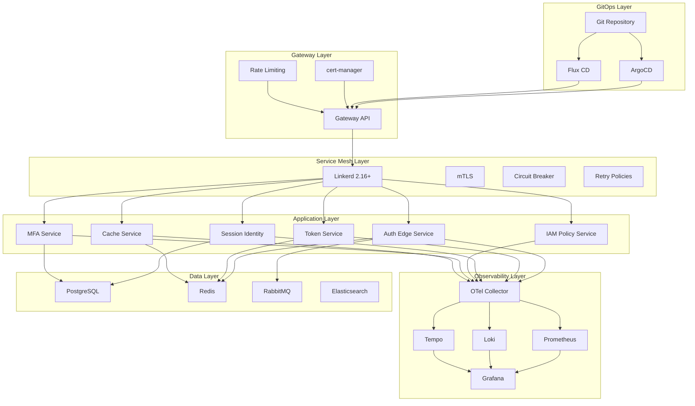

# Design Document: Deploy Modernization 2025

## Overview

This design document specifies the modernization of the Auth Platform deployment infrastructure to align with December 2025 best practices. The modernization encompasses Docker Compose V2 configurations, Kubernetes manifests with Pod Security Standards, production-ready Helm charts, Gateway API integration with Linkerd service mesh, GitOps-ready structure for ArgoCD/Flux, and a comprehensive observability stack.

The current infrastructure uses Docker Compose 3.9 with deprecated patterns, basic Kubernetes deployments, and a minimal observability setup. This modernization will transform it into a production-grade, security-hardened, GitOps-native deployment platform.

## Architecture



## Components and Interfaces

### 1. Docker Compose V2 Configuration

The Docker Compose configuration follows 2025 best practices with multi-environment support.

#### Base Configuration Structure

```yaml
# docker-compose.yml (base)
x-common-logging: &common-logging
  driver: json-file
  options:
    max-size: "10m"
    max-file: "3"

x-common-security: &common-security
  security_opt:
    - no-new-privileges:true

x-common-healthcheck: &common-healthcheck
  interval: 30s
  timeout: 10s
  retries: 3
  start_period: 60s

services:
  auth-edge-service:
    image: auth-platform/auth-edge-service:${VERSION}
    <<: *common-security
    logging: *common-logging
    deploy:
      resources:
        limits:
          cpus: '0.5'
          memory: 256M
        reservations:
          cpus: '0.1'
          memory: 64M
    healthcheck:
      <<: *common-healthcheck
      test: ["CMD", "/app/health"]
    depends_on:
      redis:
        condition: service_healthy
    networks:
      - platform-network
    env_file:
      - .env

networks:
  platform-network:
    driver: bridge
    ipam:
      config:
        - subnet: 172.28.0.0/16
```

#### Environment-Specific Overrides

| File | Purpose | Key Differences |
|------|---------|-----------------|
| `docker-compose.yml` | Base shared definitions | Common services, networks, volumes |
| `docker-compose.dev.yml` | Development overrides | Debug ports, hot reload, verbose logging |
| `docker-compose.staging.yml` | Staging configuration | Production-like with test data |
| `docker-compose.prod.yml` | Production hardening | No debug ports, minimal logging, secrets |

### 2. OpenTelemetry Collector Configuration

Enhanced OTel Collector with security filtering, tail-based sampling, and comprehensive telemetry processing.

```yaml
# otel-collector-config.yaml
receivers:
  otlp:
    protocols:
      grpc:
        endpoint: 0.0.0.0:4317
      http:
        endpoint: 0.0.0.0:4318

processors:
  resourcedetection:
    detectors: [env, system, docker]
    timeout: 5s
    override: false

  attributes/filter-sensitive:
    actions:
      - key: password
        action: delete
      - key: token
        action: delete
      - key: authorization
        action: delete
      - key: api_key
        action: delete

  tail_sampling:
    decision_wait: 10s
    num_traces: 100000
    policies:
      - name: errors-policy
        type: status_code
        status_code: {status_codes: [ERROR]}
      - name: slow-traces-policy
        type: latency
        latency: {threshold_ms: 1000}
      - name: probabilistic-policy
        type: probabilistic
        probabilistic: {sampling_percentage: 10}

  transform/logs:
    log_statements:
      - context: log
        statements:
          - merge_maps(attributes, ParseJSON(body), "insert")

  memory_limiter:
    check_interval: 1s
    limit_mib: 1024
    spike_limit_mib: 256

  batch:
    timeout: 5s
    send_batch_size: 10000

exporters:
  prometheus:
    endpoint: "0.0.0.0:8888"
    resource_to_telemetry_conversion:
      enabled: true

  otlp/tempo:
    endpoint: tempo:4317
    tls:
      insecure: true
    retry_on_failure:
      enabled: true
      initial_interval: 5s
      max_interval: 30s
      max_elapsed_time: 300s

  loki:
    endpoint: http://loki:3100/loki/api/v1/push
    retry_on_failure:
      enabled: true

extensions:
  health_check:
    endpoint: 0.0.0.0:13133

service:
  extensions: [health_check]
  pipelines:
    traces:
      receivers: [otlp]
      processors: [memory_limiter, resourcedetection, attributes/filter-sensitive, tail_sampling, batch]
      exporters: [otlp/tempo]
    metrics:
      receivers: [otlp]
      processors: [memory_limiter, resourcedetection, batch]
      exporters: [prometheus]
    logs:
      receivers: [otlp]
      processors: [memory_limiter, resourcedetection, attributes/filter-sensitive, transform/logs, batch]
      exporters: [loki]
```

### 3. Kubernetes Security Hardening

All deployments follow Pod Security Standards (PSS) with restricted profile.

```yaml
# deployment-template.yaml
apiVersion: apps/v1
kind: Deployment
metadata:
  name: {{ .service.name }}
spec:
  template:
    spec:
      securityContext:
        runAsNonRoot: true
        runAsUser: 65534
        runAsGroup: 65534
        fsGroup: 65534
        seccompProfile:
          type: RuntimeDefault
      containers:
        - name: {{ .service.name }}
          securityContext:
            allowPrivilegeEscalation: false
            readOnlyRootFilesystem: true
            capabilities:
              drop:
                - ALL
          resources:
            requests:
              cpu: {{ .resources.requests.cpu }}
              memory: {{ .resources.requests.memory }}
            limits:
              cpu: {{ .resources.limits.cpu }}
              memory: {{ .resources.limits.memory }}
          volumeMounts:
            - name: tmp
              mountPath: /tmp
      volumes:
        - name: tmp
          emptyDir:
            sizeLimit: 100Mi
```

### 4. Helm Chart Production Features

#### PodDisruptionBudget Template

```yaml
{{- if .Values.podDisruptionBudget.enabled }}
apiVersion: policy/v1
kind: PodDisruptionBudget
metadata:
  name: {{ include "chart.fullname" . }}
spec:
  minAvailable: {{ .Values.podDisruptionBudget.minAvailable | default 2 }}
  selector:
    matchLabels:
      {{- include "chart.selectorLabels" . | nindent 6 }}
{{- end }}
```

#### HorizontalPodAutoscaler Template

```yaml
{{- if .Values.autoscaling.enabled }}
apiVersion: autoscaling/v2
kind: HorizontalPodAutoscaler
metadata:
  name: {{ include "chart.fullname" . }}
spec:
  scaleTargetRef:
    apiVersion: apps/v1
    kind: Deployment
    name: {{ include "chart.fullname" . }}
  minReplicas: {{ .Values.autoscaling.minReplicas }}
  maxReplicas: {{ .Values.autoscaling.maxReplicas }}
  metrics:
    - type: Resource
      resource:
        name: cpu
        target:
          type: Utilization
          averageUtilization: {{ .Values.autoscaling.targetCPUUtilizationPercentage }}
    - type: Resource
      resource:
        name: memory
        target:
          type: Utilization
          averageUtilization: {{ .Values.autoscaling.targetMemoryUtilizationPercentage }}
{{- end }}
```

#### NetworkPolicy Template

```yaml
apiVersion: networking.k8s.io/v1
kind: NetworkPolicy
metadata:
  name: {{ include "chart.fullname" . }}
spec:
  podSelector:
    matchLabels:
      {{- include "chart.selectorLabels" . | nindent 6 }}
  policyTypes:
    - Ingress
    - Egress
  ingress:
    - from:
        - namespaceSelector:
            matchLabels:
              name: {{ .Release.Namespace }}
        - podSelector:
            matchLabels:
              app.kubernetes.io/part-of: auth-platform
      ports:
        - protocol: TCP
          port: {{ .Values.service.port }}
  egress:
    - to:
        - namespaceSelector:
            matchLabels:
              name: {{ .Release.Namespace }}
    - to:
        - namespaceSelector:
            matchLabels:
              name: kube-system
      ports:
        - protocol: UDP
          port: 53
```

### 5. Gateway API and Service Mesh Integration

#### HTTPRoute with Rate Limiting

```yaml
apiVersion: gateway.networking.k8s.io/v1
kind: HTTPRoute
metadata:
  name: auth-api-route
  annotations:
    retry.linkerd.io/http: "5xx,429"
    retry.linkerd.io/limit: "3"
    retry.linkerd.io/timeout: "500ms"
spec:
  parentRefs:
    - name: auth-gateway
      sectionName: https
  hostnames:
    - "auth.example.com"
  rules:
    - matches:
        - path:
            type: PathPrefix
            value: /api/v1
      filters:
        - type: ExtensionRef
          extensionRef:
            group: gateway.envoyproxy.io
            kind: RateLimitFilter
            name: api-rate-limit
      backendRefs:
        - name: auth-edge-service
          port: 8080
```

#### GRPCRoute Configuration

```yaml
apiVersion: gateway.networking.k8s.io/v1
kind: GRPCRoute
metadata:
  name: grpc-services-route
spec:
  parentRefs:
    - name: auth-gateway
      sectionName: grpc
  hostnames:
    - "grpc.auth.example.com"
  rules:
    - matches:
        - method:
            service: auth.v1.TokenService
      backendRefs:
        - name: token-service
          port: 9091
    - matches:
        - method:
            service: auth.v1.SessionService
      backendRefs:
        - name: session-identity-core
          port: 9092
```

#### Linkerd ServiceProfile for Circuit Breaker

```yaml
apiVersion: linkerd.io/v1alpha2
kind: ServiceProfile
metadata:
  name: token-service.auth-system.svc.cluster.local
  namespace: auth-system
spec:
  routes:
    - name: POST /api/v1/tokens
      condition:
        method: POST
        pathRegex: /api/v1/tokens
      responseClasses:
        - condition:
            status:
              min: 500
              max: 599
          isFailure: true
      timeout: 5s
      retries:
        budget:
          retryRatio: 0.2
          minRetriesPerSecond: 10
          ttl: 10s
```

### 6. GitOps Directory Structure

```
deploy/
├── kubernetes/
│   ├── base/
│   │   ├── kustomization.yaml
│   │   ├── namespace.yaml
│   │   ├── auth-edge-service/
│   │   ├── token-service/
│   │   ├── session-identity-core/
│   │   ├── iam-policy-service/
│   │   ├── mfa-service/
│   │   └── cache-service/
│   ├── overlays/
│   │   ├── dev/
│   │   │   ├── kustomization.yaml
│   │   │   ├── patches/
│   │   │   └── secrets/
│   │   ├── staging/
│   │   │   ├── kustomization.yaml
│   │   │   ├── patches/
│   │   │   └── secrets/
│   │   └── prod/
│   │       ├── kustomization.yaml
│   │       ├── patches/
│   │       └── secrets/
│   └── argocd/
│       ├── dev-application.yaml
│       ├── staging-application.yaml
│       └── prod-application.yaml
```

#### ArgoCD Application Manifest

```yaml
apiVersion: argoproj.io/v1alpha1
kind: Application
metadata:
  name: auth-platform-prod
  namespace: argocd
spec:
  project: auth-platform
  source:
    repoURL: https://github.com/org/auth-platform.git
    targetRevision: main
    path: deploy/kubernetes/overlays/prod
  destination:
    server: https://kubernetes.default.svc
    namespace: auth-system
  syncPolicy:
    automated:
      prune: true
      selfHeal: true
      allowEmpty: false
    syncOptions:
      - CreateNamespace=true
      - PrunePropagationPolicy=foreground
      - PruneLast=true
    retry:
      limit: 5
      backoff:
        duration: 5s
        factor: 2
        maxDuration: 3m
  healthChecks:
    - group: apps
      kind: Deployment
      namespace: auth-system
```

## Data Models

### Docker Compose Service Definition

```typescript
interface DockerComposeService {
  image: string;
  deploy: {
    resources: {
      limits: { cpus: string; memory: string };
      reservations: { cpus: string; memory: string };
    };
  };
  logging: {
    driver: 'json-file';
    options: {
      'max-size': string;
      'max-file': string;
    };
  };
  security_opt: string[];
  healthcheck: {
    test: string[];
    interval: string;
    timeout: string;
    retries: number;
    start_period: string;
  };
  depends_on?: Record<string, { condition: 'service_healthy' }>;
  networks: string[];
  env_file?: string[];
}
```

### Kubernetes Deployment Security Context

```typescript
interface PodSecurityContext {
  runAsNonRoot: true;
  runAsUser: number;
  runAsGroup: number;
  fsGroup: number;
  seccompProfile: {
    type: 'RuntimeDefault';
  };
}

interface ContainerSecurityContext {
  allowPrivilegeEscalation: false;
  readOnlyRootFilesystem: boolean;
  capabilities: {
    drop: ['ALL'];
    add?: string[];
  };
}
```

### Helm Values Schema

```typescript
interface HelmValues {
  replicaCount: number;
  image: {
    repository: string;
    tag: string;  // Must not be 'latest' in production
    pullPolicy: 'IfNotPresent' | 'Always';
  };
  podDisruptionBudget: {
    enabled: boolean;
    minAvailable: number;  // >= 2 for stateless services
  };
  autoscaling: {
    enabled: boolean;
    minReplicas: number;
    maxReplicas: number;
    targetCPUUtilizationPercentage: number;
    targetMemoryUtilizationPercentage: number;
  };
  affinity: {
    podAntiAffinity: {
      preferredDuringSchedulingIgnoredDuringExecution: AffinityTerm[];
    };
  };
  networkPolicy: {
    enabled: boolean;
  };
  serviceMonitor: {
    enabled: boolean;
  };
  probes: {
    liveness: ProbeConfig;
    readiness: ProbeConfig;
    startup: ProbeConfig;
  };
}
```

## Correctness Properties

*A property is a characteristic or behavior that should hold true across all valid executions of a system—essentially, a formal statement about what the system should do. Properties serve as the bridge between human-readable specifications and machine-verifiable correctness guarantees.*

### Property 1: Docker Compose V2 Compliance

*For any* Docker Compose file in the deployment configuration, the file SHALL NOT contain a `version` field, all services SHALL have `deploy.resources` defined, logging SHALL use `json-file` driver with max-size 10m and max-file 3, all application services SHALL have `security_opt: no-new-privileges:true`, and all health checks SHALL include `start_period`.

**Validates: Requirements 1.1, 1.2, 1.3, 1.5, 1.7**

### Property 2: Docker Compose Dependency Health Conditions

*For any* service in a Docker Compose file that has dependencies defined via `depends_on`, all dependencies SHALL specify `condition: service_healthy`.

**Validates: Requirements 1.4**

### Property 3: Docker Compose Secret Externalization

*For any* Docker Compose file, no hardcoded secrets (passwords, tokens, API keys) SHALL exist in environment variables; all sensitive values SHALL reference external sources (env_file, Docker secrets, or environment variable substitution).

**Validates: Requirements 1.8**

### Property 4: Production Compose Security

*For any* production Docker Compose configuration (`docker-compose.prod.yml`), no debug ports SHALL be exposed and verbose logging SHALL be disabled.

**Validates: Requirements 2.5**

### Property 5: OTel Collector Security Filtering

*For any* telemetry data processed by the OTel Collector, sensitive attributes (password, token, authorization, api_key) SHALL be removed before export.

**Validates: Requirements 3.2**

### Property 6: OTel Collector Exporter Retry

*For any* exporter configured in the OTel Collector, retry on failure SHALL be enabled with appropriate backoff configuration.

**Validates: Requirements 3.8**

### Property 7: Kubernetes Pod Security Standards

*For any* Kubernetes Deployment in the configuration, pods SHALL have `runAsNonRoot: true`, `seccompProfile.type: RuntimeDefault`, and all containers SHALL have `allowPrivilegeEscalation: false` with all capabilities dropped.

**Validates: Requirements 4.1, 4.3, 4.4, 4.6**

### Property 8: Kubernetes Resource Constraints

*For any* container in a Kubernetes Deployment, resource requests and limits SHALL be defined for both CPU and memory.

**Validates: Requirements 4.5**

### Property 9: Helm Chart High Availability

*For any* stateless service Helm chart, a PodDisruptionBudget SHALL be defined with `minAvailable >= 2`, and pod anti-affinity SHALL be configured to spread replicas across nodes.

**Validates: Requirements 5.1, 5.3**

### Property 10: Helm Chart Production Image Tags

*For any* Helm chart deployment to production, the image tag SHALL NOT be `latest` or empty; an explicit version tag SHALL be required.

**Validates: Requirements 5.8**

### Property 11: Gateway API Rate Limiting

*For any* HTTPRoute or GRPCRoute in the Gateway API configuration, rate limiting policies SHALL be configured.

**Validates: Requirements 6.3**

### Property 12: GitOps Sync Policy

*For any* ArgoCD Application manifest, sync policies SHALL include automated pruning and self-healing, and health checks SHALL be defined.

**Validates: Requirements 7.4, 7.6**

### Property 13: Observability Dashboard Provisioning

*For any* Grafana dashboard deployment, dashboards SHALL be provisioned via ConfigMaps using Grafana's provisioning mechanism.

**Validates: Requirements 8.7**

### Property 14: Validation Pipeline Blocking

*For any* validation failure in the CI/CD pipeline (compose config, helm lint, kubectl dry-run, kubeconform, trivy, checkov), the deployment SHALL be blocked and errors SHALL be reported.

**Validates: Requirements 9.7**

## Error Handling

### Docker Compose Validation Errors

| Error Type | Handling Strategy |
|------------|-------------------|
| Invalid YAML syntax | Block deployment, report line number |
| Missing required fields | Block deployment, list missing fields |
| Invalid resource format | Block deployment, show valid format |
| Health check misconfiguration | Warn and suggest correction |

### Kubernetes Manifest Errors

| Error Type | Handling Strategy |
|------------|-------------------|
| Schema validation failure | Block deployment via Kubeconform |
| Security policy violation | Block deployment via Checkov/Kubesec |
| Resource quota exceeded | Block deployment, show quota limits |
| Image vulnerability (CVSS 7+) | Block deployment via Trivy |

### GitOps Sync Errors

| Error Type | Handling Strategy |
|------------|-------------------|
| Sync failure | Retry with exponential backoff (5 attempts) |
| Health check failure | Mark application as degraded |
| Pruning conflict | Pause sync, alert operators |
| Secret decryption failure | Block sync, alert security team |

## Testing Strategy

### Unit Tests

Unit tests validate individual configuration files and templates:

- Docker Compose YAML structure validation
- Helm template rendering with various values
- Kustomize patch application
- OTel Collector configuration parsing

### Property-Based Tests

Property-based tests use Python with Hypothesis to validate universal properties across generated configurations:

```python
from hypothesis import given, strategies as st
import yaml

@given(st.sampled_from(compose_files))
def test_no_version_field(compose_file):
    """Property 1: No version field in compose files"""
    with open(compose_file) as f:
        config = yaml.safe_load(f)
    assert 'version' not in config

@given(st.sampled_from(k8s_deployments))
def test_pod_security_standards(deployment_file):
    """Property 7: Pod Security Standards compliance"""
    with open(deployment_file) as f:
        deployment = yaml.safe_load(f)
    
    pod_spec = deployment['spec']['template']['spec']
    assert pod_spec['securityContext']['runAsNonRoot'] == True
    assert pod_spec['securityContext']['seccompProfile']['type'] == 'RuntimeDefault'
    
    for container in pod_spec['containers']:
        ctx = container['securityContext']
        assert ctx['allowPrivilegeEscalation'] == False
        assert 'ALL' in ctx['capabilities']['drop']
```

### Integration Tests

Integration tests validate end-to-end deployment scenarios:

- Docker Compose stack startup and health checks
- Helm chart installation in Kind cluster
- ArgoCD sync and health verification
- OTel Collector telemetry pipeline

### Validation Pipeline Tests

CI/CD pipeline tests ensure all validation tools run correctly:

```yaml
# .github/workflows/validate-deploy.yml
jobs:
  validate:
    runs-on: ubuntu-latest
    steps:
      - name: Validate Docker Compose
        run: docker compose -f deploy/docker/docker-compose.yml config

      - name: Lint Helm Charts
        run: |
          for chart in deploy/kubernetes/helm/*/; do
            helm lint "$chart"
          done

      - name: Validate Kubernetes Manifests
        run: |
          kubeconform -strict -summary deploy/kubernetes/

      - name: Security Scan
        run: |
          checkov -d deploy/kubernetes/ --framework kubernetes
          trivy config deploy/

      - name: Dry Run
        run: |
          kubectl apply --dry-run=server -f deploy/kubernetes/base/
```

### Test Configuration

- Property-based tests: Minimum 100 iterations per property
- Integration tests: Run in isolated Kind cluster
- Security scans: Block on CVSS 7+ vulnerabilities
- Coverage target: 80% of configuration files validated
