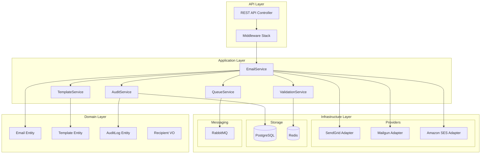

# Design Document: Email Microservice

## Overview

The Email Microservice is a PHP 8.x-based service that provides comprehensive email functionality including sending, validation, templating, queue management, and multi-provider support. It follows a hexagonal architecture pattern with clear separation between domain logic, infrastructure adapters, and API layer.

The service integrates with the existing Auth Platform ecosystem, using RabbitMQ for asynchronous processing, Redis for rate limiting and caching, PostgreSQL for persistence, and Prometheus for observability.

## Architecture



## Components and Interfaces

### 1. API Controller

```php
interface EmailControllerInterface
{
    public function send(SendEmailRequest $request): JsonResponse;
    public function verify(VerifyEmailRequest $request): JsonResponse;
    public function resend(ResendEmailRequest $request): JsonResponse;
    public function getStatus(string $emailId): JsonResponse;
    public function getAuditLogs(AuditQueryRequest $request): JsonResponse;
}
```

### 2. Email Service

```php
interface EmailServiceInterface
{
    public function send(EmailDTO $email): EmailResult;
    public function sendAsync(EmailDTO $email): string; // Returns queue job ID
    public function resend(string $emailId): EmailResult;
    public function getStatus(string $emailId): EmailStatus;
}
```

### 3. Validation Service

```php
interface ValidationServiceInterface
{
    public function validateEmail(string $email): ValidationResult;
    public function validateDomain(string $domain): DomainValidationResult;
    public function isDisposable(string $email): bool;
    public function checkRateLimit(string $senderId): RateLimitResult;
}
```

### 4. Template Service

```php
interface TemplateServiceInterface
{
    public function render(string $templateId, array $variables): RenderedTemplate;
    public function getTemplate(string $templateId): ?Template;
    public function validateVariables(string $templateId, array $variables): array;
}
```

### 5. Queue Service

```php
interface QueueServiceInterface
{
    public function enqueue(EmailJob $job, int $priority = 0): string;
    public function process(EmailJob $job): ProcessResult;
    public function retry(string $jobId): void;
    public function moveToDeadLetter(string $jobId, string $reason): void;
    public function getQueueDepth(): int;
}
```

### 6. Provider Interface

```php
interface EmailProviderInterface
{
    public function send(Email $email): ProviderResult;
    public function getDeliveryStatus(string $messageId): DeliveryStatus;
    public function getName(): string;
    public function isHealthy(): bool;
}
```

### 7. Audit Service

```php
interface AuditServiceInterface
{
    public function log(AuditEntry $entry): void;
    public function query(AuditQuery $query): AuditResultSet;
    public function getByEmailId(string $emailId): array;
}
```

## Data Models

### Email Entity

```php
class Email
{
    public readonly string $id;
    public readonly array $recipients;      // Recipient[]
    public readonly ?array $cc;
    public readonly ?array $bcc;
    public readonly string $from;
    public readonly string $subject;
    public readonly string $body;
    public readonly ContentType $contentType; // HTML or PLAIN
    public readonly array $attachments;     // Attachment[]
    public readonly array $headers;
    public readonly EmailStatus $status;
    public readonly DateTimeImmutable $createdAt;
    public readonly ?DateTimeImmutable $sentAt;
    public readonly array $metadata;
}
```

### Recipient Value Object

```php
class Recipient
{
    public readonly string $email;
    public readonly ?string $name;
    
    public function __construct(string $email, ?string $name = null)
    {
        if (!filter_var($email, FILTER_VALIDATE_EMAIL)) {
            throw new InvalidEmailException($email);
        }
        $this->email = $email;
        $this->name = $name;
    }
}
```

### Template Entity

```php
class Template
{
    public readonly string $id;
    public readonly string $name;
    public readonly string $subject;
    public readonly string $bodyHtml;
    public readonly ?string $bodyText;
    public readonly array $requiredVariables;
    public readonly array $defaultVariables;
    public readonly DateTimeImmutable $createdAt;
    public readonly DateTimeImmutable $updatedAt;
}
```

### AuditLog Entity

```php
class AuditLog
{
    public readonly string $id;
    public readonly string $emailId;
    public readonly string $action;         // SENT, FAILED, RETRIED, DELIVERED
    public readonly string $senderId;
    public readonly string $recipientEmail;
    public readonly string $subject;
    public readonly EmailStatus $status;
    public readonly ?string $errorMessage;
    public readonly ?string $providerName;
    public readonly ?string $providerMessageId;
    public readonly array $metadata;
    public readonly DateTimeImmutable $timestamp;
}
```

### EmailJob (Queue Message)

```php
class EmailJob
{
    public readonly string $id;
    public readonly Email $email;
    public readonly int $priority;
    public readonly int $attempts;
    public readonly int $maxAttempts;
    public readonly ?DateTimeImmutable $nextRetryAt;
    public readonly DateTimeImmutable $createdAt;
}
```

### Enums

```php
enum EmailStatus: string
{
    case PENDING = 'pending';
    case QUEUED = 'queued';
    case SENDING = 'sending';
    case SENT = 'sent';
    case DELIVERED = 'delivered';
    case FAILED = 'failed';
    case BOUNCED = 'bounced';
    case REJECTED = 'rejected';
}

enum ContentType: string
{
    case HTML = 'text/html';
    case PLAIN = 'text/plain';
}

enum AuditAction: string
{
    case CREATED = 'created';
    case QUEUED = 'queued';
    case SENT = 'sent';
    case DELIVERED = 'delivered';
    case FAILED = 'failed';
    case RETRIED = 'retried';
    case DEAD_LETTERED = 'dead_lettered';
}
```


## Correctness Properties

*A property is a characteristic or behavior that should hold true across all valid executions of a system—essentially, a formal statement about what the system should do. Properties serve as the bridge between human-readable specifications and machine-verifiable correctness guarantees.*

### Property 1: Valid Email Sending
*For any* valid email request with properly formatted recipient, subject, and body, the Email_Service SHALL successfully queue or send the email and return a success response with email ID.
**Validates: Requirements 1.1**

### Property 2: HTML Content Preservation
*For any* email with HTML content, the rendered email body SHALL contain the exact HTML structure provided in the request, with no content loss or corruption.
**Validates: Requirements 1.2**

### Property 3: Attachment Size Validation
*For any* email request with attachments, IF total attachment size is ≤ 25MB THEN attachments SHALL be included, ELSE the request SHALL be rejected with appropriate error.
**Validates: Requirements 1.3**

### Property 4: Multi-Recipient Individual Emails
*For any* email request with N recipients (N > 1), the Email_Service SHALL create exactly N individual email records, one per recipient.
**Validates: Requirements 1.5**

### Property 5: Provider Failover
*For any* email send attempt where the primary provider fails, the Email_Service SHALL attempt delivery via the configured secondary provider before returning failure.
**Validates: Requirements 1.6, 8.2**

### Property 6: RFC 5322 Email Validation
*For any* string submitted as an email address, the ValidationService SHALL return valid=true if and only if the string conforms to RFC 5322 format specification.
**Validates: Requirements 2.1**

### Property 7: MX Record Validation
*For any* email address with a syntactically valid format, the ValidationService SHALL verify the domain has at least one valid MX record before accepting.
**Validates: Requirements 2.2**

### Property 8: Disposable Domain Rejection
*For any* email address with a domain in the disposable domain list, the ValidationService SHALL reject the address with error code DISPOSABLE_EMAIL.
**Validates: Requirements 2.3**

### Property 9: Rate Limit Enforcement
*For any* sender who has sent N emails in the current time window where N ≥ configured limit, subsequent send requests SHALL return HTTP 429 with retry-after header.
**Validates: Requirements 2.4, 9.4**

### Property 10: Validation Error Specificity
*For any* invalid email request, the error response SHALL contain a specific error code that uniquely identifies the validation failure type.
**Validates: Requirements 2.5**

### Property 11: Failed Email Resend
*For any* email with status FAILED, a resend request SHALL create a new queue entry and return the new email ID.
**Validates: Requirements 3.1**

### Property 12: Retry Count Enforcement
*For any* email that fails delivery, the Queue_Processor SHALL retry exactly up to maxAttempts (default 3) times before marking as permanently failed.
**Validates: Requirements 3.2**

### Property 13: Dead Letter Queue Routing
*For any* email that has failed maxAttempts times, the Queue_Processor SHALL move it to the Dead_Letter_Queue with failure reason preserved.
**Validates: Requirements 3.3**

### Property 14: Verification Token Regeneration
*For any* verification email resend request, the Email_Service SHALL generate a new unique token different from any previous tokens for that email address.
**Validates: Requirements 3.4**

### Property 15: Template Variable Substitution
*For any* template with variables V and provided values M, the rendered output SHALL contain M[v] for each v in V where M[v] is defined.
**Validates: Requirements 4.1**

### Property 16: Default Variable Handling
*For any* template variable v not provided in the request, the Template_Engine SHALL substitute with defaultVariables[v] if defined, otherwise empty string.
**Validates: Requirements 4.2**

### Property 17: XSS Prevention
*For any* template variable value containing HTML special characters (<, >, &, ", '), the rendered output SHALL contain the escaped equivalents (&lt;, &gt;, &amp;, &quot;, &#039;).
**Validates: Requirements 4.3**

### Property 18: Twig Syntax Support
*For any* valid Twig template syntax (variables, filters, conditionals, loops), the Template_Engine SHALL correctly parse and render the template.
**Validates: Requirements 4.4**

### Property 19: Audit Log Completeness
*For any* email operation (send, fail, retry, deliver), the Audit_Logger SHALL create a log entry containing: emailId, action, senderId, recipientEmail, subject, status, timestamp, and errorMessage (if applicable).
**Validates: Requirements 5.1, 5.2**

### Property 20: Audit Log Filtering
*For any* audit query with filters (dateRange, status, sender), the returned results SHALL contain only entries matching ALL specified filter criteria.
**Validates: Requirements 5.4**

### Property 21: Queue Priority and FIFO Ordering
*For any* set of queued emails, processing order SHALL respect: (1) higher priority first, (2) FIFO within same priority level.
**Validates: Requirements 6.1, 6.2**

### Property 22: Exponential Backoff Timing
*For any* failed email on attempt N (1 ≤ N ≤ maxAttempts), the next retry SHALL be scheduled after 2^(N-1) seconds (1s, 2s, 4s, 8s, 16s).
**Validates: Requirements 6.3**

### Property 23: Email Authentication Headers
*For any* outgoing email, the headers SHALL include valid SPF, DKIM signature, and DMARC policy alignment.
**Validates: Requirements 7.4**

### Property 24: PII Masking in Logs
*For any* log entry containing email addresses or personal data, the logged value SHALL be masked (e.g., j***@example.com) to prevent PII exposure.
**Validates: Requirements 7.5**

### Property 25: Provider Routing by Email Type
*For any* email with specified type (transactional, marketing, verification), the Email_Service SHALL route to the provider configured for that type.
**Validates: Requirements 8.3**

### Property 26: Per-Provider Metrics
*For any* email sent through a provider, the metrics system SHALL increment counters for that specific provider (sent, delivered, failed, bounced).
**Validates: Requirements 8.5**

### Property 27: Per-Sender Rate Limiting
*For any* sender, the Rate_Limiter SHALL track and enforce the configured limit (default 100/minute) independently of other senders.
**Validates: Requirements 9.1**

### Property 28: Global Provider Rate Limiting
*For any* provider, the Rate_Limiter SHALL enforce the provider's quota limit across all senders combined.
**Validates: Requirements 9.2**

### Property 29: Graceful Rate Limit Approach
*For any* sender approaching rate limit (≥80% of limit), new emails SHALL be queued for delayed delivery rather than rejected.
**Validates: Requirements 9.3**

### Property 30: API Request Validation
*For any* API request, the controller SHALL validate the request body against the JSON schema and return structured error response with field-level errors for invalid requests.
**Validates: Requirements 10.6, 10.7**

## Error Handling

### Error Categories

1. **Validation Errors (4xx)**
   - Invalid email format
   - Missing required fields
   - Attachment size exceeded
   - Rate limit exceeded
   - Invalid template ID

2. **Provider Errors (5xx)**
   - Provider connection failure
   - Provider authentication failure
   - Provider rate limit
   - Provider service unavailable

3. **System Errors (5xx)**
   - Database connection failure
   - Queue connection failure
   - Template rendering failure

### Error Response Format

```php
class ErrorResponse
{
    public readonly string $code;           // e.g., "INVALID_EMAIL_FORMAT"
    public readonly string $message;        // Human-readable message
    public readonly ?array $details;        // Field-level errors
    public readonly string $correlationId;  // Request tracking ID
    public readonly DateTimeImmutable $timestamp;
}
```

### Error Codes

| Code | HTTP Status | Description |
|------|-------------|-------------|
| INVALID_EMAIL_FORMAT | 400 | Email address doesn't match RFC 5322 |
| INVALID_DOMAIN | 400 | Domain has no valid MX records |
| DISPOSABLE_EMAIL | 400 | Disposable email domain detected |
| ATTACHMENT_TOO_LARGE | 400 | Total attachments exceed 25MB |
| TEMPLATE_NOT_FOUND | 404 | Requested template doesn't exist |
| EMAIL_NOT_FOUND | 404 | Email ID not found |
| RATE_LIMIT_EXCEEDED | 429 | Sender rate limit exceeded |
| PROVIDER_RATE_LIMIT | 429 | Provider quota exceeded |
| AUTHENTICATION_FAILED | 401 | Invalid API credentials |
| PROVIDER_ERROR | 502 | Email provider returned error |
| QUEUE_ERROR | 503 | Message queue unavailable |

### Retry Strategy

```php
class RetryConfig
{
    public int $maxAttempts = 3;
    public int $baseDelaySeconds = 1;
    public float $multiplier = 2.0;
    public int $maxDelaySeconds = 16;
    public array $retryableErrors = [
        'PROVIDER_ERROR',
        'QUEUE_ERROR',
        'PROVIDER_RATE_LIMIT'
    ];
}
```

## Testing Strategy

### Dual Testing Approach

The Email Microservice uses both unit tests and property-based tests for comprehensive coverage:

- **Unit Tests**: Verify specific examples, edge cases, and error conditions
- **Property-Based Tests**: Verify universal properties across all valid inputs

### Testing Framework

- **PHPUnit 11.x**: Primary testing framework
- **PHPUnit/Hypothesis-PHP** or **Eris**: Property-based testing library
- **Mockery**: Mocking framework for unit tests

### Property-Based Test Configuration

```php
// Each property test runs minimum 100 iterations
#[CoversProperty('email-microservice', 1)]
public function testValidEmailSending(): void
{
    $this->forAll(
        Generator::validEmailRequest()
    )->then(function (EmailRequest $request) {
        $result = $this->emailService->send($request);
        $this->assertTrue($result->isSuccess());
        $this->assertNotEmpty($result->getEmailId());
    });
}
```

### Test Categories

1. **Unit Tests**
   - Recipient value object validation
   - Email entity creation
   - Template variable substitution
   - Error code mapping
   - Rate limit calculation

2. **Property-Based Tests**
   - Email validation (RFC 5322 compliance)
   - Template rendering (variable substitution)
   - Queue ordering (priority + FIFO)
   - Rate limiting (limit enforcement)
   - Audit logging (completeness)
   - XSS prevention (HTML escaping)

3. **Integration Tests**
   - Provider adapter connectivity
   - Queue message processing
   - Database persistence
   - Redis rate limiting

### Test File Structure

```
services/email-service/
├── tests/
│   ├── Unit/
│   │   ├── Domain/
│   │   │   ├── EmailTest.php
│   │   │   ├── RecipientTest.php
│   │   │   └── TemplateTest.php
│   │   ├── Service/
│   │   │   ├── EmailServiceTest.php
│   │   │   ├── ValidationServiceTest.php
│   │   │   └── TemplateServiceTest.php
│   │   └── Infrastructure/
│   │       ├── SendGridAdapterTest.php
│   │       └── RateLimiterTest.php
│   ├── Property/
│   │   ├── EmailValidationPropertyTest.php
│   │   ├── TemplateRenderingPropertyTest.php
│   │   ├── QueueOrderingPropertyTest.php
│   │   ├── RateLimitPropertyTest.php
│   │   ├── AuditLoggingPropertyTest.php
│   │   └── XssPreventionPropertyTest.php
│   └── Integration/
│       ├── ProviderIntegrationTest.php
│       ├── QueueIntegrationTest.php
│       └── DatabaseIntegrationTest.php
```

### Coverage Requirements

- Unit tests: 80% code coverage minimum
- Property tests: All 30 correctness properties covered
- Integration tests: All external dependencies tested
