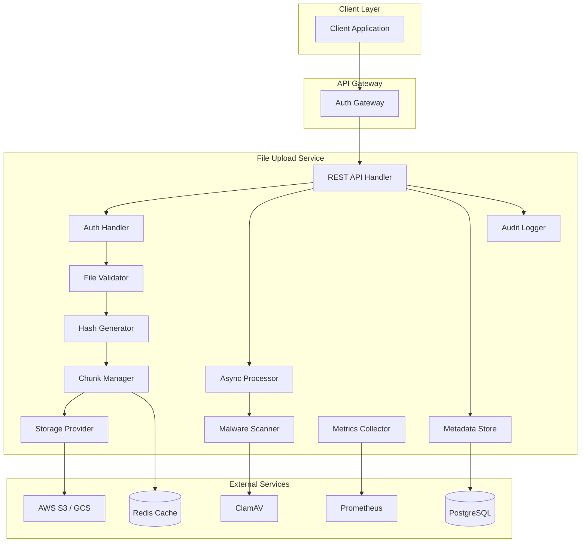
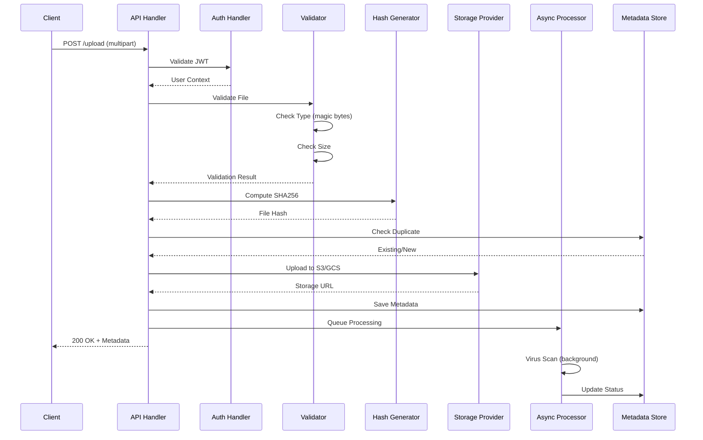

# Design Document: File Upload Service

## Overview

The File Upload Service is a high-performance Golang microservice designed to handle secure file uploads with cloud storage integration. It provides RESTful APIs for uploading, managing, and retrieving files with support for chunked uploads, asynchronous processing, and comprehensive security features.

The service integrates with the Auth Platform ecosystem, leveraging existing authentication infrastructure (JWT/OAuth2) and following established patterns for observability, resilience, and multi-tenancy.

## Architecture



### Request Flow



## Components and Interfaces

### 1. REST API Handler

```go
// Handler defines the HTTP API interface
type Handler interface {
    // Upload handles single file upload
    Upload(ctx context.Context, req *UploadRequest) (*UploadResponse, error)
    
    // InitChunkedUpload starts a chunked upload session
    InitChunkedUpload(ctx context.Context, req *InitChunkRequest) (*ChunkSession, error)
    
    // UploadChunk uploads a single chunk
    UploadChunk(ctx context.Context, sessionID string, chunk *ChunkData) error
    
    // CompleteChunkedUpload finalizes chunked upload
    CompleteChunkedUpload(ctx context.Context, sessionID string) (*UploadResponse, error)
    
    // GetFile retrieves file metadata
    GetFile(ctx context.Context, fileID string) (*FileMetadata, error)
    
    // ListFiles lists files with pagination
    ListFiles(ctx context.Context, req *ListRequest) (*ListResponse, error)
    
    // DeleteFile soft-deletes a file
    DeleteFile(ctx context.Context, fileID string) error
    
    // GetDownloadURL generates signed download URL
    GetDownloadURL(ctx context.Context, fileID string) (*DownloadURL, error)
}
```

### 2. File Validator

```go
// Validator defines file validation interface
type Validator interface {
    // ValidateType checks file type using magic bytes
    ValidateType(content io.Reader) (MIMEType, error)
    
    // ValidateSize checks file size against limits
    ValidateSize(size int64, isChunked bool) error
    
    // ValidateExtension checks extension matches content type
    ValidateExtension(filename string, mimeType MIMEType) error
    
    // IsAllowedType checks if MIME type is in allowlist
    IsAllowedType(mimeType MIMEType) bool
}

// MIMEType represents a validated MIME type
type MIMEType string

const (
    MIMETypeJPEG MIMEType = "image/jpeg"
    MIMETypePNG  MIMEType = "image/png"
    MIMETypeGIF  MIMEType = "image/gif"
    MIMETypePDF  MIMEType = "application/pdf"
    MIMETypeMP4  MIMEType = "video/mp4"
    MIMETypeMOV  MIMEType = "video/quicktime"
    MIMETypeDOCX MIMEType = "application/vnd.openxmlformats-officedocument.wordprocessingml.document"
    MIMETypeXLSX MIMEType = "application/vnd.openxmlformats-officedocument.spreadsheetml.sheet"
)
```

### 3. Hash Generator

```go
// HashGenerator defines file hashing interface
type HashGenerator interface {
    // ComputeHash computes SHA256 hash from reader (streaming)
    ComputeHash(content io.Reader) (string, error)
    
    // ComputeHashWithSize computes hash and returns size
    ComputeHashWithSize(content io.Reader) (hash string, size int64, err error)
    
    // VerifyHash verifies content matches expected hash
    VerifyHash(content io.Reader, expectedHash string) (bool, error)
}
```

### 4. Storage Provider

```go
// StorageProvider defines cloud storage interface
type StorageProvider interface {
    // Upload uploads file to cloud storage
    Upload(ctx context.Context, req *StorageRequest) (*StorageResult, error)
    
    // Download retrieves file from storage
    Download(ctx context.Context, path string) (io.ReadCloser, error)
    
    // Delete removes file from storage
    Delete(ctx context.Context, path string) error
    
    // GenerateSignedURL creates time-limited access URL
    GenerateSignedURL(ctx context.Context, path string, expiry time.Duration) (string, error)
    
    // GeneratePublicURL creates permanent public URL
    GeneratePublicURL(ctx context.Context, path string) string
    
    // Exists checks if file exists
    Exists(ctx context.Context, path string) (bool, error)
}

// StorageRequest contains upload parameters
type StorageRequest struct {
    TenantID    string
    FileHash    string
    Filename    string
    Content     io.Reader
    ContentType string
    Size        int64
    Metadata    map[string]string
}

// StorageResult contains upload result
type StorageResult struct {
    Path      string
    URL       string
    ETag      string
    VersionID string
}
```

### 5. Chunk Manager

```go
// ChunkManager handles chunked uploads
type ChunkManager interface {
    // CreateSession creates new upload session
    CreateSession(ctx context.Context, req *CreateSessionRequest) (*ChunkSession, error)
    
    // UploadChunk stores a chunk
    UploadChunk(ctx context.Context, sessionID string, chunk *ChunkData) error
    
    // GetSession retrieves session state
    GetSession(ctx context.Context, sessionID string) (*ChunkSession, error)
    
    // CompleteUpload assembles chunks and finalizes
    CompleteUpload(ctx context.Context, sessionID string) (*AssembledFile, error)
    
    // AbortUpload cancels session and cleans up
    AbortUpload(ctx context.Context, sessionID string) error
    
    // CleanupExpiredSessions removes stale sessions
    CleanupExpiredSessions(ctx context.Context) (int, error)
}

// ChunkSession represents an upload session
type ChunkSession struct {
    ID            string
    TenantID      string
    UserID        string
    Filename      string
    TotalSize     int64
    ChunkSize     int64
    TotalChunks   int
    UploadedChunks []int
    CreatedAt     time.Time
    ExpiresAt     time.Time
    Status        SessionStatus
}

// ChunkData represents a single chunk
type ChunkData struct {
    Index    int
    Content  io.Reader
    Size     int64
    Checksum string
}
```

### 6. Async Processor

```go
// AsyncProcessor handles background processing
type AsyncProcessor interface {
    // QueueProcessing queues file for async processing
    QueueProcessing(ctx context.Context, fileID string, tasks []ProcessingTask) error
    
    // ProcessFile executes processing tasks
    ProcessFile(ctx context.Context, fileID string) error
    
    // GetProcessingStatus returns current processing status
    GetProcessingStatus(ctx context.Context, fileID string) (*ProcessingStatus, error)
}

// ProcessingTask defines a processing task type
type ProcessingTask string

const (
    TaskVirusScan         ProcessingTask = "virus_scan"
    TaskThumbnailGenerate ProcessingTask = "thumbnail_generate"
    TaskMetadataExtract   ProcessingTask = "metadata_extract"
)

// ProcessingStatus represents processing state
type ProcessingStatus struct {
    FileID      string
    Status      string // pending, processing, completed, failed
    Tasks       map[ProcessingTask]TaskStatus
    StartedAt   *time.Time
    CompletedAt *time.Time
    Error       string
}
```

### 7. Malware Scanner

```go
// MalwareScanner defines virus scanning interface
type MalwareScanner interface {
    // Scan scans file content for malware
    Scan(ctx context.Context, content io.Reader) (*ScanResult, error)
    
    // IsAvailable checks if scanner is operational
    IsAvailable(ctx context.Context) bool
}

// ScanResult contains scan results
type ScanResult struct {
    Clean       bool
    ThreatName  string
    ThreatType  string
    ScannedAt   time.Time
    ScannerName string
}
```

### 8. Metadata Store

```go
// MetadataStore defines file metadata persistence
type MetadataStore interface {
    // Create stores new file metadata
    Create(ctx context.Context, metadata *FileMetadata) error
    
    // GetByID retrieves metadata by ID
    GetByID(ctx context.Context, id string) (*FileMetadata, error)
    
    // GetByHash retrieves metadata by hash (for deduplication)
    GetByHash(ctx context.Context, tenantID, hash string) (*FileMetadata, error)
    
    // List retrieves files with pagination and filters
    List(ctx context.Context, req *ListRequest) (*ListResult, error)
    
    // Search searches files by name or hash
    Search(ctx context.Context, tenantID, query string) ([]*FileMetadata, error)
    
    // Update updates file metadata
    Update(ctx context.Context, metadata *FileMetadata) error
    
    // SoftDelete marks file as deleted
    SoftDelete(ctx context.Context, id string) error
    
    // HardDelete permanently removes metadata
    HardDelete(ctx context.Context, id string) error
    
    // GetExpiredDeleted retrieves files past retention period
    GetExpiredDeleted(ctx context.Context, before time.Time) ([]*FileMetadata, error)
}
```

### 9. Auth Handler

```go
// AuthHandler defines authentication/authorization interface
type AuthHandler interface {
    // ValidateToken validates JWT and returns user context
    ValidateToken(ctx context.Context, token string) (*UserContext, error)
    
    // AuthorizeAccess checks if user can access resource
    AuthorizeAccess(ctx context.Context, userCtx *UserContext, resourceTenantID string) error
}

// UserContext contains authenticated user information
type UserContext struct {
    UserID    string
    TenantID  string
    Roles     []string
    ExpiresAt time.Time
}
```

## Data Models

### FileMetadata

```go
// FileMetadata represents stored file information
type FileMetadata struct {
    ID            string            `json:"id" db:"id"`
    TenantID      string            `json:"tenant_id" db:"tenant_id"`
    UserID        string            `json:"user_id" db:"user_id"`
    Filename      string            `json:"filename" db:"filename"`
    OriginalName  string            `json:"original_name" db:"original_name"`
    MIMEType      string            `json:"mime_type" db:"mime_type"`
    Size          int64             `json:"size" db:"size"`
    Hash          string            `json:"hash" db:"hash"`
    StoragePath   string            `json:"storage_path" db:"storage_path"`
    StorageURL    string            `json:"storage_url,omitempty" db:"storage_url"`
    Status        FileStatus        `json:"status" db:"status"`
    ScanStatus    ScanStatus        `json:"scan_status" db:"scan_status"`
    Metadata      map[string]string `json:"metadata,omitempty" db:"metadata"`
    CreatedAt     time.Time         `json:"created_at" db:"created_at"`
    UpdatedAt     time.Time         `json:"updated_at" db:"updated_at"`
    DeletedAt     *time.Time        `json:"deleted_at,omitempty" db:"deleted_at"`
}

// FileStatus represents file lifecycle status
type FileStatus string

const (
    FileStatusPending    FileStatus = "pending"
    FileStatusUploaded   FileStatus = "uploaded"
    FileStatusProcessing FileStatus = "processing"
    FileStatusReady      FileStatus = "ready"
    FileStatusFailed     FileStatus = "failed"
    FileStatusDeleted    FileStatus = "deleted"
)

// ScanStatus represents malware scan status
type ScanStatus string

const (
    ScanStatusPending  ScanStatus = "pending"
    ScanStatusScanning ScanStatus = "scanning"
    ScanStatusClean    ScanStatus = "clean"
    ScanStatusInfected ScanStatus = "infected"
    ScanStatusFailed   ScanStatus = "failed"
)
```

### API Request/Response Models

```go
// UploadRequest represents upload API request
type UploadRequest struct {
    File        io.Reader
    Filename    string
    ContentType string
    Size        int64
    Metadata    map[string]string
}

// UploadResponse represents upload API response
type UploadResponse struct {
    ID          string            `json:"id"`
    Filename    string            `json:"filename"`
    Size        int64             `json:"size"`
    Hash        string            `json:"hash"`
    MIMEType    string            `json:"mime_type"`
    StoragePath string            `json:"storage_path"`
    URL         string            `json:"url,omitempty"`
    Status      FileStatus        `json:"status"`
    CreatedAt   time.Time         `json:"created_at"`
    Metadata    map[string]string `json:"metadata,omitempty"`
}

// ListRequest represents list API request
type ListRequest struct {
    TenantID  string
    PageSize  int
    PageToken string
    StartDate *time.Time
    EndDate   *time.Time
    SortBy    string
    SortOrder string
    Status    *FileStatus
}

// ListResponse represents list API response
type ListResponse struct {
    Files         []*FileMetadata `json:"files"`
    NextPageToken string          `json:"next_page_token,omitempty"`
    TotalCount    int64           `json:"total_count"`
}

// ErrorResponse represents API error response
type ErrorResponse struct {
    Code      string `json:"code"`
    Message   string `json:"message"`
    RequestID string `json:"request_id"`
    Details   any    `json:"details,omitempty"`
}
```

### Database Schema

```sql
CREATE TABLE files (
    id UUID PRIMARY KEY DEFAULT gen_random_uuid(),
    tenant_id VARCHAR(64) NOT NULL,
    user_id VARCHAR(64) NOT NULL,
    filename VARCHAR(255) NOT NULL,
    original_name VARCHAR(255) NOT NULL,
    mime_type VARCHAR(128) NOT NULL,
    size BIGINT NOT NULL,
    hash VARCHAR(64) NOT NULL,
    storage_path VARCHAR(512) NOT NULL,
    storage_url VARCHAR(1024),
    status VARCHAR(32) NOT NULL DEFAULT 'pending',
    scan_status VARCHAR(32) NOT NULL DEFAULT 'pending',
    metadata JSONB,
    created_at TIMESTAMP WITH TIME ZONE NOT NULL DEFAULT NOW(),
    updated_at TIMESTAMP WITH TIME ZONE NOT NULL DEFAULT NOW(),
    deleted_at TIMESTAMP WITH TIME ZONE,
    
    CONSTRAINT unique_tenant_hash UNIQUE (tenant_id, hash)
);

CREATE INDEX idx_files_tenant_id ON files(tenant_id);
CREATE INDEX idx_files_user_id ON files(user_id);
CREATE INDEX idx_files_hash ON files(hash);
CREATE INDEX idx_files_status ON files(status);
CREATE INDEX idx_files_created_at ON files(created_at);
CREATE INDEX idx_files_deleted_at ON files(deleted_at) WHERE deleted_at IS NOT NULL;

CREATE TABLE chunk_sessions (
    id UUID PRIMARY KEY DEFAULT gen_random_uuid(),
    tenant_id VARCHAR(64) NOT NULL,
    user_id VARCHAR(64) NOT NULL,
    filename VARCHAR(255) NOT NULL,
    total_size BIGINT NOT NULL,
    chunk_size BIGINT NOT NULL,
    total_chunks INT NOT NULL,
    uploaded_chunks INT[] DEFAULT '{}',
    status VARCHAR(32) NOT NULL DEFAULT 'active',
    created_at TIMESTAMP WITH TIME ZONE NOT NULL DEFAULT NOW(),
    expires_at TIMESTAMP WITH TIME ZONE NOT NULL,
    completed_at TIMESTAMP WITH TIME ZONE
);

CREATE INDEX idx_chunk_sessions_tenant ON chunk_sessions(tenant_id);
CREATE INDEX idx_chunk_sessions_expires ON chunk_sessions(expires_at);
CREATE INDEX idx_chunk_sessions_status ON chunk_sessions(status);

CREATE TABLE audit_logs (
    id UUID PRIMARY KEY DEFAULT gen_random_uuid(),
    tenant_id VARCHAR(64) NOT NULL,
    user_id VARCHAR(64) NOT NULL,
    file_id UUID,
    operation VARCHAR(32) NOT NULL,
    filename VARCHAR(255),
    file_size BIGINT,
    file_hash VARCHAR(64),
    source_ip VARCHAR(45),
    user_agent VARCHAR(512),
    request_id VARCHAR(64),
    details JSONB,
    created_at TIMESTAMP WITH TIME ZONE NOT NULL DEFAULT NOW()
);

CREATE INDEX idx_audit_logs_tenant ON audit_logs(tenant_id);
CREATE INDEX idx_audit_logs_file ON audit_logs(file_id);
CREATE INDEX idx_audit_logs_created ON audit_logs(created_at);
```

## Correctness Properties

*A property is a characteristic or behavior that should hold true across all valid executions of a system—essentially, a formal statement about what the system should do. Properties serve as the bridge between human-readable specifications and machine-verifiable correctness guarantees.*

### Property 1: Upload Response Completeness

*For any* successful file upload, the response SHALL contain all required metadata fields: id, filename, size, hash, mime_type, storage_path, status, and created_at.

**Validates: Requirements 1.2, 5.4**

### Property 2: File Type Validation Correctness

*For any* uploaded file, the File_Validator SHALL correctly identify the MIME type by inspecting magic bytes, and SHALL reject files where the extension does not match the detected content type or the type is not in the allowlist.

**Validates: Requirements 2.1, 2.2, 2.3**

### Property 3: File Size Validation

*For any* file upload, if the file size exceeds the configured maximum (10MB for regular, 5GB for chunked), the upload SHALL be rejected with HTTP 400 before any storage operation occurs.

**Validates: Requirements 3.1, 3.2**

### Property 4: Storage Path Structure

*For any* successfully stored file, the storage path SHALL follow the format `/{tenant_id}/{year}/{month}/{day}/{file_hash}/{filename}` where year/month/day correspond to the upload timestamp.

**Validates: Requirements 4.5**

### Property 5: Hash Computation Correctness

*For any* uploaded file, the computed SHA256 hash SHALL be deterministic—uploading the same file content SHALL always produce the same hash value.

**Validates: Requirements 5.1**

### Property 6: File Deduplication

*For any* file upload where a file with identical hash already exists for the same tenant, the service SHALL return the existing file reference without creating a duplicate storage entry.

**Validates: Requirements 5.2**

### Property 7: Chunked Upload Round-Trip

*For any* file uploaded via chunking, reassembling all chunks in order SHALL produce a file with identical content (verified by hash) to the original file.

**Validates: Requirements 6.3**

### Property 8: Async Processing Independence

*For any* file upload, the API response time SHALL NOT depend on async processing duration—the response SHALL be returned immediately after storage completion.

**Validates: Requirements 7.3**

### Property 9: Authentication Enforcement

*For any* API request without a valid JWT token (missing, malformed, or expired), the service SHALL return HTTP 401 without processing the request.

**Validates: Requirements 8.1, 8.4**

### Property 10: Tenant Isolation

*For any* authenticated request, the service SHALL only return files belonging to the user's tenant—cross-tenant access attempts SHALL result in HTTP 403.

**Validates: Requirements 8.2, 13.2**

### Property 11: Rate Limiting Enforcement

*For any* tenant exceeding the configured rate limit, subsequent requests SHALL receive HTTP 429 with a Retry-After header indicating when requests can resume.

**Validates: Requirements 10.2, 10.3**

### Property 12: Concurrent Upload Handling

*For any* set of concurrent upload requests, all valid uploads SHALL complete successfully without data corruption or race conditions.

**Validates: Requirements 10.1**

### Property 13: Structured Logging Format

*For any* API request, the generated log entry SHALL be valid JSON containing at minimum: timestamp, level, correlation_id, tenant_id, and message fields.

**Validates: Requirements 11.2**

### Property 14: Audit Log Completeness

*For any* file operation (upload, access, delete), an audit log entry SHALL be created containing: filename, size, hash, user_id, tenant_id, timestamp, and source_ip.

**Validates: Requirements 12.1, 12.2**

### Property 15: Audit Log Security

*For any* audit log entry, the content SHALL NOT contain file content bytes, passwords, tokens, or other PII beyond user identifiers.

**Validates: Requirements 12.3**

### Property 16: Metadata Persistence

*For any* successfully uploaded file, querying the metadata store by file ID SHALL return metadata matching the upload response.

**Validates: Requirements 13.1**

### Property 17: File Listing and Search

*For any* list or search request, the results SHALL only include files matching the filter criteria and belonging to the requesting tenant, with correct pagination.

**Validates: Requirements 13.3, 13.4**

### Property 18: Soft-Delete Behavior

*For any* deleted file, the metadata SHALL be marked with deleted_at timestamp and excluded from normal list/search results, but the storage content SHALL remain until retention period expires.

**Validates: Requirements 14.1**

### Property 19: Delete Authorization

*For any* file deletion request, the service SHALL verify the requesting user has authorization (same tenant) before marking the file as deleted.

**Validates: Requirements 14.3**

## Error Handling

### Error Categories

| Category | HTTP Status | Error Code | Description |
|----------|-------------|------------|-------------|
| Validation | 400 | INVALID_FILE_TYPE | File type not in allowlist |
| Validation | 400 | FILE_TOO_LARGE | File exceeds size limit |
| Validation | 400 | EXTENSION_MISMATCH | Extension doesn't match content |
| Validation | 400 | MALWARE_DETECTED | File contains malware |
| Authentication | 401 | INVALID_TOKEN | JWT token invalid or expired |
| Authentication | 401 | MISSING_TOKEN | No authorization header |
| Authorization | 403 | ACCESS_DENIED | User cannot access resource |
| Not Found | 404 | FILE_NOT_FOUND | File does not exist |
| Rate Limit | 429 | RATE_LIMIT_EXCEEDED | Too many requests |
| Internal | 500 | STORAGE_ERROR | Cloud storage operation failed |
| Internal | 500 | DATABASE_ERROR | Database operation failed |
| Internal | 500 | SCANNER_ERROR | Malware scanner unavailable |

### Error Response Format

```go
type ErrorResponse struct {
    Code      string            `json:"code"`
    Message   string            `json:"message"`
    RequestID string            `json:"request_id"`
    Details   map[string]any    `json:"details,omitempty"`
    Timestamp time.Time         `json:"timestamp"`
}
```

### Retry Strategy

For transient errors (storage failures, scanner unavailability):
- Maximum 3 retry attempts
- Exponential backoff: 100ms, 200ms, 400ms
- Circuit breaker after 5 consecutive failures

## Testing Strategy

### Unit Tests

Unit tests verify individual component behavior:

- **Validator Tests**: Magic byte detection, size validation, extension matching
- **Hash Generator Tests**: SHA256 computation correctness, streaming behavior
- **Storage Provider Tests**: Path generation, URL signing (with mocked S3/GCS)
- **Chunk Manager Tests**: Session management, chunk assembly
- **Auth Handler Tests**: Token validation, authorization checks

### Property-Based Tests

Property-based tests verify universal properties using the `testing/quick` package or `gopter`:

- **Configuration**: Minimum 100 iterations per property
- **Tag Format**: `Feature: file-upload-service, Property N: {property_text}`
- **Framework**: `github.com/leanovate/gopter` for Go property-based testing

Each correctness property (1-19) SHALL have a corresponding property-based test that:
1. Generates random valid inputs
2. Executes the operation
3. Verifies the property holds

### Integration Tests

Integration tests verify component interactions:

- Upload flow: API → Validator → Hash → Storage → Metadata
- Chunked upload: Init → Upload chunks → Complete → Verify
- Authentication flow: Token validation → Authorization → Operation
- Async processing: Upload → Queue → Process → Status update

### Test Coverage Requirements

- Unit tests: 80% line coverage minimum
- Property tests: All 19 correctness properties
- Integration tests: All critical paths
- E2E tests: Happy path and error scenarios
