# Design Document: Go Libraries State-of-the-Art Modernization 2025

## Overview

This design document describes the architectural modernization of the `libs/go` library collection to achieve state-of-the-art standards as of December 2025. The modernization eliminates redundancy, centralizes logic, adopts Go 1.25+ features, and restructures the architecture for maximum reusability.

### Goals

1. **Zero Redundancy**: Single authoritative implementation for each concept
2. **Extreme Centralization**: Business rules and validations in single locations
3. **State-of-the-Art**: Go 1.25+, OpenTelemetry, slog, generics everywhere
4. **Minimal Dense Code**: Small, direct, expressive implementations
5. **Mandatory Reusability**: Generic abstractions over concrete implementations

### Non-Goals

- Breaking public API contracts without migration path
- Removing functionality (only consolidating)
- Supporting Go versions < 1.25

## Architecture

### Current State Analysis

The current `libs/go` structure has significant redundancy:

```
Redundancy Map:
┌─────────────────────────────────────────────────────────────────┐
│ DUPLICATE: LRU Cache                                            │
│   src/cache/lru.go (175 lines)                                  │
│   src/collections/lru.go (155 lines)                            │
│   → Consolidate to: src/collections/lru.go                      │
├─────────────────────────────────────────────────────────────────┤
│ DUPLICATE: Codec                                                │
│   src/codec/codec.go (165 lines)                                │
│   src/utils/codec.go (70 lines)                                 │
│   → Consolidate to: src/codec/codec.go                          │
├─────────────────────────────────────────────────────────────────┤
│ DUPLICATE: Validation                                           │
│   src/validation/validation.go (220 lines)                      │
│   src/utils/validation.go (175 lines)                           │
│   → Consolidate to: src/validation/validation.go                │
├─────────────────────────────────────────────────────────────────┤
│ FRAGMENTED: Micro-modules in go.work (60+ entries)              │
│   functional/option, functional/result, functional/either...    │
│   resilience/circuitbreaker, resilience/retry...                │
│   → Consolidate to domain-aligned modules                       │
└─────────────────────────────────────────────────────────────────┘
```

### Target Architecture

```
libs/go/
├── src/                          # Source code (24 modules max)
│   ├── cache/                    # REMOVE - merge to collections
│   ├── codec/                    # Unified encoding/decoding
│   ├── collections/              # Generic collections + LRU
│   ├── concurrency/              # Async primitives
│   ├── config/                   # Configuration management
│   ├── domain/                   # Domain value objects
│   ├── errors/                   # Base error types
│   ├── events/                   # Event bus, pub/sub
│   ├── functional/               # Option, Result, Either, Pipeline
│   ├── grpc/                     # gRPC utilities
│   ├── http/                     # HTTP client & middleware
│   ├── idempotency/              # Idempotency handling
│   ├── observability/            # OpenTelemetry + slog
│   ├── optics/                   # Lens, Prism
│   ├── pagination/               # Cursor/offset pagination
│   ├── patterns/                 # Registry, Specification
│   ├── resilience/               # Circuit breaker, retry, etc.
│   ├── security/                 # Security utilities
│   ├── server/                   # Health, shutdown
│   ├── testing/                  # Test utilities, generators
│   ├── utils/                    # REMOVE - distribute to domains
│   ├── validation/               # Composable validation
│   ├── versioning/               # API versioning
│   ├── workerpool/               # Generic worker pool
│   └── go.work                   # Workspace (24 modules)
│
├── tests/                        # Test code (mirrors src/)
│   ├── codec/
│   ├── collections/
│   ├── concurrency/
│   ├── ... (mirrors src/)
│   └── go.work
│
├── README.md
├── CHANGELOG.md
└── MIGRATION.md
```

### Module Consolidation Strategy

```mermaid
graph TD
    subgraph "Before: 60+ Micro-modules"
        F1[functional/option]
        F2[functional/result]
        F3[functional/either]
        F4[functional/iterator]
        F5[functional/lazy]
        F6[functional/pipeline]
        F7[functional/stream]
        F8[functional/tuple]
        
        R1[resilience/circuitbreaker]
        R2[resilience/retry]
        R3[resilience/ratelimit]
        R4[resilience/bulkhead]
        R5[resilience/timeout]
        R6[resilience/domain]
        R7[resilience/errors]
    end
    
    subgraph "After: Domain-aligned Modules"
        FUNC[src/functional]
        RES[src/resilience]
    end
    
    F1 --> FUNC
    F2 --> FUNC
    F3 --> FUNC
    F4 --> FUNC
    F5 --> FUNC
    F6 --> FUNC
    F7 --> FUNC
    F8 --> FUNC
    
    R1 --> RES
    R2 --> RES
    R3 --> RES
    R4 --> RES
    R5 --> RES
    R6 --> RES
    R7 --> RES
```



## Components and Interfaces

### 1. Unified Collections Module

```go
// src/collections/collections.go
package collections

import (
    "iter"
    "github.com/authcorp/libs/go/src/functional"
)

// Iterator provides Go 1.23+ iterator support
type Iterator[T any] interface {
    All() iter.Seq[T]
    Collect() []T
}

// Collection is the base interface for all collections
type Collection[T any] interface {
    Iterator[T]
    Size() int
    IsEmpty() bool
    Clear()
}
```

```go
// src/collections/lru.go (consolidated)
package collections

// LRUCache is the single authoritative LRU implementation
type LRUCache[K comparable, V any] struct {
    capacity   int
    items      map[K]*list.Element
    order      *list.List
    mu         sync.RWMutex
    onEvict    func(K, V)
    ttl        time.Duration
    stats      Stats
}

// Get returns Option[V] for type-safe access
func (c *LRUCache[K, V]) Get(key K) functional.Option[V]

// GetOrCompute returns cached value or computes and caches
func (c *LRUCache[K, V]) GetOrCompute(key K, compute func() V) V

// All returns Go 1.23+ iterator
func (c *LRUCache[K, V]) All() iter.Seq2[K, V]
```

### 2. Unified Codec Module

```go
// src/codec/codec.go (consolidated)
package codec

import "github.com/authcorp/libs/go/src/functional"

// Codec provides encoding/decoding operations
type Codec interface {
    Encode(v any) ([]byte, error)
    Decode(data []byte, v any) error
}

// TypedCodec provides generic type-safe operations
type TypedCodec[T any] interface {
    Encode(T) ([]byte, error)
    Decode([]byte) (T, error)
}

// EncodeResult returns Result for functional error handling
func EncodeResult[T any](codec TypedCodec[T], v T) functional.Result[[]byte]

// DecodeResult returns Result for functional error handling
func DecodeResult[T any](codec TypedCodec[T], data []byte) functional.Result[T]
```

### 3. Unified Validation Module

```go
// src/validation/validation.go (consolidated)
package validation

// Validator is a function that validates a value
type Validator[T any] func(T) *ValidationError

// Result accumulates validation errors
type Result struct {
    errors []ValidationError
}

// And combines validators with AND logic
func And[T any](validators ...Validator[T]) Validator[T]

// Or combines validators with OR logic
func Or[T any](validators ...Validator[T]) Validator[T]

// Not negates a validator
func Not[T any](validator Validator[T], message, code string) Validator[T]

// Field creates a field validator with path tracking
func Field[T any](path string, value T, validators ...Validator[T]) *Result
```

### 4. Unified Error Types

```go
// src/errors/errors.go
package errors

import (
    "errors"
    "net/http"
    "google.golang.org/grpc/codes"
)

// AppError is the base error type for all application errors
type AppError struct {
    Code       string         `json:"code"`
    Message    string         `json:"message"`
    Details    map[string]any `json:"details,omitempty"`
    HTTPStatus int            `json:"-"`
    GRPCCode   codes.Code     `json:"-"`
    Cause      error          `json:"-"`
}

// Is implements errors.Is for error comparison
func (e *AppError) Is(target error) bool

// As implements errors.As for error type assertion
func (e *AppError) As(target any) bool

// Unwrap returns the underlying cause
func (e *AppError) Unwrap() error

// AsType uses Go 1.26 generic error assertion
func AsType[T error](err error) (T, bool) {
    return errors.AsType[T](err)
}
```

### 5. Unified Resilience Module

```go
// src/resilience/resilience.go
package resilience

import (
    "context"
    "github.com/authcorp/libs/go/src/functional"
)

// ResilienceError is the base error for all resilience errors
type ResilienceError struct {
    *errors.AppError
    Pattern string // "circuit_breaker", "retry", "rate_limit", etc.
}

// Execute runs an operation with resilience patterns
func Execute[T any](ctx context.Context, op func(context.Context) (T, error), 
    opts ...Option) functional.Result[T]

// CircuitBreaker provides fail-fast behavior
type CircuitBreaker struct {
    config CircuitBreakerConfig
    state  atomic.Value // *circuitState
}

// Call executes with circuit breaker protection
func (cb *CircuitBreaker) Call(ctx context.Context, 
    fn func(context.Context) error) functional.Result[struct{}]
```

### 6. Unified Functional Module

```go
// src/functional/functional.go
package functional

import "iter"

// Functor interface for all functional types
type Functor[A any] interface {
    Map(func(A) A) Functor[A]
}

// Option represents an optional value
type Option[T any] struct {
    value *T
}

func Some[T any](v T) Option[T]
func None[T any]() Option[T]
func (o Option[T]) IsSome() bool
func (o Option[T]) IsNone() bool
func (o Option[T]) Unwrap() T
func (o Option[T]) UnwrapOr(def T) T
func (o Option[T]) Map(fn func(T) T) Option[T]
func (o Option[T]) All() iter.Seq[T] // Go 1.23+ iterator

// Result represents success or failure
type Result[T any] struct {
    value T
    err   error
}

func Ok[T any](v T) Result[T]
func Err[T any](err error) Result[T]
func (r Result[T]) IsOk() bool
func (r Result[T]) IsErr() bool
func (r Result[T]) Unwrap() T
func (r Result[T]) UnwrapErr() error
func (r Result[T]) Map(fn func(T) T) Result[T]

// Either represents a value of one of two types
type Either[L, R any] struct {
    left  *L
    right *R
}

func Left[L, R any](v L) Either[L, R]
func Right[L, R any](v R) Either[L, R]

// Type conversions
func OptionToResult[T any](opt Option[T], err error) Result[T]
func ResultToOption[T any](res Result[T]) Option[T]
func EitherToResult[L, R any](e Either[L, R]) Result[R]
```

### 7. Unified Observability Module

```go
// src/observability/observability.go
package observability

import (
    "context"
    "log/slog"
    "go.opentelemetry.io/otel"
    "go.opentelemetry.io/otel/trace"
)

// Logger wraps slog with OpenTelemetry integration
type Logger struct {
    *slog.Logger
    tracer trace.Tracer
}

// NewLogger creates a logger with OpenTelemetry bridge
func NewLogger(opts ...LoggerOption) *Logger

// WithContext adds trace context to log entries
func (l *Logger) WithContext(ctx context.Context) *Logger

// Info logs at INFO level with trace correlation
func (l *Logger) Info(msg string, args ...any)

// CorrelationID extracts or generates correlation ID
func CorrelationID(ctx context.Context) string

// WithCorrelationID adds correlation ID to context
func WithCorrelationID(ctx context.Context, id string) context.Context

// RedactPII redacts sensitive fields from log data
func RedactPII(data map[string]any, fields ...string) map[string]any
```

## Data Models

### Error Data Model

```go
// Unified error structure
type AppError struct {
    Code       string         `json:"code"`
    Message    string         `json:"message"`
    Details    map[string]any `json:"details,omitempty"`
    HTTPStatus int            `json:"-"`
    GRPCCode   codes.Code     `json:"-"`
    Cause      error          `json:"-"`
    Stack      []string       `json:"-"`
}

// Resilience-specific error
type ResilienceError struct {
    *AppError
    Pattern     string        `json:"pattern"`
    Attempts    int           `json:"attempts,omitempty"`
    LastAttempt time.Time     `json:"last_attempt,omitempty"`
    NextRetry   time.Time     `json:"next_retry,omitempty"`
}
```

### Validation Data Model

```go
// Validation error with full context
type ValidationError struct {
    Field   string `json:"field"`
    Path    string `json:"path,omitempty"`
    Message string `json:"message"`
    Code    string `json:"code"`
    Value   any    `json:"value,omitempty"`
}

// Validation result with error accumulation
type Result struct {
    errors []ValidationError
}
```

### Cache Statistics Model

```go
// Cache statistics for monitoring
type Stats struct {
    Hits        int64     `json:"hits"`
    Misses      int64     `json:"misses"`
    Evictions   int64     `json:"evictions"`
    Expirations int64     `json:"expirations"`
    Size        int       `json:"size"`
    Capacity    int       `json:"capacity"`
    HitRate     float64   `json:"hit_rate"`
}
```

## Correctness Properties

*A property is a characteristic or behavior that should hold true across all valid executions of a system—essentially, a formal statement about what the system should do. Properties serve as the bridge between human-readable specifications and machine-verifiable correctness guarantees.*

### Property 1: LRU Cache Correctness

*For any* LRU cache with capacity N and any sequence of Put/Get operations:
- The cache size never exceeds N
- Get returns Some(v) if and only if key was Put and not evicted
- GetOrCompute always returns a value (computed if not cached)
- TTL expiration removes entries correctly
- Eviction callback is called for every evicted entry

**Validates: Requirements 1.3, 1.4, 1.5**

### Property 2: Codec Round-Trip

*For any* valid value of type T:
- `Decode(Encode(v)) == v` for JSON codec
- `Decode(Encode(v)) == v` for YAML codec
- `Decode(Encode(data)) == data` for Base64 codec
- Result wrapper correctly propagates errors

**Validates: Requirements 2.3, 2.4, 2.5**

### Property 3: Validation Composition

*For any* validators V1, V2 and value v:
- `And(V1, V2)(v)` fails if either V1 or V2 fails
- `Or(V1, V2)(v)` succeeds if either V1 or V2 succeeds
- `Not(V)(v)` succeeds if and only if V(v) fails
- Error accumulation collects all errors from all validators
- Nested field paths are correctly constructed

**Validates: Requirements 3.3, 3.4, 3.5**

### Property 4: Error Type Completeness

*For any* AppError e:
- `errors.Is(e, target)` returns true for matching error codes
- `errors.As(e, &target)` extracts the correct error type
- `e.HTTPStatus()` returns valid HTTP status code
- `e.GRPCCode()` returns valid gRPC code
- JSON serialization preserves code, message, and details

**Validates: Requirements 6.3, 6.4, 6.5**

### Property 5: Functor Laws

*For any* Option[T], Result[T], or Either[L,R] and functions f, g:
- Identity: `x.Map(id) == x`
- Composition: `x.Map(f).Map(g) == x.Map(f ∘ g)`
- Type conversions preserve semantics:
  - `OptionToResult(Some(v), err).IsOk() == true`
  - `ResultToOption(Ok(v)).IsSome() == true`
  - `EitherToResult(Right(v)).IsOk() == true`

**Validates: Requirements 8.3, 8.4**

### Property 6: Resilience Result Integration

*For any* resilience operation with context ctx:
- Cancelled context returns Err with context.Canceled
- Timeout returns Err with context.DeadlineExceeded
- Circuit open returns Err with CircuitOpenError
- Rate limit exceeded returns Err with RateLimitError
- All errors extend ResilienceError base type

**Validates: Requirements 7.3, 7.4, 7.5**

### Property 7: Iterator Correctness

*For any* collection C with elements [e1, e2, ..., en]:
- `C.All()` yields exactly n elements
- Elements are yielded in correct order (FIFO for Queue, priority for PriorityQueue)
- `C.Collect()` returns slice equal to original elements
- Iterator is reusable (multiple calls yield same sequence)

**Validates: Requirements 5.3, 8.5**

### Property 8: Observability Context Propagation

*For any* request with trace context:
- Trace ID is propagated through all log entries
- Correlation ID is preserved across service boundaries
- PII fields are redacted in log output
- Span context is correctly linked to parent

**Validates: Requirements 10.3, 10.4, 10.5**

### Property 9: Generator Validity

*For any* domain type T and generator Gen[T]:
- All generated values pass domain validation
- Generated values cover edge cases (empty, max, special chars)
- Seeded generators produce reproducible sequences
- Generated values are valid inputs for property tests

**Validates: Requirements 11.1, 11.3**

### Property 10: File Size Compliance

*For any* source file in `src/`:
- Non-blank line count <= 400
- Split files maintain single responsibility
- Barrel exports exist for split modules

**Validates: Requirements 13.1, 13.4**

### Property 11: Documentation Completeness

*For any* module in `src/`:
- README.md exists with usage examples
- All public symbols have GoDoc comments
- Migration guide documents breaking changes

**Validates: Requirements 14.1, 14.5**

## Error Handling

### Error Hierarchy

```
AppError (base)
├── ValidationError
├── NotFoundError
├── ConflictError
├── UnauthorizedError
├── ForbiddenError
├── InternalError
└── ResilienceError
    ├── CircuitOpenError
    ├── RateLimitError
    ├── RetryExhaustedError
    ├── BulkheadFullError
    └── TimeoutError
```

### Error Handling Patterns

```go
// Using errors.Is for sentinel errors
if errors.Is(err, ErrNotFound) {
    // handle not found
}

// Using errors.As for typed errors (Go 1.26+)
if appErr, ok := errors.AsType[*AppError](err); ok {
    log.Error("app error", "code", appErr.Code)
}

// Using Result for functional error handling
result := resilience.Execute(ctx, operation)
result.Match(
    func(v T) { /* success */ },
    func(err error) { /* failure */ },
)
```

## Testing Strategy

### Dual Testing Approach

1. **Unit Tests**: Specific examples, edge cases, error conditions
2. **Property Tests**: Universal properties across generated inputs

### Property-Based Testing Configuration

- Library: `github.com/flyingmutant/rapid`
- Minimum iterations: 100 per property
- Seeded reproducibility for CI/CD

### Test Organization

```
tests/
├── collections/
│   ├── lru_property_test.go      # Property 1: LRU Cache Correctness
│   └── iterator_property_test.go # Property 7: Iterator Correctness
├── codec/
│   └── codec_property_test.go    # Property 2: Codec Round-Trip
├── validation/
│   └── validation_property_test.go # Property 3: Validation Composition
├── errors/
│   └── errors_property_test.go   # Property 4: Error Type Completeness
├── functional/
│   └── functor_property_test.go  # Property 5: Functor Laws
├── resilience/
│   └── resilience_property_test.go # Property 6: Resilience Result Integration
├── observability/
│   └── observability_property_test.go # Property 8: Context Propagation
├── testing/
│   └── generators_property_test.go # Property 9: Generator Validity
└── go.work
```

### Test Tagging Format

```go
// Feature: go-libs-state-of-art-2025, Property 1: LRU Cache Correctness
// Validates: Requirements 1.3, 1.4, 1.5
func TestLRUCacheCorrectness(t *testing.T) {
    rapid.Check(t, func(t *rapid.T) {
        // property test implementation
    })
}
```
