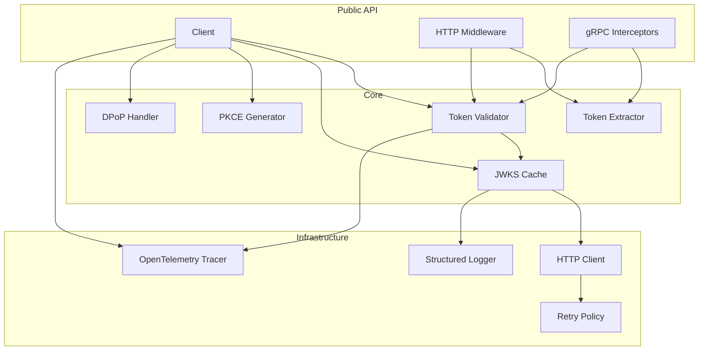

# Design Document: Go SDK Modernization

## Overview

This design document describes the modernization of the Auth Platform Go SDK to December 2025 state-of-the-art standards. The modernization includes upgrading to Go 1.25+, migrating to jwx/v3, implementing PKCE and DPoP support, centralizing token extraction, introducing generic error handling, and restructuring the architecture with separated tests.

The SDK follows a layered architecture with clear separation of concerns:
- **Public API Layer**: Client, middleware, interceptors
- **Core Layer**: Token validation, JWKS cache, authentication flows
- **Infrastructure Layer**: HTTP client, retry logic, observability

## Architecture



## Components and Interfaces

### Directory Structure

```
sdk/go/
├── client.go           # Main client and configuration
├── auth.go             # Authentication flows (ClientCredentials, PKCE)
├── dpop.go             # DPoP proof generation and validation
├── errors.go           # Error types and codes
├── extractor.go        # Token extraction interface and implementations
├── jwks.go             # JWKS cache with jwx/v3
├── middleware.go       # HTTP middleware
├── grpc.go             # gRPC interceptors
├── result.go           # Generic Result[T] and Option[T] types
├── retry.go            # Retry policy with exponential backoff
├── go.mod              # Module definition
├── README.md           # Documentation
├── CHANGELOG.md        # Version history
├── internal/
│   └── observability/
│       ├── tracing.go  # OpenTelemetry integration
│       └── logging.go  # Structured logging
├── tests/
│   ├── client_test.go
│   ├── auth_test.go
│   ├── dpop_test.go
│   ├── errors_test.go
│   ├── extractor_test.go
│   ├── jwks_test.go
│   ├── middleware_test.go
│   ├── grpc_test.go
│   ├── result_test.go
│   ├── retry_test.go
│   └── property/
│       ├── pkce_prop_test.go
│       ├── dpop_prop_test.go
│       ├── extractor_prop_test.go
│       ├── errors_prop_test.go
│       ├── retry_prop_test.go
│       ├── config_prop_test.go
│       └── result_prop_test.go
└── examples/
    ├── http_middleware/
    ├── grpc_interceptor/
    ├── pkce_flow/
    └── dpop_binding/
```

### Core Interfaces

```go
// TokenExtractor extracts authentication tokens from requests.
type TokenExtractor interface {
    Extract(ctx context.Context) (token string, scheme TokenScheme, err error)
}

// TokenScheme represents the authentication scheme.
type TokenScheme string

const (
    TokenSchemeBearer TokenScheme = "Bearer"
    TokenSchemeDPoP   TokenScheme = "DPoP"
)

// PKCEGenerator generates PKCE code verifiers and challenges.
type PKCEGenerator interface {
    GenerateVerifier() (string, error)
    ComputeChallenge(verifier string) string
}

// DPoPProver generates DPoP proofs for requests.
type DPoPProver interface {
    GenerateProof(ctx context.Context, method, uri string, accessToken string) (string, error)
    ValidateProof(ctx context.Context, proof string, method, uri string) (*DPoPClaims, error)
}

// Validator validates JWT tokens.
type Validator interface {
    Validate(ctx context.Context, token string, opts ...ValidationOption) (*Claims, error)
}
```

### Error Types

```go
// ErrorCode represents SDK error codes for programmatic handling.
type ErrorCode string

const (
    ErrCodeInvalidConfig   ErrorCode = "INVALID_CONFIG"
    ErrCodeTokenExpired    ErrorCode = "TOKEN_EXPIRED"
    ErrCodeTokenInvalid    ErrorCode = "TOKEN_INVALID"
    ErrCodeTokenRefresh    ErrorCode = "TOKEN_REFRESH_FAILED"
    ErrCodeNetwork         ErrorCode = "NETWORK_ERROR"
    ErrCodeRateLimited     ErrorCode = "RATE_LIMITED"
    ErrCodeValidation      ErrorCode = "VALIDATION_FAILED"
    ErrCodeUnauthorized    ErrorCode = "UNAUTHORIZED"
    ErrCodeDPoPRequired    ErrorCode = "DPOP_REQUIRED"
    ErrCodeDPoPInvalid     ErrorCode = "DPOP_INVALID"
    ErrCodePKCEInvalid     ErrorCode = "PKCE_INVALID"
)

// SDKError is the structured error type for all SDK errors.
type SDKError struct {
    Code    ErrorCode
    Message string
    Cause   error
}

func (e *SDKError) Error() string {
    if e.Cause != nil {
        return fmt.Sprintf("%s: %s: %v", e.Code, e.Message, e.Cause)
    }
    return fmt.Sprintf("%s: %s", e.Code, e.Message)
}

func (e *SDKError) Unwrap() error {
    return e.Cause
}
```

### Generic Result Types

```go
// Result represents the outcome of an operation that may fail.
type Result[T any] struct {
    value T
    err   error
    ok    bool
}

// Ok creates a successful Result.
func Ok[T any](value T) Result[T] {
    return Result[T]{value: value, ok: true}
}

// Err creates a failed Result.
func Err[T any](err error) Result[T] {
    return Result[T]{err: err, ok: false}
}

// Map transforms the value if successful.
func (r Result[T]) Map[U any](fn func(T) U) Result[U] {
    if !r.ok {
        return Err[U](r.err)
    }
    return Ok(fn(r.value))
}

// FlatMap chains operations that may fail.
func (r Result[T]) FlatMap[U any](fn func(T) Result[U]) Result[U] {
    if !r.ok {
        return Err[U](r.err)
    }
    return fn(r.value)
}

// Match applies the appropriate function based on success/failure.
func (r Result[T]) Match(onOk func(T), onErr func(error)) {
    if r.ok {
        onOk(r.value)
    } else {
        onErr(r.err)
    }
}

// Option represents an optional value.
type Option[T any] struct {
    value T
    some  bool
}

// Some creates an Option with a value.
func Some[T any](value T) Option[T] {
    return Option[T]{value: value, some: true}
}

// None creates an empty Option.
func None[T any]() Option[T] {
    return Option[T]{}
}
```

## Data Models

### Configuration

```go
// Config holds client configuration.
type Config struct {
    // Required fields
    BaseURL  string `env:"AUTH_PLATFORM_BASE_URL"`
    ClientID string `env:"AUTH_PLATFORM_CLIENT_ID"`
    
    // Optional fields with defaults
    ClientSecret string        `env:"AUTH_PLATFORM_CLIENT_SECRET"`
    Timeout      time.Duration `env:"AUTH_PLATFORM_TIMEOUT" default:"30s"`
    JWKSCacheTTL time.Duration `env:"AUTH_PLATFORM_JWKS_CACHE_TTL" default:"1h"`
    
    // Retry configuration
    MaxRetries   int           `env:"AUTH_PLATFORM_MAX_RETRIES" default:"3"`
    BaseDelay    time.Duration `env:"AUTH_PLATFORM_BASE_DELAY" default:"1s"`
    MaxDelay     time.Duration `env:"AUTH_PLATFORM_MAX_DELAY" default:"30s"`
    
    // DPoP configuration
    DPoPEnabled  bool          `env:"AUTH_PLATFORM_DPOP_ENABLED" default:"false"`
    DPoPKeyPath  string        `env:"AUTH_PLATFORM_DPOP_KEY_PATH"`
}

// Validate checks configuration validity.
func (c *Config) Validate() error {
    if c.BaseURL == "" {
        return &SDKError{Code: ErrCodeInvalidConfig, Message: "BaseURL is required"}
    }
    if _, err := url.Parse(c.BaseURL); err != nil {
        return &SDKError{Code: ErrCodeInvalidConfig, Message: "BaseURL is invalid", Cause: err}
    }
    if c.ClientID == "" {
        return &SDKError{Code: ErrCodeInvalidConfig, Message: "ClientID is required"}
    }
    if c.Timeout <= 0 {
        return &SDKError{Code: ErrCodeInvalidConfig, Message: "Timeout must be positive"}
    }
    if c.JWKSCacheTTL < time.Minute || c.JWKSCacheTTL > 24*time.Hour {
        return &SDKError{Code: ErrCodeInvalidConfig, Message: "JWKSCacheTTL must be between 1 minute and 24 hours"}
    }
    return nil
}
```

### Claims

```go
// Claims represents validated JWT claims.
type Claims struct {
    Subject   string    `json:"sub"`
    Issuer    string    `json:"iss"`
    Audience  []string  `json:"aud"`
    ExpiresAt time.Time `json:"exp"`
    IssuedAt  time.Time `json:"iat"`
    Scope     string    `json:"scope,omitempty"`
    ClientID  string    `json:"client_id,omitempty"`
    
    // DPoP binding
    Confirmation *Confirmation `json:"cnf,omitempty"`
}

// Confirmation holds DPoP confirmation claim.
type Confirmation struct {
    JWKThumbprint string `json:"jkt,omitempty"`
}

// DPoPClaims represents DPoP proof claims.
type DPoPClaims struct {
    JTI              string    `json:"jti"`
    HTTPMethod       string    `json:"htm"`
    HTTPUri          string    `json:"htu"`
    IssuedAt         time.Time `json:"iat"`
    AccessTokenHash  string    `json:"ath,omitempty"`
}
```

## Correctness Properties

*A property is a characteristic or behavior that should hold true across all valid executions of a system—essentially, a formal statement about what the system should do. Properties serve as the bridge between human-readable specifications and machine-verifiable correctness guarantees.*

### Property 1: Token Extraction Round-Trip

*For any* valid token string and supported scheme (Bearer or DPoP), formatting the token with the scheme prefix and then extracting it SHALL return the original token and correct scheme.

**Validates: Requirements 3.4, 3.5**

### Property 2: Error Structure Completeness

*For any* SDKError instance, the error SHALL have a non-empty Code and non-empty Message.

**Validates: Requirements 4.1**

### Property 3: Error Type Extraction with AsType

*For any* error chain containing an SDKError, calling `errors.AsType[*SDKError]()` SHALL successfully extract the SDKError.

**Validates: Requirements 4.2**

### Property 4: Is Helper Functions Correctness

*For any* sentinel error and its corresponding Is* helper function, the helper SHALL return true for that error and false for all other sentinel errors.

**Validates: Requirements 4.3**

### Property 5: Error Chain Preservation

*For any* error wrapped with `fmt.Errorf("%w", err)`, calling `errors.Unwrap()` repeatedly SHALL recover all wrapped errors in order.

**Validates: Requirements 4.4**

### Property 6: No Sensitive Data in Errors

*For any* SDKError message, the message SHALL NOT contain patterns matching tokens, secrets, or credentials (no "Bearer ", no base64-encoded JWTs, no "secret").

**Validates: Requirements 4.6**

### Property 7: PKCE Verifier Constraints

*For any* generated PKCE code verifier, the length SHALL be between 43 and 128 characters, and all characters SHALL be from the unreserved character set [A-Za-z0-9-._~].

**Validates: Requirements 5.1**

### Property 8: PKCE Challenge Round-Trip

*For any* valid code verifier, computing the S256 challenge and then verifying the verifier against the challenge SHALL succeed.

**Validates: Requirements 5.2**

### Property 9: DPoP Proof Required Claims

*For any* generated DPoP proof, parsing the JWT SHALL reveal claims jti, htm, htu, and iat with valid values.

**Validates: Requirements 6.2**

### Property 10: DPoP ATH Claim Correctness

*For any* DPoP proof generated with an access token binding, the ath claim SHALL equal the base64url-encoded SHA-256 hash of the access token.

**Validates: Requirements 6.3**

### Property 11: DPoP Algorithm Support

*For any* supported key type (EC P-256 for ES256, RSA 2048+ for RS256), generating and validating a DPoP proof SHALL succeed.

**Validates: Requirements 6.4**

### Property 12: DPoP Validation Correctness

*For any* valid DPoP proof, validation SHALL succeed. *For any* tampered DPoP proof (modified signature, expired, wrong method/uri), validation SHALL fail.

**Validates: Requirements 6.5**

### Property 13: Claims Stored in Context After Validation

*For any* valid token processed by middleware or interceptor, the resulting context SHALL contain Claims retrievable via GetClaimsFromContext.

**Validates: Requirements 8.3, 9.4**

### Property 14: gRPC Status Codes for Validation Failures

*For any* invalid or missing token in gRPC request, the interceptor SHALL return status code Unauthenticated (16).

**Validates: Requirements 8.6**

### Property 15: Skip Pattern Matching

*For any* request path matching a configured skip pattern, the middleware SHALL NOT require authentication and SHALL pass the request through.

**Validates: Requirements 9.2**

### Property 16: Cookie Token Extraction

*For any* token stored in a configured cookie name, extraction SHALL return the same token as if it were in the Authorization header.

**Validates: Requirements 9.5**

### Property 17: Exponential Backoff Delays

*For any* sequence of retry attempts, the delay between attempt n and n+1 SHALL be approximately baseDelay * 2^n (with jitter).

**Validates: Requirements 10.1**

### Property 18: Retry-After Header Respect

*For any* response with Retry-After header, the next retry delay SHALL be at least the value specified in the header.

**Validates: Requirements 10.2**

### Property 19: Maximum Retry Count

*For any* operation with configured maxRetries, the total number of attempts SHALL NOT exceed maxRetries + 1 (initial + retries).

**Validates: Requirements 10.3**

### Property 20: Retry Delay Bounds

*For any* retry delay calculation, the delay SHALL be at least baseDelay and at most maxDelay.

**Validates: Requirements 10.4**

### Property 21: Context Cancellation Stops Retry

*For any* cancelled context during retry loop, the operation SHALL return immediately with context.Canceled error.

**Validates: Requirements 10.5**

### Property 22: Non-Retryable Error Handling

*For any* HTTP 4xx error (except 429 and 503), the operation SHALL NOT retry and SHALL return immediately.

**Validates: Requirements 10.6**

### Property 23: Required Field Validation

*For any* Config with empty BaseURL or empty ClientID, Validate() SHALL return an SDKError with code INVALID_CONFIG.

**Validates: Requirements 11.1, 11.2**

### Property 24: Timeout Validation

*For any* Config with non-positive Timeout, Validate() SHALL return an SDKError with code INVALID_CONFIG.

**Validates: Requirements 11.3**

### Property 25: Cache TTL Validation

*For any* Config with JWKSCacheTTL less than 1 minute or greater than 24 hours, Validate() SHALL return an SDKError with code INVALID_CONFIG.

**Validates: Requirements 11.4**

### Property 26: Default Values Application

*For any* Config with zero-value optional fields, after applying defaults, Timeout SHALL be 30s, JWKSCacheTTL SHALL be 1h, MaxRetries SHALL be 3.

**Validates: Requirements 11.5**

### Property 27: Environment Variable Configuration

*For any* environment variable AUTH_PLATFORM_* set, loading config from environment SHALL populate the corresponding field.

**Validates: Requirements 11.6**

### Property 28: No Sensitive Data in Observability

*For any* span attribute or log message, the content SHALL NOT contain patterns matching tokens, secrets, or credentials.

**Validates: Requirements 12.3, 12.6**

### Property 29: Log Severity Matching

*For any* error logged, the log level SHALL be ERROR or WARN. *For any* successful operation logged, the level SHALL be INFO or DEBUG.

**Validates: Requirements 12.5**

### Property 30: Result Map/FlatMap Correctness

*For any* Result[T], Map SHALL transform the value if Ok and preserve the error if Err. FlatMap SHALL chain operations correctly.

**Validates: Requirements 14.3**

### Property 31: Result Error Preservation

*For any* Result created with Err(err), the error SHALL be retrievable and SHALL preserve the error chain.

**Validates: Requirements 14.4**

### Property 32: Result Match Correctness

*For any* Result, Match SHALL call onOk for Ok results and onErr for Err results, never both.

**Validates: Requirements 14.5**

## Error Handling

### Error Categories

| Category | Error Codes | Retryable | User Action |
|----------|-------------|-----------|-------------|
| Configuration | INVALID_CONFIG | No | Fix configuration |
| Authentication | TOKEN_EXPIRED, TOKEN_INVALID, UNAUTHORIZED | No | Re-authenticate |
| Token Refresh | TOKEN_REFRESH_FAILED | Yes | Retry or re-authenticate |
| Network | NETWORK_ERROR | Yes | Retry with backoff |
| Rate Limiting | RATE_LIMITED | Yes | Wait and retry |
| Validation | VALIDATION_FAILED | No | Check token/request |
| DPoP | DPOP_REQUIRED, DPOP_INVALID | No | Enable/fix DPoP |
| PKCE | PKCE_INVALID | No | Regenerate PKCE |

### Error Handling Pattern

```go
result := client.ValidateToken(ctx, token)
result.Match(
    func(claims *Claims) {
        // Handle success
    },
    func(err error) {
        var sdkErr *SDKError
        if errors.As(err, &sdkErr) {
            switch sdkErr.Code {
            case ErrCodeTokenExpired:
                // Refresh token
            case ErrCodeRateLimited:
                // Wait and retry
            default:
                // Log and handle
            }
        }
    },
)
```

## Testing Strategy

### Test Organization

Tests are organized in `sdk/go/tests/` mirroring the source structure:

- **Unit Tests** (`*_test.go`): Test individual functions and methods
- **Property Tests** (`property/*_prop_test.go`): Test universal properties with rapid
- **Integration Tests** (`integration/*_test.go`): Test component interactions

### Property-Based Testing Configuration

```go
import "pgregory.net/rapid"

func TestPKCEVerifierConstraints(t *testing.T) {
    // Feature: go-sdk-modernization, Property 7: PKCE Verifier Constraints
    // Validates: Requirements 5.1
    rapid.Check(t, func(t *rapid.T) {
        gen := NewPKCEGenerator()
        verifier, err := gen.GenerateVerifier()
        
        if err != nil {
            t.Fatal(err)
        }
        
        // Length constraint
        if len(verifier) < 43 || len(verifier) > 128 {
            t.Fatalf("verifier length %d not in [43, 128]", len(verifier))
        }
        
        // Character set constraint
        for _, c := range verifier {
            if !isUnreservedChar(c) {
                t.Fatalf("invalid character %c in verifier", c)
            }
        }
    })
}
```

### Test Coverage Requirements

| Component | Unit Coverage | Property Coverage |
|-----------|---------------|-------------------|
| Token Extraction | 80%+ | Properties 1, 16 |
| Error Handling | 80%+ | Properties 2-6 |
| PKCE | 90%+ | Properties 7-8 |
| DPoP | 90%+ | Properties 9-12 |
| Middleware/Interceptors | 80%+ | Properties 13-15 |
| Retry Logic | 90%+ | Properties 17-22 |
| Configuration | 90%+ | Properties 23-27 |
| Observability | 70%+ | Properties 28-29 |
| Result Types | 90%+ | Properties 30-32 |

### Testing Commands

```bash
# Run all tests
go test ./sdk/go/tests/...

# Run property tests only
go test ./sdk/go/tests/property/... -v

# Run with coverage
go test ./sdk/go/tests/... -coverprofile=coverage.out

# Run benchmarks
go test ./sdk/go/tests/... -bench=. -benchmem
```
