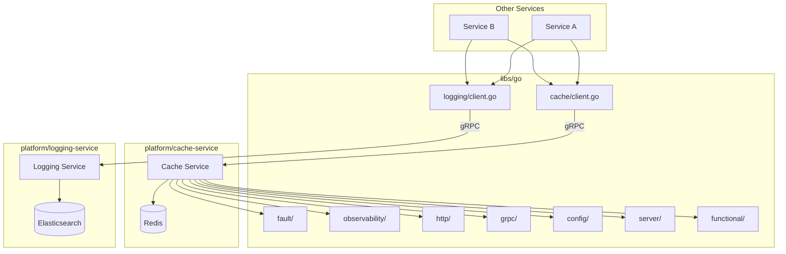

# Design Document: Libs Microservices Integration

## Overview

Esta spec define a arquitetura para integrar as bibliotecas compartilhadas Go (`libs/go`) com os microserviços de plataforma. O objetivo principal é:

1. Criar clientes gRPC nas libs para comunicação com `cache-service` e `logging-service`
2. Remover implementações locais de cache (LRU) e logging das libs
3. Migrar o `cache-service` para usar 100% das libs disponíveis
4. Eliminar código duplicado mantendo compatibilidade de API

## Architecture



## Components and Interfaces

### 1. Cache Client (`libs/go/src/cache/client.go`)

```go
package cache

import (
    "context"
    "time"
    
    "github.com/authcorp/libs/go/src/fault"
    "github.com/authcorp/libs/go/src/functional"
)

// Client provides distributed cache operations via cache-service.
type Client struct {
    conn          *grpc.ClientConn
    client        CacheServiceClient
    circuitBreaker *fault.CircuitBreaker
    localFallback *LocalCache
    config        ClientConfig
}

// ClientConfig configures the cache client.
type ClientConfig struct {
    Address           string
    Namespace         string
    Timeout           time.Duration
    MaxRetries        int
    CircuitBreaker    fault.CircuitBreakerConfig
    LocalFallback     bool
    LocalCacheSize    int
    ConnectionPool    PoolConfig
}

// PoolConfig configures connection pooling.
type PoolConfig struct {
    MaxConns     int
    IdleTimeout  time.Duration
}

// NewClient creates a new cache client.
func NewClient(config ClientConfig) (*Client, error)

// Get retrieves a value from cache.
func (c *Client) Get(ctx context.Context, key string) functional.Result[[]byte]

// Set stores a value in cache.
func (c *Client) Set(ctx context.Context, key string, value []byte, ttl time.Duration) error

// Delete removes a value from cache.
func (c *Client) Delete(ctx context.Context, key string) error

// BatchGet retrieves multiple values.
func (c *Client) BatchGet(ctx context.Context, keys []string) functional.Result[map[string][]byte]

// BatchSet stores multiple values.
func (c *Client) BatchSet(ctx context.Context, entries map[string][]byte, ttl time.Duration) error

// Close closes the client connection.
func (c *Client) Close() error

// LocalOnly creates a client that only uses local cache (for testing).
func LocalOnly(size int) *Client
```

### 2. Logging Client (`libs/go/src/logging/client.go`)

```go
package logging

import (
    "context"
    "time"
    
    "github.com/authcorp/libs/go/src/observability"
)

// Client provides structured logging via logging-service.
type Client struct {
    conn       *grpc.ClientConn
    client     LoggingServiceClient
    buffer     *logBuffer
    config     ClientConfig
    fallback   *localLogger
}

// ClientConfig configures the logging client.
type ClientConfig struct {
    Address       string
    ServiceName   string
    BufferSize    int
    FlushInterval time.Duration
    Timeout       time.Duration
    LocalFallback bool
}

// NewClient creates a new logging client.
func NewClient(config ClientConfig) (*Client, error)

// Debug logs at debug level.
func (c *Client) Debug(ctx context.Context, msg string, fields ...Field)

// Info logs at info level.
func (c *Client) Info(ctx context.Context, msg string, fields ...Field)

// Warn logs at warn level.
func (c *Client) Warn(ctx context.Context, msg string, fields ...Field)

// Error logs at error level.
func (c *Client) Error(ctx context.Context, msg string, fields ...Field)

// With returns a logger with additional fields.
func (c *Client) With(fields ...Field) *Client

// FromContext creates a logger with context values.
func (c *Client) FromContext(ctx context.Context) *Client

// Flush sends buffered logs immediately.
func (c *Client) Flush() error

// Close flushes and closes the client.
func (c *Client) Close() error

// LocalOnly creates a client that only logs locally (for testing).
func LocalOnly(serviceName string) *Client

// Field represents a log field.
type Field struct {
    Key   string
    Value any
}

// Helper functions for creating fields.
func String(key, value string) Field
func Int(key string, value int) Field
func Int64(key string, value int64) Field
func Error(err error) Field
func Duration(key string, value time.Duration) Field
```

### 3. Updated CachedRepository (`libs/go/src/patterns/cached_repository.go`)

```go
package patterns

import (
    "context"
    
    "github.com/authcorp/libs/go/src/cache"
    "github.com/authcorp/libs/go/src/functional"
)

// CachedRepository wraps a repository with distributed caching.
type CachedRepository[T any, ID comparable] struct {
    inner       Repository[T, ID]
    cache       *cache.Client
    serializer  Serializer[T]
    keyPrefix   string
    ttl         time.Duration
}

// NewCachedRepository creates a cached repository using cache-service.
func NewCachedRepository[T any, ID comparable](
    inner Repository[T, ID],
    cacheClient *cache.Client,
    serializer Serializer[T],
    keyPrefix string,
    ttl time.Duration,
) *CachedRepository[T, ID]
```

### 4. Cache-Service Migration Map

| Current (internal/) | New (libs/go/src/) | Notes |
|---------------------|-------------------|-------|
| `circuitbreaker/breaker.go` | `fault/circuitbreaker.go` | Lib has generics support |
| `broker/retry.go` | `fault/retry.go` | Lib has jitter strategies |
| `observability/context.go` | `observability/context.go` | Nearly identical |
| `localcache/cache.go` | Remove | Use cache-service for all caching |
| `http/handlers.go` | Keep + use `http/middleware.go` | Add lib middlewares |
| `grpc/errors.go` | `grpc/errors.go` | Lib has fault integration |
| `config/config.go` | `config/config.go` | Lib has YAML/JSON support |

## Data Models

### Cache Client Request/Response

```go
// GetRequest for cache get operation.
type GetRequest struct {
    Namespace string
    Key       string
}

// GetResponse for cache get operation.
type GetResponse struct {
    Found  bool
    Value  []byte
    Source CacheSource
}

// CacheSource indicates where the value came from.
type CacheSource int

const (
    SourceUnknown CacheSource = iota
    SourceRemote
    SourceLocal
)
```

### Log Entry

```go
// LogEntry represents a structured log entry.
type LogEntry struct {
    Timestamp     time.Time
    Level         Level
    Message       string
    Service       string
    CorrelationID string
    TraceID       string
    SpanID        string
    Fields        map[string]any
}
```

## Correctness Properties

*A property is a characteristic or behavior that should hold true across all valid executions of a system—essentially, a formal statement about what the system should do. Properties serve as the bridge between human-readable specifications and machine-verifiable correctness guarantees.*

### Property 1: Cache Round-Trip Consistency

*For any* valid key and value, setting a value in the cache and then getting it should return the same value.

```
∀ key ∈ ValidKeys, value ∈ ValidValues:
  Set(key, value, ttl) → Get(key) = Some(value)
```

**Validates: Requirements 1.1, 5.10, 8.1**

### Property 2: Namespace Isolation

*For any* two different namespaces and the same key, setting a value in one namespace should not affect the value in another namespace.

```
∀ ns1, ns2 ∈ Namespaces where ns1 ≠ ns2, key ∈ ValidKeys:
  Set(ns1, key, v1) → Set(ns2, key, v2) → Get(ns1, key) = Some(v1)
```

**Validates: Requirements 1.2**

### Property 3: Circuit Breaker Threshold

*For any* sequence of consecutive failures exceeding the threshold, the circuit breaker should transition to open state.

```
∀ failures ∈ FailureSequence where len(failures) ≥ threshold:
  Execute(failures) → CircuitState = Open
```

**Validates: Requirements 1.3, 5.1**

### Property 4: Context Propagation

*For any* log entry created with a context containing correlation_id, trace_id, or span_id, the shipped log entry should contain those same values.

```
∀ ctx ∈ ContextWithIDs, msg ∈ Messages:
  Log(ctx, msg) → ShippedEntry.CorrelationID = ctx.CorrelationID
```

**Validates: Requirements 2.3, 5.3**

### Property 5: PII Redaction

*For any* log message or field containing PII patterns (email, phone, SSN), the shipped log should have those patterns redacted.

```
∀ msg ∈ MessagesWithPII:
  Log(msg) → ¬ContainsPII(ShippedEntry)
```

**Validates: Requirements 2.5**

### Property 6: Batch Operation Atomicity

*For any* batch set operation, either all entries are stored or none are (in case of error).

```
∀ entries ∈ BatchEntries:
  BatchSet(entries) = Ok → ∀ e ∈ entries: Get(e.key) = Some(e.value)
  BatchSet(entries) = Err → ∀ e ∈ entries: Get(e.key) = previous_value
```

**Validates: Requirements 1.1**

### Property 7: gRPC Error Code Mapping

*For any* fault error type, the gRPC conversion should produce the correct status code.

```
∀ err ∈ FaultErrors:
  ToGRPCError(CircuitOpenError) → codes.Unavailable
  ToGRPCError(RateLimitError) → codes.ResourceExhausted
  ToGRPCError(TimeoutError) → codes.DeadlineExceeded
```

**Validates: Requirements 5.6, 8.1**

### Property 8: API Backward Compatibility

*For any* valid API request that worked before migration, the same request should produce an equivalent response after migration.

```
∀ req ∈ ValidRequests:
  ResponseBefore(req) ≈ ResponseAfter(req)
```

**Validates: Requirements 8.1, 8.2, 8.3**

### Property 9: Log Batching Respects Buffer Size

*For any* sequence of log calls, the buffer should flush when reaching the configured size limit.

```
∀ logs ∈ LogSequence where len(logs) ≥ bufferSize:
  Log(logs) → FlushCount ≥ len(logs) / bufferSize
```

**Validates: Requirements 2.2, 2.6**

### Property 10: Local Fallback Activation

*For any* cache operation when the remote service is unavailable and local fallback is enabled, the operation should use local cache.

```
∀ op ∈ CacheOperations, config.LocalFallback = true:
  RemoteUnavailable → op uses LocalCache
```

**Validates: Requirements 1.6, 2.4**

## Error Handling

### Cache Client Errors

```go
var (
    ErrConnectionFailed = errors.New("cache: connection failed")
    ErrCircuitOpen      = errors.New("cache: circuit breaker open")
    ErrTimeout          = errors.New("cache: operation timeout")
    ErrNotFound         = errors.New("cache: key not found")
    ErrInvalidKey       = errors.New("cache: invalid key")
    ErrInvalidNamespace = errors.New("cache: invalid namespace")
)

// IsRetryable returns true if the error is retryable.
func IsRetryable(err error) bool

// IsNotFound returns true if the error indicates key not found.
func IsNotFound(err error) bool
```

### Logging Client Errors

```go
var (
    ErrConnectionFailed = errors.New("logging: connection failed")
    ErrBufferFull       = errors.New("logging: buffer full")
    ErrFlushFailed      = errors.New("logging: flush failed")
)
```

### Error Recovery Strategy

1. **Circuit Breaker**: Protects against cascading failures
2. **Retry with Backoff**: Uses `libs/go/src/fault/retry.go` with jitter
3. **Local Fallback**: Falls back to local cache/stdout when remote unavailable
4. **Graceful Degradation**: Service continues with reduced functionality

## Testing Strategy

### Unit Tests

- Test each client method in isolation with mocked gRPC
- Test error handling for all error types
- Test configuration validation
- Test PII redaction patterns

### Property-Based Tests

Using `pgregory.net/rapid` or `github.com/leanovate/gopter`:

1. **Cache Round-Trip**: Generate random keys/values, verify round-trip
2. **Namespace Isolation**: Generate random namespaces, verify isolation
3. **Circuit Breaker**: Generate failure sequences, verify state transitions
4. **PII Redaction**: Generate strings with PII patterns, verify redaction
5. **Batch Operations**: Generate batch entries, verify atomicity
6. **gRPC Error Mapping**: Generate fault errors, verify code mapping

### Integration Tests

- Test actual gRPC communication with test servers
- Test fallback behavior with service unavailability
- Test end-to-end cache operations
- Test log shipping and batching

### Migration Tests

- Compare behavior before/after migration
- Verify API compatibility with existing clients
- Performance benchmarks to ensure no regression
