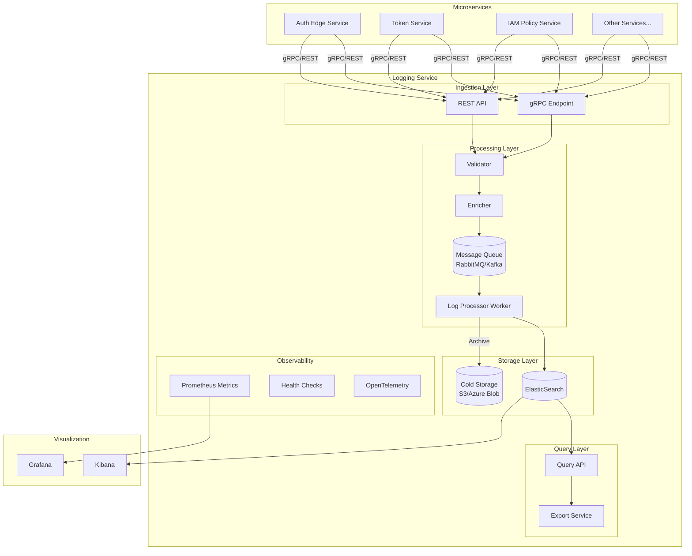

# Design Document: Logging Microservice

## Overview

O Logging Microservice é um serviço de infraestrutura em C# (.NET 8) que centraliza a coleta, processamento e armazenamento de logs de todos os microserviços da plataforma de autenticação. O serviço utiliza uma arquitetura event-driven com filas para processamento assíncrono, ElasticSearch para armazenamento indexado, e expõe APIs gRPC e REST para ingestão e consulta de logs.

### Localização no Monorepo

Seguindo o ADR-001, o serviço será posicionado em:
```
platform/logging-service/
├── src/
│   ├── LoggingService.Api/           # API Layer (gRPC + REST)
│   ├── LoggingService.Core/          # Domain models e interfaces
│   ├── LoggingService.Infrastructure/ # ElasticSearch, Queue implementations
│   └── LoggingService.Worker/        # Background processing worker
├── tests/
│   ├── LoggingService.Unit.Tests/
│   ├── LoggingService.Integration.Tests/
│   └── LoggingService.Property.Tests/
├── Dockerfile
├── docker-compose.yml
└── README.md
```

## Architecture



## Components and Interfaces

### 1. Log Entry Model

```csharp
public sealed record LogEntry
{
    public required string Id { get; init; }
    public required DateTimeOffset Timestamp { get; init; }
    public required string CorrelationId { get; init; }
    public required string ServiceId { get; init; }
    public required LogLevel Level { get; init; }
    public required string Message { get; init; }
    public string? TraceId { get; init; }
    public string? SpanId { get; init; }
    public string? UserId { get; init; }
    public string? RequestId { get; init; }
    public string? Method { get; init; }
    public string? Path { get; init; }
    public int? StatusCode { get; init; }
    public long? DurationMs { get; init; }
    public Dictionary<string, object>? Metadata { get; init; }
    public ExceptionInfo? Exception { get; init; }
}

public enum LogLevel
{
    Debug = 0,
    Info = 1,
    Warn = 2,
    Error = 3,
    Fatal = 4
}

public sealed record ExceptionInfo
{
    public required string Type { get; init; }
    public required string Message { get; init; }
    public string? StackTrace { get; init; }
    public ExceptionInfo? InnerException { get; init; }
}
```

### 2. API Interfaces

#### gRPC Service Definition

```protobuf
syntax = "proto3";
package logging.v1;

service LoggingService {
    rpc IngestLog(IngestLogRequest) returns (IngestLogResponse);
    rpc IngestLogBatch(IngestLogBatchRequest) returns (IngestLogBatchResponse);
    rpc QueryLogs(QueryLogsRequest) returns (QueryLogsResponse);
    rpc StreamLogs(StreamLogsRequest) returns (stream LogEntry);
}

message IngestLogRequest {
    LogEntry entry = 1;
}

message IngestLogBatchRequest {
    repeated LogEntry entries = 1;
}
```

#### REST API Endpoints

| Method | Endpoint | Description |
|--------|----------|-------------|
| POST | /api/v1/logs | Ingest single log entry |
| POST | /api/v1/logs/batch | Ingest batch of logs (max 1000) |
| GET | /api/v1/logs | Query logs with filters |
| GET | /api/v1/logs/{id} | Get specific log entry |
| GET | /api/v1/logs/export | Export logs as JSON/CSV |
| GET | /health/live | Liveness probe |
| GET | /health/ready | Readiness probe |
| GET | /metrics | Prometheus metrics |

### 3. Core Interfaces

```csharp
public interface ILogIngestionService
{
    Task<IngestResult> IngestAsync(LogEntry entry, CancellationToken ct = default);
    Task<BatchIngestResult> IngestBatchAsync(IEnumerable<LogEntry> entries, CancellationToken ct = default);
}

public interface ILogProcessor
{
    Task ProcessAsync(LogEntry entry, CancellationToken ct = default);
}

public interface ILogRepository
{
    Task<string> SaveAsync(LogEntry entry, CancellationToken ct = default);
    Task SaveBatchAsync(IEnumerable<LogEntry> entries, CancellationToken ct = default);
    Task<LogEntry?> GetByIdAsync(string id, CancellationToken ct = default);
    Task<PagedResult<LogEntry>> QueryAsync(LogQuery query, CancellationToken ct = default);
}

public interface ILogQueue
{
    Task EnqueueAsync(LogEntry entry, CancellationToken ct = default);
    Task EnqueueBatchAsync(IEnumerable<LogEntry> entries, CancellationToken ct = default);
    Task<LogEntry?> DequeueAsync(CancellationToken ct = default);
    int GetQueueDepth();
}

public interface IPiiMasker
{
    LogEntry MaskSensitiveData(LogEntry entry);
}

public interface IRetentionService
{
    Task ApplyRetentionPoliciesAsync(CancellationToken ct = default);
    Task ArchiveLogsAsync(DateTimeOffset olderThan, CancellationToken ct = default);
}
```

### 4. Query Model

```csharp
public sealed record LogQuery
{
    public DateTimeOffset? StartTime { get; init; }
    public DateTimeOffset? EndTime { get; init; }
    public string? ServiceId { get; init; }
    public LogLevel? MinLevel { get; init; }
    public string? CorrelationId { get; init; }
    public string? SearchText { get; init; }
    public int Page { get; init; } = 1;
    public int PageSize { get; init; } = 100;
    public SortDirection SortDirection { get; init; } = SortDirection.Descending;
}

public sealed record PagedResult<T>
{
    public required IReadOnlyList<T> Items { get; init; }
    public required int TotalCount { get; init; }
    public required int Page { get; init; }
    public required int PageSize { get; init; }
    public bool HasMore => Page * PageSize < TotalCount;
}
```

### 5. Service Implementations

#### Log Ingestion Service

```csharp
public sealed class LogIngestionService : ILogIngestionService
{
    private readonly ILogQueue _queue;
    private readonly ILogEntryValidator _validator;
    private readonly ILogEntryEnricher _enricher;
    private readonly IPiiMasker _piiMasker;
    private readonly ILogger<LogIngestionService> _logger;
    private readonly Counter _logsReceivedCounter;

    public async Task<IngestResult> IngestAsync(LogEntry entry, CancellationToken ct)
    {
        // 1. Validate entry
        var validationResult = _validator.Validate(entry);
        if (!validationResult.IsValid)
            return IngestResult.ValidationFailed(validationResult.Errors);

        // 2. Enrich (add correlation_id if missing, normalize timestamp)
        var enrichedEntry = _enricher.Enrich(entry);

        // 3. Mask PII
        var maskedEntry = _piiMasker.MaskSensitiveData(enrichedEntry);

        // 4. Enqueue for async processing
        await _queue.EnqueueAsync(maskedEntry, ct);

        _logsReceivedCounter.Inc();
        return IngestResult.Success(maskedEntry.Id);
    }

    public async Task<BatchIngestResult> IngestBatchAsync(
        IEnumerable<LogEntry> entries, 
        CancellationToken ct)
    {
        var entriesList = entries.ToList();
        
        if (entriesList.Count > 1000)
            return BatchIngestResult.BatchTooLarge(entriesList.Count, 1000);

        var results = new List<IngestResult>();
        var validEntries = new List<LogEntry>();

        foreach (var entry in entriesList)
        {
            var validationResult = _validator.Validate(entry);
            if (!validationResult.IsValid)
            {
                results.Add(IngestResult.ValidationFailed(validationResult.Errors));
                continue;
            }

            var enriched = _enricher.Enrich(entry);
            var masked = _piiMasker.MaskSensitiveData(enriched);
            validEntries.Add(masked);
            results.Add(IngestResult.Success(masked.Id));
        }

        if (validEntries.Count > 0)
            await _queue.EnqueueBatchAsync(validEntries, ct);

        _logsReceivedCounter.Inc(validEntries.Count);
        return new BatchIngestResult(results, validEntries.Count, entriesList.Count - validEntries.Count);
    }
}
```

#### Log Entry Validator

```csharp
public sealed class LogEntryValidator : ILogEntryValidator
{
    private static readonly HashSet<LogLevel> ValidLogLevels = 
        [LogLevel.Debug, LogLevel.Info, LogLevel.Warn, LogLevel.Error, LogLevel.Fatal];

    public ValidationResult Validate(LogEntry entry)
    {
        var errors = new List<FieldError>();

        if (entry.Timestamp == default)
            errors.Add(new FieldError("timestamp", "REQUIRED", "Timestamp is required"));

        if (string.IsNullOrWhiteSpace(entry.ServiceId))
            errors.Add(new FieldError("serviceId", "REQUIRED", "ServiceId is required"));

        if (!ValidLogLevels.Contains(entry.Level))
            errors.Add(new FieldError("level", "INVALID", $"Level must be one of: {string.Join(", ", ValidLogLevels)}"));

        if (string.IsNullOrWhiteSpace(entry.Message))
            errors.Add(new FieldError("message", "REQUIRED", "Message is required"));

        return errors.Count == 0 
            ? ValidationResult.Valid() 
            : ValidationResult.Invalid(errors);
    }
}
```

#### PII Masker

```csharp
public sealed class PiiMasker : IPiiMasker
{
    private readonly SecurityOptions _options;
    private readonly ILogger<PiiMasker> _logger;

    private static readonly Regex EmailPattern = new(
        @"[a-zA-Z0-9._%+-]+@[a-zA-Z0-9.-]+\.[a-zA-Z]{2,}",
        RegexOptions.Compiled);
    
    private static readonly Regex PhonePattern = new(
        @"\b\d{3}[-.]?\d{3}[-.]?\d{4}\b",
        RegexOptions.Compiled);
    
    private static readonly Regex IpPattern = new(
        @"\b(?:\d{1,3}\.){3}\d{1,3}\b",
        RegexOptions.Compiled);

    public LogEntry MaskSensitiveData(LogEntry entry)
    {
        if (_options.MaskingMode == PiiMaskingMode.None)
            return entry;

        return entry with
        {
            Message = MaskString(entry.Message),
            Path = entry.Path != null ? MaskString(entry.Path) : null,
            Metadata = entry.Metadata != null ? MaskMetadata(entry.Metadata) : null
        };
    }

    private string MaskString(string input)
    {
        var result = input;
        
        if (_options.PiiPatterns.Contains("email"))
            result = EmailPattern.Replace(result, GetMaskedValue("email"));
        
        if (_options.PiiPatterns.Contains("phone"))
            result = PhonePattern.Replace(result, GetMaskedValue("phone"));
        
        if (_options.PiiPatterns.Contains("ip"))
            result = IpPattern.Replace(result, GetMaskedValue("ip"));

        return result;
    }

    private string GetMaskedValue(string type) => _options.MaskingMode switch
    {
        PiiMaskingMode.Mask => $"[MASKED_{type.ToUpper()}]",
        PiiMaskingMode.Redact => "[REDACTED]",
        PiiMaskingMode.Hash => "[HASHED]", // In real impl, would compute hash
        _ => throw new InvalidOperationException($"Unknown masking mode: {_options.MaskingMode}")
    };

    private Dictionary<string, object> MaskMetadata(Dictionary<string, object> metadata)
    {
        return metadata.ToDictionary(
            kvp => kvp.Key,
            kvp => kvp.Value is string s ? (object)MaskString(s) : kvp.Value);
    }
}
```

#### Log Processor Worker

```csharp
public sealed class LogProcessorWorker : BackgroundService
{
    private readonly ILogQueue _queue;
    private readonly ILogRepository _repository;
    private readonly QueueOptions _options;
    private readonly ILogger<LogProcessorWorker> _logger;
    private readonly Counter _logsProcessedCounter;
    private readonly Counter _logsFailedCounter;
    private readonly Histogram _processingLatency;

    protected override async Task ExecuteAsync(CancellationToken stoppingToken)
    {
        _logger.LogInformation("Log processor worker starting");

        while (!stoppingToken.IsCancellationRequested)
        {
            try
            {
                var batch = new List<LogEntry>();
                
                // Collect batch
                for (int i = 0; i < _options.BatchSize; i++)
                {
                    var entry = await _queue.DequeueAsync(stoppingToken);
                    if (entry == null) break;
                    batch.Add(entry);
                }

                if (batch.Count > 0)
                {
                    using var timer = _processingLatency.NewTimer();
                    await ProcessBatchAsync(batch, stoppingToken);
                }
                else
                {
                    await Task.Delay(_options.ProcessingInterval, stoppingToken);
                }
            }
            catch (OperationCanceledException) when (stoppingToken.IsCancellationRequested)
            {
                break;
            }
            catch (Exception ex)
            {
                _logger.LogError(ex, "Error processing log batch");
                _logsFailedCounter.Inc();
            }
        }
    }

    private async Task ProcessBatchAsync(List<LogEntry> batch, CancellationToken ct)
    {
        try
        {
            await _repository.SaveBatchAsync(batch, ct);
            _logsProcessedCounter.Inc(batch.Count);
            _logger.LogDebug("Processed {Count} log entries", batch.Count);
        }
        catch (Exception ex)
        {
            _logger.LogError(ex, "Failed to save batch of {Count} entries", batch.Count);
            _logsFailedCounter.Inc(batch.Count);
            throw;
        }
    }
}
```

### 6. ElasticSearch Repository

```csharp
public sealed class ElasticSearchLogRepository : ILogRepository
{
    private readonly IElasticClient _client;
    private readonly ElasticSearchOptions _options;
    private readonly ILogger<ElasticSearchLogRepository> _logger;

    public async Task<string> SaveAsync(LogEntry entry, CancellationToken ct)
    {
        var indexName = GetIndexName(entry);
        
        var response = await _client.IndexAsync(entry, i => i
            .Index(indexName)
            .Id(entry.Id)
            .Refresh(Refresh.False), ct);

        if (!response.IsValid)
            throw new StorageException($"Failed to index log: {response.DebugInformation}");

        return entry.Id;
    }

    public async Task SaveBatchAsync(IEnumerable<LogEntry> entries, CancellationToken ct)
    {
        var bulkDescriptor = new BulkDescriptor();

        foreach (var entry in entries)
        {
            var indexName = GetIndexName(entry);
            bulkDescriptor.Index<LogEntry>(i => i
                .Index(indexName)
                .Id(entry.Id)
                .Document(entry));
        }

        var response = await _client.BulkAsync(bulkDescriptor, ct);

        if (response.Errors)
        {
            var failedItems = response.ItemsWithErrors.Select(i => i.Id);
            _logger.LogError("Bulk indexing had errors for items: {Items}", string.Join(", ", failedItems));
            throw new StorageException($"Bulk indexing failed for {response.ItemsWithErrors.Count()} items");
        }
    }

    public async Task<PagedResult<LogEntry>> QueryAsync(LogQuery query, CancellationToken ct)
    {
        var searchDescriptor = new SearchDescriptor<LogEntry>()
            .Index($"{_options.IndexPrefix}-*")
            .From((query.Page - 1) * query.PageSize)
            .Size(Math.Min(query.PageSize, 1000))
            .Sort(s => query.SortDirection == SortDirection.Ascending
                ? s.Ascending(e => e.Timestamp)
                : s.Descending(e => e.Timestamp))
            .Query(q => BuildQuery(q, query));

        var response = await _client.SearchAsync<LogEntry>(searchDescriptor, ct);

        if (!response.IsValid)
            throw new StorageException($"Query failed: {response.DebugInformation}");

        return new PagedResult<LogEntry>
        {
            Items = response.Documents.ToList(),
            TotalCount = (int)response.Total,
            Page = query.Page,
            PageSize = query.PageSize
        };
    }

    private string GetIndexName(LogEntry entry)
    {
        var date = entry.Timestamp.ToString("yyyy.MM.dd");
        return $"{_options.IndexPrefix}-{entry.ServiceId}-{date}";
    }

    private QueryContainer BuildQuery(QueryContainerDescriptor<LogEntry> q, LogQuery query)
    {
        var filters = new List<QueryContainer>();

        if (query.StartTime.HasValue)
            filters.Add(q.DateRange(r => r.Field(f => f.Timestamp).GreaterThanOrEquals(query.StartTime.Value)));

        if (query.EndTime.HasValue)
            filters.Add(q.DateRange(r => r.Field(f => f.Timestamp).LessThanOrEquals(query.EndTime.Value)));

        if (!string.IsNullOrEmpty(query.ServiceId))
            filters.Add(q.Term(t => t.Field(f => f.ServiceId).Value(query.ServiceId)));

        if (query.MinLevel.HasValue)
            filters.Add(q.Range(r => r.Field(f => f.Level).GreaterThanOrEquals((int)query.MinLevel.Value)));

        if (!string.IsNullOrEmpty(query.CorrelationId))
            filters.Add(q.Term(t => t.Field(f => f.CorrelationId).Value(query.CorrelationId)));

        if (!string.IsNullOrEmpty(query.SearchText))
            filters.Add(q.Match(m => m.Field(f => f.Message).Query(query.SearchText)));

        return filters.Count > 0 
            ? q.Bool(b => b.Must(filters.ToArray())) 
            : q.MatchAll();
    }
}
```

### 7. Queue Implementation (RabbitMQ)

```csharp
public sealed class RabbitMqLogQueue : ILogQueue, IDisposable
{
    private readonly IConnection _connection;
    private readonly IModel _channel;
    private readonly QueueOptions _options;
    private readonly ILogger<RabbitMqLogQueue> _logger;
    private readonly Gauge _queueDepthGauge;

    public RabbitMqLogQueue(QueueOptions options, ILogger<RabbitMqLogQueue> logger)
    {
        _options = options;
        _logger = logger;

        var factory = new ConnectionFactory { Uri = new Uri(options.ConnectionString) };
        _connection = factory.CreateConnection();
        _channel = _connection.CreateModel();

        _channel.QueueDeclare(
            queue: options.QueueName,
            durable: true,
            exclusive: false,
            autoDelete: false,
            arguments: new Dictionary<string, object>
            {
                { "x-max-length", options.MaxQueueSize }
            });

        _queueDepthGauge = Metrics.CreateGauge("logging_queue_depth", "Current queue depth");
    }

    public async Task EnqueueAsync(LogEntry entry, CancellationToken ct)
    {
        var body = JsonSerializer.SerializeToUtf8Bytes(entry);
        
        var properties = _channel.CreateBasicProperties();
        properties.Persistent = true;
        properties.ContentType = "application/json";

        _channel.BasicPublish(
            exchange: "",
            routingKey: _options.QueueName,
            basicProperties: properties,
            body: body);

        UpdateQueueDepth();
        await Task.CompletedTask;
    }

    public async Task EnqueueBatchAsync(IEnumerable<LogEntry> entries, CancellationToken ct)
    {
        var batch = _channel.CreateBasicPublishBatch();
        
        foreach (var entry in entries)
        {
            var body = JsonSerializer.SerializeToUtf8Bytes(entry);
            var properties = _channel.CreateBasicProperties();
            properties.Persistent = true;
            properties.ContentType = "application/json";

            batch.Add(
                exchange: "",
                routingKey: _options.QueueName,
                mandatory: false,
                properties: properties,
                body: new ReadOnlyMemory<byte>(body));
        }

        batch.Publish();
        UpdateQueueDepth();
        await Task.CompletedTask;
    }

    public int GetQueueDepth()
    {
        var result = _channel.QueueDeclarePassive(_options.QueueName);
        return (int)result.MessageCount;
    }

    private void UpdateQueueDepth()
    {
        _queueDepthGauge.Set(GetQueueDepth());
    }

    public void Dispose()
    {
        _channel?.Dispose();
        _connection?.Dispose();
    }
}
```

## Data Models

### ElasticSearch Index Mapping

```json
{
  "mappings": {
    "properties": {
      "id": { "type": "keyword" },
      "timestamp": { "type": "date" },
      "correlationId": { "type": "keyword" },
      "serviceId": { "type": "keyword" },
      "level": { "type": "keyword" },
      "message": { 
        "type": "text",
        "analyzer": "standard",
        "fields": {
          "keyword": { "type": "keyword", "ignore_above": 256 }
        }
      },
      "traceId": { "type": "keyword" },
      "spanId": { "type": "keyword" },
      "userId": { "type": "keyword" },
      "requestId": { "type": "keyword" },
      "method": { "type": "keyword" },
      "path": { "type": "keyword" },
      "statusCode": { "type": "integer" },
      "durationMs": { "type": "long" },
      "metadata": { "type": "object", "enabled": true },
      "exception": {
        "type": "object",
        "properties": {
          "type": { "type": "keyword" },
          "message": { "type": "text" },
          "stackTrace": { "type": "text", "index": false }
        }
      }
    }
  },
  "settings": {
    "number_of_shards": 3,
    "number_of_replicas": 1,
    "index.lifecycle.name": "logs-retention-policy"
  }
}
```

### Index Lifecycle Management (ILM) Policy

```json
{
  "policy": {
    "phases": {
      "hot": {
        "min_age": "0ms",
        "actions": {
          "rollover": {
            "max_size": "50gb",
            "max_age": "1d"
          }
        }
      },
      "warm": {
        "min_age": "7d",
        "actions": {
          "shrink": { "number_of_shards": 1 },
          "forcemerge": { "max_num_segments": 1 }
        }
      },
      "cold": {
        "min_age": "30d",
        "actions": {
          "searchable_snapshot": {
            "snapshot_repository": "logs-archive"
          }
        }
      },
      "delete": {
        "min_age": "365d",
        "actions": {
          "delete": {}
        }
      }
    }
  }
}
```

### Configuration Model

```csharp
public sealed record LoggingServiceOptions
{
    public required ElasticSearchOptions ElasticSearch { get; init; }
    public required QueueOptions Queue { get; init; }
    public required RetentionOptions Retention { get; init; }
    public required SecurityOptions Security { get; init; }
}

public sealed record ElasticSearchOptions
{
    public required string[] Nodes { get; init; }
    public string IndexPrefix { get; init; } = "logs";
    public int NumberOfShards { get; init; } = 3;
    public int NumberOfReplicas { get; init; } = 1;
}

public sealed record QueueOptions
{
    public required string ConnectionString { get; init; }
    public string QueueName { get; init; } = "logs-ingestion";
    public int MaxQueueSize { get; init; } = 100_000;
    public int BatchSize { get; init; } = 100;
    public TimeSpan ProcessingInterval { get; init; } = TimeSpan.FromMilliseconds(100);
}

public sealed record RetentionOptions
{
    public TimeSpan DebugRetention { get; init; } = TimeSpan.FromDays(7);
    public TimeSpan InfoRetention { get; init; } = TimeSpan.FromDays(30);
    public TimeSpan WarnRetention { get; init; } = TimeSpan.FromDays(90);
    public TimeSpan ErrorRetention { get; init; } = TimeSpan.FromDays(365);
    public TimeSpan FatalRetention { get; init; } = TimeSpan.FromDays(365);
    public bool ArchiveBeforeDelete { get; init; } = true;
}

public sealed record SecurityOptions
{
    public bool RequireTls { get; init; } = true;
    public bool EncryptAtRest { get; init; } = true;
    public string[] PiiPatterns { get; init; } = ["email", "phone", "ip", "ssn"];
    public PiiMaskingMode MaskingMode { get; init; } = PiiMaskingMode.Redact;
}

public enum PiiMaskingMode
{
    None,
    Mask,
    Redact,
    Hash
}
```

### 8. API Controllers

#### REST Log Ingestion Controller

```csharp
[ApiController]
[Route("api/v1/logs")]
[Produces("application/json")]
public sealed class LogsController : ControllerBase
{
    private readonly ILogIngestionService _ingestionService;
    private readonly ILogRepository _repository;
    private readonly ILogger<LogsController> _logger;

    [HttpPost]
    [ProducesResponseType(typeof(IngestResult), StatusCodes.Status202Accepted)]
    [ProducesResponseType(typeof(ErrorResponse), StatusCodes.Status400BadRequest)]
    [ProducesResponseType(typeof(ErrorResponse), StatusCodes.Status503ServiceUnavailable)]
    public async Task<IActionResult> IngestLog(
        [FromBody] LogEntryRequest request,
        CancellationToken ct)
    {
        var entry = request.ToLogEntry();
        var result = await _ingestionService.IngestAsync(entry, ct);

        return result.IsSuccess
            ? Accepted(result)
            : BadRequest(result.ToErrorResponse());
    }

    [HttpPost("batch")]
    [ProducesResponseType(typeof(BatchIngestResult), StatusCodes.Status202Accepted)]
    [ProducesResponseType(typeof(ErrorResponse), StatusCodes.Status400BadRequest)]
    public async Task<IActionResult> IngestBatch(
        [FromBody] BatchLogEntryRequest request,
        CancellationToken ct)
    {
        if (request.Entries.Count > 1000)
            return BadRequest(new ErrorResponse
            {
                Code = "BATCH_TOO_LARGE",
                Message = $"Batch size {request.Entries.Count} exceeds maximum of 1000"
            });

        var entries = request.Entries.Select(e => e.ToLogEntry());
        var result = await _ingestionService.IngestBatchAsync(entries, ct);

        return Accepted(result);
    }

    [HttpGet]
    [ProducesResponseType(typeof(PagedResult<LogEntry>), StatusCodes.Status200OK)]
    public async Task<IActionResult> QueryLogs(
        [FromQuery] LogQueryRequest request,
        CancellationToken ct)
    {
        var query = request.ToLogQuery();
        var result = await _repository.QueryAsync(query, ct);

        if (result.TotalCount > 10000)
        {
            Response.Headers.Append("X-Warning", "Large result set. Consider narrowing your search.");
        }

        return Ok(result);
    }

    [HttpGet("{id}")]
    [ProducesResponseType(typeof(LogEntry), StatusCodes.Status200OK)]
    [ProducesResponseType(StatusCodes.Status404NotFound)]
    public async Task<IActionResult> GetLog(string id, CancellationToken ct)
    {
        var entry = await _repository.GetByIdAsync(id, ct);
        return entry != null ? Ok(entry) : NotFound();
    }

    [HttpGet("export")]
    [ProducesResponseType(typeof(FileContentResult), StatusCodes.Status200OK)]
    public async Task<IActionResult> ExportLogs(
        [FromQuery] LogQueryRequest request,
        [FromQuery] string format = "json",
        CancellationToken ct = default)
    {
        var query = request.ToLogQuery() with { PageSize = 1000 };
        var result = await _repository.QueryAsync(query, ct);

        return format.ToLower() switch
        {
            "csv" => ExportAsCsv(result.Items),
            _ => ExportAsJson(result.Items)
        };
    }

    private FileContentResult ExportAsJson(IReadOnlyList<LogEntry> entries)
    {
        var json = JsonSerializer.SerializeToUtf8Bytes(entries, new JsonSerializerOptions
        {
            WriteIndented = true
        });
        return File(json, "application/json", "logs-export.json");
    }

    private FileContentResult ExportAsCsv(IReadOnlyList<LogEntry> entries)
    {
        var sb = new StringBuilder();
        sb.AppendLine("Id,Timestamp,CorrelationId,ServiceId,Level,Message");
        
        foreach (var entry in entries)
        {
            sb.AppendLine($"\"{entry.Id}\",\"{entry.Timestamp:O}\",\"{entry.CorrelationId}\",\"{entry.ServiceId}\",\"{entry.Level}\",\"{EscapeCsv(entry.Message)}\"");
        }

        return File(Encoding.UTF8.GetBytes(sb.ToString()), "text/csv", "logs-export.csv");
    }

    private static string EscapeCsv(string value) => 
        value.Replace("\"", "\"\"").Replace("\n", " ").Replace("\r", "");
}
```

#### Health Check Endpoints

```csharp
[ApiController]
[Route("health")]
public sealed class HealthController : ControllerBase
{
    private readonly ILogQueue _queue;
    private readonly IElasticClient _elasticClient;
    private readonly QueueOptions _queueOptions;

    [HttpGet("live")]
    public IActionResult LivenessProbe() => Ok(new { status = "healthy" });

    [HttpGet("ready")]
    public async Task<IActionResult> ReadinessProbe(CancellationToken ct)
    {
        var checks = new Dictionary<string, string>();

        // Check ElasticSearch
        try
        {
            var pingResponse = await _elasticClient.PingAsync(ct);
            checks["elasticsearch"] = pingResponse.IsValid ? "healthy" : "unhealthy";
        }
        catch
        {
            checks["elasticsearch"] = "unhealthy";
        }

        // Check Queue
        try
        {
            var depth = _queue.GetQueueDepth();
            var queueHealthy = depth < _queueOptions.MaxQueueSize * 0.9;
            checks["queue"] = queueHealthy ? "healthy" : "degraded";
        }
        catch
        {
            checks["queue"] = "unhealthy";
        }

        var allHealthy = checks.Values.All(v => v == "healthy");
        var statusCode = allHealthy ? StatusCodes.Status200OK : StatusCodes.Status503ServiceUnavailable;

        return StatusCode(statusCode, new { status = allHealthy ? "healthy" : "unhealthy", checks });
    }
}
```

### 9. Prometheus Metrics

```csharp
public static class LoggingMetrics
{
    public static readonly Counter LogsReceived = Metrics.CreateCounter(
        "logging_logs_received_total",
        "Total number of logs received",
        new CounterConfiguration
        {
            LabelNames = ["service_id", "level"]
        });

    public static readonly Counter LogsProcessed = Metrics.CreateCounter(
        "logging_logs_processed_total",
        "Total number of logs processed and stored");

    public static readonly Counter LogsFailed = Metrics.CreateCounter(
        "logging_logs_failed_total",
        "Total number of logs that failed processing",
        new CounterConfiguration
        {
            LabelNames = ["error_type"]
        });

    public static readonly Gauge QueueDepth = Metrics.CreateGauge(
        "logging_queue_depth",
        "Current number of logs in the processing queue");

    public static readonly Histogram ProcessingLatency = Metrics.CreateHistogram(
        "logging_processing_latency_seconds",
        "Time taken to process a batch of logs",
        new HistogramConfiguration
        {
            Buckets = [0.001, 0.005, 0.01, 0.05, 0.1, 0.5, 1, 5]
        });

    public static readonly Histogram QueryLatency = Metrics.CreateHistogram(
        "logging_query_latency_seconds",
        "Time taken to execute a log query",
        new HistogramConfiguration
        {
            Buckets = [0.01, 0.05, 0.1, 0.25, 0.5, 1, 2.5, 5]
        });
}
```

### 10. OpenTelemetry Configuration

```csharp
public static class OpenTelemetryExtensions
{
    public static IServiceCollection AddLoggingServiceTelemetry(
        this IServiceCollection services,
        IConfiguration configuration)
    {
        services.AddOpenTelemetry()
            .ConfigureResource(resource => resource
                .AddService("logging-service")
                .AddAttributes(new Dictionary<string, object>
                {
                    ["deployment.environment"] = configuration["Environment"] ?? "development"
                }))
            .WithTracing(tracing => tracing
                .AddAspNetCoreInstrumentation()
                .AddHttpClientInstrumentation()
                .AddSource("LoggingService")
                .AddOtlpExporter(options =>
                {
                    options.Endpoint = new Uri(configuration["Otlp:Endpoint"] ?? "http://localhost:4317");
                }))
            .WithMetrics(metrics => metrics
                .AddAspNetCoreInstrumentation()
                .AddHttpClientInstrumentation()
                .AddPrometheusExporter());

        return services;
    }
}
```


## Correctness Properties

*A property is a characteristic or behavior that should hold true across all valid executions of a system—essentially, a formal statement about what the system should do. Properties serve as the bridge between human-readable specifications and machine-verifiable correctness guarantees.*

### Property 1: Input Validation Rejects Invalid Entries

*For any* log entry that is malformed JSON, missing required fields (timestamp, service_id, level, message), or has invalid field types, the Logging_Service SHALL reject it with an appropriate error response containing field-specific validation messages.

**Validates: Requirements 1.3, 1.4**

### Property 2: Batch Size Enforcement

*For any* batch submission request, if the batch contains more than 1000 entries, the Logging_Service SHALL reject the entire batch with HTTP 400. If the batch contains 1000 or fewer valid entries, all entries SHALL be accepted.

**Validates: Requirements 1.5**

### Property 3: Log Entry Structure Completeness

*For any* valid LogEntry object created by the system, it SHALL contain all required fields (id, timestamp, correlation_id, service_id, level, message) with correct types, and the log level SHALL be one of: DEBUG, INFO, WARN, ERROR, FATAL.

**Validates: Requirements 2.1, 2.3**

### Property 4: Correlation ID Generation

*For any* log entry received without a correlation_id, after processing by the Logging_Service, the entry SHALL have a valid UUID v4 assigned as its correlation_id.

**Validates: Requirements 2.2**

### Property 5: Serialization Round-Trip

*For any* valid LogEntry object, serializing it to JSON and then deserializing back to a LogEntry SHALL produce an object that is equivalent to the original (all field values match).

**Validates: Requirements 2.4, 2.5**

### Property 6: Queue Delivery Guarantee

*For any* valid log entry that is successfully ingested, it SHALL be enqueued for processing, and eventually (within the processing window) it SHALL appear in the storage layer. No valid log entry SHALL be lost between ingestion and storage.

**Validates: Requirements 3.1, 3.5**

### Property 7: Index Naming Convention

*For any* log entry persisted to ElasticSearch, the index name SHALL follow the format `logs-{service_id}-{yyyy.MM.dd}` where the date corresponds to the log entry's timestamp.

**Validates: Requirements 4.1, 4.2**

### Property 8: Query Filter Correctness

*For any* query with filters (time range, service_id, log_level, correlation_id, search text), all returned log entries SHALL match ALL specified filter criteria, and no log entry matching all criteria SHALL be excluded from results.

**Validates: Requirements 4.4, 4.5**

### Property 9: Retention Policy Enforcement

*For any* log entry that has exceeded its retention period (based on log level), the entry SHALL be deleted from hot storage. If archive-before-delete is enabled, the entry SHALL exist in cold storage before deletion from hot storage.

**Validates: Requirements 5.2, 5.3**

### Property 10: PII Masking Completeness

*For any* log entry containing PII patterns (email addresses, phone numbers, IP addresses) in any string field, after processing by the PiiMasker, those patterns SHALL be masked/redacted according to the configured masking mode, and the original PII values SHALL NOT be recoverable from the masked output.

**Validates: Requirements 6.3**

### Property 11: Encryption at Rest

*For any* log entry with fields marked as sensitive, when stored in ElasticSearch, those field values SHALL be encrypted using AES-256, and decrypting with the correct key SHALL recover the original value.

**Validates: Requirements 6.2**

### Property 12: Audit Trail Completeness

*For any* query operation performed against the log storage, an audit log entry SHALL be created containing: timestamp, user/service identity, query parameters, and result count.

**Validates: Requirements 6.5**

### Property 13: Metrics Accuracy

*For any* sequence of log operations (ingest, process, fail), the corresponding Prometheus metrics (logs_received_total, logs_processed_total, logs_failed_total) SHALL accurately reflect the count of each operation type.

**Validates: Requirements 7.2**

### Property 14: Trace Context Propagation

*For any* incoming request with W3C Trace Context headers (traceparent, tracestate), the Logging_Service SHALL propagate these to all downstream operations and include trace_id and span_id in the log entry.

**Validates: Requirements 7.5**

### Property 15: Query Pagination Correctness

*For any* paginated query, the results SHALL be correctly paginated (page N contains items from offset (N-1)*pageSize to N*pageSize), sorted according to the specified direction (asc/desc by timestamp), and no page SHALL contain more than 1000 entries.

**Validates: Requirements 8.1, 8.2, 8.3**

### Property 16: Export Format Validity

*For any* export request, if JSON format is requested, the output SHALL be valid JSON that can be parsed back into LogEntry objects. If CSV format is requested, the output SHALL be valid CSV with headers matching LogEntry field names.

**Validates: Requirements 8.5**

## Error Handling

### Error Categories

| Category | HTTP Status | gRPC Code | Handling Strategy |
|----------|-------------|-----------|-------------------|
| Validation Error | 400 | INVALID_ARGUMENT | Return field-specific errors, do not retry |
| Authentication Error | 401 | UNAUTHENTICATED | Return auth challenge, do not retry |
| Authorization Error | 403 | PERMISSION_DENIED | Log attempt, return forbidden |
| Not Found | 404 | NOT_FOUND | Return empty result |
| Rate Limited | 429 | RESOURCE_EXHAUSTED | Return retry-after header |
| Queue Full | 503 | UNAVAILABLE | Apply backpressure, client should retry |
| Storage Error | 500 | INTERNAL | Log error, retry with exponential backoff |
| Timeout | 504 | DEADLINE_EXCEEDED | Log timeout, client should retry |

### Error Response Format

```csharp
public sealed record ErrorResponse
{
    public required string Code { get; init; }
    public required string Message { get; init; }
    public string? CorrelationId { get; init; }
    public IReadOnlyList<FieldError>? FieldErrors { get; init; }
    public DateTimeOffset Timestamp { get; init; } = DateTimeOffset.UtcNow;
}

public sealed record FieldError
{
    public required string Field { get; init; }
    public required string Code { get; init; }
    public required string Message { get; init; }
}
```

### Retry Strategy

```csharp
public sealed record RetryPolicy
{
    public int MaxRetries { get; init; } = 3;
    public TimeSpan InitialDelay { get; init; } = TimeSpan.FromMilliseconds(100);
    public TimeSpan MaxDelay { get; init; } = TimeSpan.FromSeconds(30);
    public double BackoffMultiplier { get; init; } = 2.0;
    public bool AddJitter { get; init; } = true;
}
```

## Testing Strategy

### Testing Framework

- **Unit Tests**: xUnit with FluentAssertions
- **Property-Based Tests**: FsCheck (C# property-based testing library)
- **Integration Tests**: Testcontainers for ElasticSearch and RabbitMQ
- **Load Tests**: NBomber for performance testing

### Test Organization

```
tests/
├── LoggingService.Unit.Tests/
│   ├── Validators/
│   │   └── LogEntryValidatorTests.cs
│   ├── Services/
│   │   ├── LogIngestionServiceTests.cs
│   │   ├── PiiMaskerTests.cs
│   │   └── RetentionServiceTests.cs
│   └── Serialization/
│       └── LogEntrySerializerTests.cs
├── LoggingService.Property.Tests/
│   ├── Generators/
│   │   ├── LogEntryGenerator.cs
│   │   └── QueryGenerator.cs
│   ├── Properties/
│   │   ├── ValidationProperties.cs
│   │   ├── SerializationProperties.cs
│   │   ├── QueryProperties.cs
│   │   └── PiiMaskingProperties.cs
│   └── GlobalUsings.cs
└── LoggingService.Integration.Tests/
    ├── Api/
    │   ├── LogIngestionApiTests.cs
    │   └── LogQueryApiTests.cs
    ├── Storage/
    │   └── ElasticSearchRepositoryTests.cs
    └── Fixtures/
        └── ElasticSearchFixture.cs
```

### Property-Based Testing Configuration

Each property test MUST:
- Run minimum 100 iterations
- Use custom generators for domain types
- Be tagged with the property number from this design document

Example configuration:
```csharp
[Property(MaxTest = 100)]
[Trait("Category", "Property")]
[Trait("Feature", "logging-microservice")]
// Property 5: Serialization Round-Trip
// Validates: Requirements 2.4, 2.5
public Property SerializationRoundTrip()
{
    return Prop.ForAll(
        LogEntryGenerator.Generate(),
        entry =>
        {
            var json = JsonSerializer.Serialize(entry);
            var deserialized = JsonSerializer.Deserialize<LogEntry>(json);
            return entry.Equals(deserialized);
        });
}
```

### Test Coverage Requirements

| Component | Unit Test Coverage | Property Test Coverage |
|-----------|-------------------|----------------------|
| Validators | 90%+ | Input validation properties |
| Serializers | 80%+ | Round-trip property |
| Services | 85%+ | Business logic properties |
| Repository | 70%+ | Query properties |
| API Controllers | 80%+ | Integration tests |

### Dual Testing Approach

- **Unit tests**: Verify specific examples, edge cases, and error conditions
- **Property tests**: Verify universal properties across all valid inputs
- Both are complementary and necessary for comprehensive coverage
