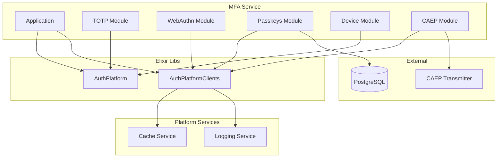

# Design Document: MFA Service Modernization 2025

## Overview

This design document describes the modernization of the MFA (Multi-Factor Authentication) Service to state-of-the-art December 2025 standards. The modernization eliminates redundancy, centralizes logic, integrates with platform services (logging-service, cache-service), and leverages the Elixir libs (auth_platform, auth_platform_clients).

### Key Modernization Goals

1. **Platform Integration**: Replace direct Redis/ETS with Cache_Service, use Logging_Service for structured logging
2. **Library Reuse**: Leverage AuthPlatform for security, validation, resilience, and observability
3. **Zero Redundancy**: Centralize challenge storage, eliminate duplicate implementations
4. **State of the Art**: Elixir 1.17+, OTP 27+, latest WebAuthn Level 2 spec
5. **Production Ready**: 80%+ test coverage, property-based tests, latency SLOs

## Architecture

### High-Level Architecture



### Module Structure

```
services/mfa/
├── lib/
│   └── mfa_service/
│       ├── application.ex          # Application startup, client initialization
│       ├── repo.ex                 # Ecto repository
│       ├── totp/
│       │   ├── generator.ex        # TOTP secret generation, provisioning URIs
│       │   └── validator.ex        # TOTP code validation
│       ├── webauthn/
│       │   ├── authentication.ex   # WebAuthn assertion verification
│       │   └── challenge.ex        # Challenge generation (uses Cache_Service)
│       ├── passkeys/
│       │   ├── authentication.ex   # Passkey authentication flow
│       │   ├── config.ex           # WebAuthn configuration
│       │   ├── credential.ex       # Ecto schema for credentials
│       │   ├── cross_device.ex     # Cross-device authentication
│       │   ├── management.ex       # Passkey CRUD operations
│       │   ├── provider.ex         # Storage provider behaviour
│       │   └── registration.ex     # Passkey registration flow
│       ├── device/
│       │   └── fingerprint.ex      # Device fingerprinting
│       └── caep/
│           └── emitter.ex          # CAEP event emission
├── test/
│   ├── mfa_service/
│   │   ├── totp/
│   │   │   ├── generator_test.exs
│   │   │   └── validator_test.exs
│   │   ├── webauthn/
│   │   │   ├── authentication_test.exs
│   │   │   └── challenge_test.exs
│   │   ├── passkeys/
│   │   │   ├── authentication_test.exs
│   │   │   ├── cross_device_test.exs
│   │   │   ├── management_test.exs
│   │   │   └── registration_test.exs
│   │   ├── device/
│   │   │   └── fingerprint_test.exs
│   │   └── caep/
│   │       └── emitter_test.exs
│   ├── property/
│   │   ├── totp_property_test.exs
│   │   ├── webauthn_property_test.exs
│   │   ├── fingerprint_property_test.exs
│   │   └── passkeys_property_test.exs
│   └── integration/
│       ├── cache_client_test.exs
│       └── logging_client_test.exs
└── mix.exs
```

## Components and Interfaces

### Application Module

```elixir
defmodule MfaService.Application do
  use Application
  
  alias AuthPlatform.Clients.{Cache, Logging}
  alias AuthPlatform.Resilience.Supervisor, as: ResilienceSupervisor
  
  @impl true
  def start(_type, _args) do
    children = [
      # Start resilience supervisor first
      {ResilienceSupervisor, []},
      # Initialize platform service clients
      {Task, fn -> initialize_platform_clients() end},
      # Database
      MfaService.Repo,
      # gRPC server
      {GRPC.Server.Supervisor, endpoint: MfaService.GRPC.Endpoint, port: grpc_port()}
    ]
    
    opts = [strategy: :one_for_one, name: MfaService.Supervisor]
    Supervisor.start_link(children, opts)
  end
  
  defp initialize_platform_clients do
    Cache.start_circuit_breaker(%{failure_threshold: 5, timeout_ms: 30_000})
    Logging.start_circuit_breaker(%{failure_threshold: 5, timeout_ms: 30_000})
  end
end
```

### Challenge Storage Interface (Centralized)

```elixir
defmodule MfaService.Challenge do
  @moduledoc """
  Centralized challenge storage using Cache_Service.
  Replaces all direct Redis/ETS challenge storage.
  """
  
  alias AuthPlatform.Clients.Cache
  alias AuthPlatform.Security
  
  @challenge_length 32
  @default_ttl 300  # 5 minutes
  
  @spec generate() :: binary()
  def generate do
    :crypto.strong_rand_bytes(@challenge_length)
  end
  
  @spec store(String.t(), binary(), keyword()) :: :ok | {:error, term()}
  def store(key, challenge, opts \\ []) do
    ttl = Keyword.get(opts, :ttl, @default_ttl)
    cache_key = "mfa:challenge:#{key}"
    encoded = Base.url_encode64(challenge, padding: false)
    Cache.set(cache_key, encoded, ttl: ttl)
  end
  
  @spec retrieve(String.t()) :: {:ok, binary()} | {:error, :not_found}
  def retrieve(key) do
    cache_key = "mfa:challenge:#{key}"
    case Cache.get(cache_key) do
      {:ok, nil} -> {:error, :not_found}
      {:ok, encoded} -> {:ok, Base.url_decode64!(encoded, padding: false)}
      error -> error
    end
  end
  
  @spec retrieve_and_delete(String.t()) :: {:ok, binary()} | {:error, :not_found}
  def retrieve_and_delete(key) do
    case retrieve(key) do
      {:ok, challenge} = result ->
        Cache.delete("mfa:challenge:#{key}")
        result
      error -> error
    end
  end
  
  @spec verify(binary(), binary()) :: :ok | {:error, :challenge_mismatch}
  def verify(received, expected) do
    if Security.constant_time_compare(received, expected) do
      :ok
    else
      {:error, :challenge_mismatch}
    end
  end
end
```

### TOTP Generator Interface

```elixir
defmodule MfaService.TOTP.Generator do
  alias AuthPlatform.Security
  
  @secret_length 20  # 160 bits per RFC 4226
  @default_issuer "AuthPlatform"
  
  @spec generate_secret(pos_integer()) :: String.t()
  def generate_secret(length \\ @secret_length) do
    :crypto.strong_rand_bytes(length)
    |> Base.encode32(padding: false)
  end
  
  @spec provisioning_uri(String.t(), String.t(), keyword()) :: String.t()
  def provisioning_uri(secret, account_name, opts \\ [])
  
  @spec encrypt_secret(String.t(), binary()) :: String.t()
  def encrypt_secret(secret, key)
  
  @spec decrypt_secret(String.t(), binary()) :: String.t()
  def decrypt_secret(encrypted, key)
end
```

### TOTP Validator Interface

```elixir
defmodule MfaService.TOTP.Validator do
  alias AuthPlatform.Security
  
  @time_window 1  # ±1 step
  
  @spec validate(String.t(), String.t(), keyword()) :: :ok | {:error, :invalid_code}
  def validate(code, secret, opts \\ [])
  
  @spec generate_code(String.t(), integer() | nil, pos_integer(), pos_integer()) :: String.t()
  def generate_code(secret, timestamp \\ nil, period \\ 30, digits \\ 6)
end
```

### WebAuthn Authentication Interface

```elixir
defmodule MfaService.WebAuthn.Authentication do
  alias MfaService.Challenge
  
  @spec begin_authentication(String.t(), [map()], keyword()) :: 
    {:ok, map(), binary()}
  def begin_authentication(user_id, credentials, opts \\ [])
  
  @spec complete_authentication(map(), map(), binary(), keyword()) ::
    {:ok, map()} | {:error, term()}
  def complete_authentication(assertion, stored_credential, expected_challenge, opts \\ [])
end
```

### Passkeys Management Interface

```elixir
defmodule MfaService.Passkeys.Management do
  @reauth_window_seconds 300  # 5 minutes
  
  @spec list_passkeys(String.t()) :: {:ok, [map()]}
  def list_passkeys(user_id)
  
  @spec rename_passkey(String.t(), String.t(), String.t()) :: 
    {:ok, map()} | {:error, term()}
  def rename_passkey(user_id, passkey_id, new_name)
  
  @spec delete_passkey(String.t(), String.t(), DateTime.t()) ::
    :ok | {:error, term()}
  def delete_passkey(user_id, passkey_id, last_auth_at)
  
  @spec can_delete?(String.t(), String.t()) :: {:ok, boolean(), String.t() | nil}
  def can_delete?(user_id, passkey_id)
end
```

### Device Fingerprint Interface

```elixir
defmodule MfaService.Device.Fingerprint do
  @significant_change_threshold 0.3  # 30% difference
  
  @spec compute(map()) :: String.t()
  def compute(attributes)
  
  @spec compare(map() | String.t(), map() | String.t()) :: map()
  def compare(old, new)
  
  @spec requires_reauth?(map()) :: boolean()
  def requires_reauth?(comparison_result)
  
  @spec extract_attributes(map(), map()) :: map()
  def extract_attributes(headers, metadata \\ %{})
end
```

### CAEP Emitter Interface

```elixir
defmodule MfaService.Caep.Emitter do
  alias AuthPlatform.Clients.Logging
  
  @spec emit_passkey_added(String.t(), String.t()) :: {:ok, String.t()} | {:error, term()}
  def emit_passkey_added(user_id, passkey_id)
  
  @spec emit_passkey_removed(String.t(), String.t()) :: {:ok, String.t()} | {:error, term()}
  def emit_passkey_removed(user_id, passkey_id)
  
  @spec emit_totp_enabled(String.t()) :: {:ok, String.t()} | {:error, term()}
  def emit_totp_enabled(user_id)
  
  @spec emit_totp_disabled(String.t()) :: {:ok, String.t()} | {:error, term()}
  def emit_totp_disabled(user_id)
end
```

## Data Models

### Passkey Credential Schema

```elixir
defmodule MfaService.Passkeys.Credential do
  use Ecto.Schema
  import Ecto.Changeset
  
  @primary_key {:id, :binary_id, autogenerate: true}
  
  schema "passkey_credentials" do
    field :user_id, :binary_id
    field :credential_id, :binary
    field :public_key, :binary
    field :public_key_alg, :integer
    field :sign_count, :integer, default: 0
    field :transports, {:array, :string}, default: []
    field :attestation_format, :string
    field :attestation_statement, :map
    field :aaguid, :binary_id
    field :device_name, :string
    field :is_discoverable, :boolean, default: true
    field :backed_up, :boolean, default: false
    field :last_used_at, :utc_datetime_usec
    
    timestamps(type: :utc_datetime_usec)
  end
end
```

### Challenge Cache Structure

```
Key: mfa:challenge:{user_id|session_id}
Value: Base64URL-encoded challenge bytes
TTL: 300 seconds (5 minutes)
```

### Cross-Device Session Structure

```
Key: mfa:cross_device:{session_id}
Value: JSON-encoded session data
  - tunnel_id: String
  - user_id: String | nil
  - challenge: Base64URL-encoded
  - expires_at: ISO8601 timestamp
TTL: 300 seconds (5 minutes)
```

## Correctness Properties

*A property is a characteristic or behavior that should hold true across all valid executions of a system—essentially, a formal statement about what the system should do. Properties serve as the bridge between human-readable specifications and machine-verifiable correctness guarantees.*

### Property 1: TOTP Secret Entropy

*For any* generated TOTP secret, the secret SHALL have at least 160 bits (20 bytes) of entropy from a cryptographically secure random source.

**Validates: Requirements 3.1**

### Property 2: TOTP Encryption Round-Trip

*For any* valid TOTP secret and encryption key, encrypting then decrypting the secret SHALL produce the original secret value.

**Validates: Requirements 3.4**

### Property 3: TOTP Provisioning URI Format

*For any* valid TOTP secret and account name, the generated provisioning URI SHALL match the pattern `otpauth://totp/{label}?secret={secret}&issuer={issuer}&algorithm={alg}&digits={digits}&period={period}`.

**Validates: Requirements 3.5**

### Property 4: TOTP Generate-Validate Round-Trip

*For any* valid TOTP secret and timestamp, generating a code and validating it within the same time window (±1 step) SHALL succeed.

**Validates: Requirements 3.2, 3.6**

### Property 5: WebAuthn Challenge Entropy

*For any* generated WebAuthn challenge, the challenge SHALL be exactly 32 bytes with approximately balanced bit distribution (30-70% ones).

**Validates: Requirements 4.1**

### Property 6: WebAuthn Challenge Encode-Decode Round-Trip

*For any* WebAuthn challenge, encoding to Base64URL then decoding SHALL produce the original challenge bytes.

**Validates: Requirements 4.7**

### Property 7: WebAuthn Sign Count Monotonicity

*For any* stored sign count N and new sign count M, authentication SHALL succeed only if M > N (strictly greater).

**Validates: Requirements 4.5**

### Property 8: WebAuthn Authenticator Data Parsing

*For any* valid authenticator data binary, parsing SHALL correctly extract the RP ID hash (32 bytes), flags (1 byte), and sign count (4 bytes big-endian).

**Validates: Requirements 4.6**

### Property 9: Device Fingerprint Determinism

*For any* set of device attributes, computing the fingerprint multiple times SHALL always produce the same SHA-256 hash.

**Validates: Requirements 5.1, 5.5**

### Property 10: Device Fingerprint Reflexivity

*For any* set of device attributes, comparing the fingerprint with itself SHALL return 100% similarity and match=true.

**Validates: Requirements 5.6**

### Property 11: Device Fingerprint Similarity Calculation

*For any* two sets of device attributes with K matching attributes out of N total, the similarity SHALL equal K/N.

**Validates: Requirements 5.2**

### Property 12: Device Fingerprint Significant Change Threshold

*For any* comparison result with similarity < 70%, the significant_change flag SHALL be true and requires_reauth? SHALL return true.

**Validates: Requirements 5.3**

### Property 13: Passkey List Structure Completeness

*For any* user with passkeys, listing passkeys SHALL return records containing id, device_name, created_at, last_used_at, backed_up, and transports fields.

**Validates: Requirements 7.1**

### Property 14: Passkey Rename Validation

*For any* passkey rename operation with name length > 255 characters, the operation SHALL fail with validation error.

**Validates: Requirements 7.2**

### Property 15: Passkey Delete Recent Auth Requirement

*For any* passkey delete operation where last_auth_at is more than 300 seconds ago, the operation SHALL fail with :reauth_required error.

**Validates: Requirements 7.3**

### Property 16: Cross-Device QR Code Format

*For any* cross-device authentication initiation, the QR code content SHALL start with "FIDO://" and contain valid CBOR-encoded hybrid transport data.

**Validates: Requirements 8.1**

### Property 17: Cross-Device Session Lifecycle

*For any* cross-device session, checking status SHALL return :pending before completion, :completed after successful auth, or :expired after TTL.

**Validates: Requirements 8.3, 8.5**

### Property 18: Error Message Sanitization

*For any* error returned by the MFA service, the error message SHALL NOT contain internal implementation details, stack traces, or sensitive data.

**Validates: Requirements 11.6**

## Error Handling

### Error Types

All errors use `AuthPlatform.Errors.AppError` for consistency:

```elixir
# Validation errors (4xx)
AppError.validation("Invalid TOTP code format")
AppError.validation("Passkey name exceeds 255 characters")

# Authentication errors (401)
AppError.unauthorized("Invalid TOTP code")
AppError.unauthorized("WebAuthn signature verification failed")

# Authorization errors (403)
AppError.forbidden("Re-authentication required for passkey deletion")
AppError.forbidden("Cannot delete last passkey without alternative method")

# Not found errors (404)
AppError.not_found("Challenge not found or expired")
AppError.not_found("Passkey not found")

# Conflict errors (409)
AppError.conflict("Sign count not increased - possible cloned authenticator")

# Internal errors (500)
AppError.internal("Cache service unavailable")
```

### Error Handling Strategy

1. **Input Validation**: Use `AuthPlatform.Validation` to validate all inputs before processing
2. **Circuit Breaker**: Wrap external service calls with `AuthPlatform.Resilience.CircuitBreaker`
3. **Retry**: Use `AuthPlatform.Resilience.Retry` for transient failures
4. **Fallback**: Implement graceful degradation when services are unavailable
5. **Logging**: Log all errors with correlation IDs using `AuthPlatform.Observability.Logger`

## Testing Strategy

### Dual Testing Approach

The MFA service uses both unit tests and property-based tests for comprehensive coverage:

- **Unit tests**: Verify specific examples, edge cases, and error conditions
- **Property tests**: Verify universal properties across all valid inputs using StreamData

### Property-Based Testing Configuration

- **Library**: StreamData (Elixir)
- **Minimum iterations**: 100 per property test
- **Tag format**: `**Feature: mfa-service-modernization-2025, Property {number}: {property_text}**`

### Test Organization

```
test/
├── mfa_service/           # Unit tests (mirror source structure)
│   ├── totp/
│   ├── webauthn/
│   ├── passkeys/
│   ├── device/
│   └── caep/
├── property/              # Property-based tests
│   ├── totp_property_test.exs
│   ├── webauthn_property_test.exs
│   ├── fingerprint_property_test.exs
│   └── passkeys_property_test.exs
└── integration/           # Integration tests
    ├── cache_client_test.exs
    └── logging_client_test.exs
```

### Coverage Requirements

- Minimum 80% code coverage
- All public functions must have unit tests
- All cryptographic operations must have property tests
- All round-trip operations must have property tests

### Test Commands

```bash
# Run all tests
mix test

# Run with coverage
mix test --cover

# Run property tests only
mix test test/property/

# Run specific property test
mix test test/property/totp_property_test.exs
```
