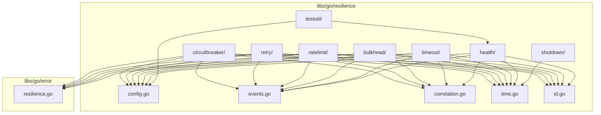

# Design Document: Resilience Library Extraction

## Overview

This design document describes the extraction of reusable resilience patterns from `platform/resilience-service/internal/` to shared libraries under `libs/go/resilience/`. The extraction maximizes code reuse across the monorepo while maintaining backward compatibility with the existing resilience-service.

### Current State Analysis

**Existing Libraries:**
- `libs/go/resilience/` - Contains primitives: config types, events, correlation, time helpers, ID generation
- `libs/go/error/` - Contains resilience error types and gRPC error mapping

**Resilience Service Internal Packages:**
- `internal/domain/` - Re-exports from libs + service-specific interfaces (CircuitBreaker, RateLimiter, Bulkhead, TimeoutManager, HealthAggregator)
- `internal/circuitbreaker/` - Circuit breaker implementation (~180 lines)
- `internal/retry/` - Retry handler with exponential backoff (~200 lines)
- `internal/ratelimit/` - Token bucket and sliding window implementations (~280 lines)
- `internal/bulkhead/` - Semaphore-based bulkhead (~200 lines)
- `internal/timeout/` - Timeout manager (~80 lines)
- `internal/health/` - Health aggregator (~180 lines)
- `internal/server/` - Graceful shutdown (~80 lines)
- `tests/testutil/` - Property-based test generators (~180 lines)

**Extraction Opportunity:** ~1,400 lines of reusable code

## Architecture

### Target Library Structure

```
libs/go/resilience/
├── config.go                    # Existing - config types
├── correlation.go               # Existing - correlation functions
├── events.go                    # Existing - event types
├── id.go                        # Existing - ID generation
├── time.go                      # Existing - time helpers
├── policy_events.go             # NEW - policy event types
├── circuitbreaker/
│   ├── breaker.go               # NEW - CircuitBreaker implementation
│   ├── serialization.go         # NEW - state serialization
│   └── breaker_test.go          # NEW - tests
├── retry/
│   ├── handler.go               # NEW - RetryHandler implementation
│   ├── policy.go                # NEW - policy serialization
│   ├── rand.go                  # NEW - random source abstraction
│   └── handler_test.go          # NEW - tests
├── ratelimit/
│   ├── token_bucket.go          # NEW - TokenBucket implementation
│   ├── sliding_window.go        # NEW - SlidingWindow implementation
│   ├── factory.go               # NEW - factory function
│   └── ratelimit_test.go        # NEW - tests
├── bulkhead/
│   ├── bulkhead.go              # NEW - Bulkhead implementation
│   ├── manager.go               # NEW - BulkheadManager
│   └── bulkhead_test.go         # NEW - tests
├── timeout/
│   ├── manager.go               # NEW - TimeoutManager implementation
│   └── manager_test.go          # NEW - tests
├── health/
│   ├── types.go                 # NEW - health types
│   ├── aggregator.go            # NEW - HealthAggregator implementation
│   └── aggregator_test.go       # NEW - tests
├── shutdown/
│   ├── graceful.go              # NEW - GracefulShutdown implementation
│   └── graceful_test.go         # NEW - tests
└── testutil/
    ├── generators.go            # NEW - gopter generators
    ├── emitter.go               # NEW - MockEventEmitter
    └── generators_test.go       # NEW - tests
```

### Dependency Graph



## Components and Interfaces

### Circuit Breaker Interface

```go
// CircuitBreakerState represents persistent circuit state.
type CircuitBreakerState struct {
    ServiceName     string       `json:"service_name"`
    State           CircuitState `json:"state"`
    FailureCount    int          `json:"failure_count"`
    SuccessCount    int          `json:"success_count"`
    LastFailureTime *time.Time   `json:"last_failure_time,omitempty"`
    LastStateChange time.Time    `json:"last_state_change"`
    Version         int64        `json:"version"`
}

// CircuitBreaker manages state transitions for a protected service.
type CircuitBreaker interface {
    Execute(ctx context.Context, operation func() error) error
    GetState() CircuitState
    GetFullState() CircuitBreakerState
    RecordSuccess()
    RecordFailure()
    Reset()
}
```

### Retry Handler Interface

```go
// RetryHandler manages retry logic with backoff.
type RetryHandler interface {
    Execute(ctx context.Context, operation func() error) error
    ExecuteWithCircuitBreaker(ctx context.Context, cb CircuitBreaker, operation func() error) error
    CalculateDelay(attempt int) time.Duration
}

// RandSource provides random number generation for jitter calculations.
type RandSource interface {
    Float64() float64
}
```

### Rate Limiter Interface

```go
// RateLimitDecision represents allow/deny decision.
type RateLimitDecision struct {
    Allowed    bool
    Remaining  int
    Limit      int
    ResetAt    time.Time
    RetryAfter time.Duration
}

// RateLimiter controls request throughput.
type RateLimiter interface {
    Allow(ctx context.Context, key string) (RateLimitDecision, error)
    GetHeaders(ctx context.Context, key string) (RateLimitHeaders, error)
}
```

### Bulkhead Interface

```go
// BulkheadMetrics reports bulkhead utilization.
type BulkheadMetrics struct {
    ActiveCount   int
    QueuedCount   int
    RejectedCount int64
}

// Bulkhead provides isolation through concurrency limits.
type Bulkhead interface {
    Acquire(ctx context.Context) error
    Release()
    GetMetrics() BulkheadMetrics
}

// BulkheadManager manages multiple bulkhead partitions.
type BulkheadManager interface {
    GetBulkhead(partition string) Bulkhead
    GetAllMetrics() map[string]BulkheadMetrics
}
```

### Timeout Manager Interface

```go
// TimeoutManager manages timeout enforcement.
type TimeoutManager interface {
    Execute(ctx context.Context, operation string, fn func(ctx context.Context) error) error
    GetTimeout(operation string) time.Duration
    WithTimeout(ctx context.Context, operation string) (context.Context, context.CancelFunc)
}
```

### Health Aggregator Interface

```go
// HealthStatus represents service health status.
type HealthStatus string

const (
    HealthHealthy   HealthStatus = "healthy"
    HealthDegraded  HealthStatus = "degraded"
    HealthUnhealthy HealthStatus = "unhealthy"
)

// HealthChecker checks health of a service.
type HealthChecker interface {
    Check(ctx context.Context) (HealthStatus, string, error)
}

// HealthAggregator collects and aggregates service health.
type HealthAggregator interface {
    GetAggregatedHealth(ctx context.Context) (*AggregatedHealth, error)
    RegisterService(name string, checker HealthChecker) error
    UnregisterService(name string) error
    UpdateHealth(name string, status HealthStatus, message string)
}
```

### Graceful Shutdown Interface

```go
// GracefulShutdown manages graceful shutdown with request draining.
type GracefulShutdown interface {
    RequestStarted() bool
    RequestFinished()
    InFlightCount() int64
    Shutdown(ctx context.Context) error
    IsShutdown() bool
    ShutdownCh() <-chan struct{}
}
```

## Data Models

### Policy Events (New in libs/go/resilience/)

```go
// PolicyEventType represents the type of policy event.
type PolicyEventType string

const (
    PolicyCreated PolicyEventType = "created"
    PolicyUpdated PolicyEventType = "updated"
    PolicyDeleted PolicyEventType = "deleted"
)

// PolicyEvent represents a policy change event.
type PolicyEvent struct {
    Type   PolicyEventType
    Policy *ResiliencePolicy
}
```

### Circuit Breaker State Change Event

```go
// CircuitStateChangeEvent represents a circuit state change event.
type CircuitStateChangeEvent struct {
    ServiceName   string       `json:"service_name"`
    PreviousState CircuitState `json:"previous_state"`
    NewState      CircuitState `json:"new_state"`
    CorrelationID string       `json:"correlation_id"`
    Timestamp     time.Time    `json:"timestamp"`
    FailureCount  int          `json:"failure_count"`
    SuccessCount  int          `json:"success_count"`
}
```

## Correctness Properties

*A property is a characteristic or behavior that should hold true across all valid executions of a system-essentially, a formal statement about what the system should do. Properties serve as the bridge between human-readable specifications and machine-verifiable correctness guarantees.*

### Property 1: Circuit Breaker State Transitions

*For any* circuit breaker with a valid configuration, recording failures up to the failure threshold SHALL transition the state from CLOSED to OPEN.

**Validates: Requirements 1.1**

### Property 2: Circuit Breaker Half-Open Recovery

*For any* circuit breaker in OPEN state, after the timeout duration elapses, the next request SHALL transition the state to HALF_OPEN.

**Validates: Requirements 1.1**

### Property 3: Retry Delay Bounds

*For any* retry handler with valid configuration and any attempt number, the calculated delay SHALL be non-negative and SHALL NOT exceed MaxDelay.

**Validates: Requirements 1.2**

### Property 4: Retry Exponential Backoff

*For any* retry handler with valid configuration, the base delay (before jitter) for attempt N+1 SHALL be greater than or equal to the base delay for attempt N, up to MaxDelay.

**Validates: Requirements 1.2**

### Property 5: Token Bucket Capacity Invariant

*For any* token bucket rate limiter, the token count SHALL never exceed the configured capacity.

**Validates: Requirements 1.3**

### Property 6: Sliding Window Request Count

*For any* sliding window rate limiter, the number of tracked requests SHALL never exceed the configured limit within any window period.

**Validates: Requirements 1.3**

### Property 7: Bulkhead Concurrency Limit

*For any* bulkhead with MaxConcurrent=N, at most N concurrent operations SHALL be active at any time.

**Validates: Requirements 1.4**

### Property 8: Health Status Aggregation

*For any* set of service health statuses, the aggregated status SHALL be the worst status (unhealthy > degraded > healthy).

**Validates: Requirements 2.1**

### Property 9: Graceful Shutdown Request Tracking

*For any* graceful shutdown manager, the in-flight count SHALL equal the number of started requests minus the number of finished requests.

**Validates: Requirements 3.1, 3.2**

### Property 10: Generated Configs Pass Validation

*For any* configuration generated by the test generators, calling Validate() SHALL return nil (no error).

**Validates: Requirements 4.1, 4.2**

### Property 11: Serialization Round-Trip

*For any* valid CircuitBreakerState, marshaling then unmarshaling SHALL produce an equivalent state.

**Validates: Requirements 5.1, 5.2, 5.3**

### Property 12: Retry Policy Round-Trip

*For any* valid RetryConfig, marshaling to PolicyDefinition then converting back SHALL produce an equivalent config.

**Validates: Requirements 5.2, 5.3**

### Property 13: Deterministic Random Source Reproducibility

*For any* seed value, two DeterministicRandSource instances with the same seed SHALL produce identical sequences.

**Validates: Requirements 7.3**

### Property 14: Random Source Value Range

*For any* RandSource implementation, Float64() SHALL return values in the range [0.0, 1.0).

**Validates: Requirements 7.1, 7.2**

### Property 15: Mock Event Emitter Recording

*For any* sequence of events emitted to a MockEventEmitter, GetEvents() SHALL return all emitted events in order.

**Validates: Requirements 4.3**

## Error Handling

### Error Types (Already in libs/go/error/)

The extraction reuses existing error types:
- `ErrCircuitOpen` - Circuit breaker is open
- `ErrRateLimitExceeded` - Rate limit exceeded
- `ErrTimeout` - Operation timed out
- `ErrBulkheadFull` - Bulkhead capacity exceeded
- `ErrRetryExhausted` - All retry attempts failed

### Error Propagation

1. All resilience pattern implementations return `*ResilienceError` for domain errors
2. Context cancellation errors are propagated as-is
3. Operation errors are wrapped in retry exhausted errors when applicable

## Testing Strategy

### Property-Based Testing Library

**Selected Library:** `github.com/leanovate/gopter`

This library is already used in the resilience-service tests and provides:
- Generators for primitive types
- Combinators for complex type generation
- Shrinking for minimal failing examples
- Integration with Go's testing package

### Test Configuration

- Minimum 100 iterations per property test
- Seed logging for reproducibility
- Shrinking enabled for minimal counterexamples

### Unit Tests

Unit tests will cover:
- Edge cases (empty inputs, zero values, boundary conditions)
- Error conditions (invalid configs, context cancellation)
- Integration between components (retry with circuit breaker)

### Property Tests

Each correctness property will have a corresponding property-based test:

```go
// Example: Property 11 - Serialization Round-Trip
func TestCircuitBreakerStateRoundTrip(t *testing.T) {
    properties := gopter.NewProperties(gopter.DefaultTestParameters())
    
    properties.Property("marshal then unmarshal preserves state", prop.ForAll(
        func(state CircuitBreakerState) bool {
            data, err := MarshalState(state)
            if err != nil {
                return false
            }
            restored, err := UnmarshalState(data)
            if err != nil {
                return false
            }
            return statesEqual(state, restored)
        },
        GenCircuitBreakerState(),
    ))
    
    properties.TestingRun(t)
}
```

### Test File Organization

```
libs/go/resilience/
├── circuitbreaker/
│   ├── breaker_test.go          # Unit tests
│   └── breaker_property_test.go # Property tests
├── retry/
│   ├── handler_test.go
│   └── handler_property_test.go
├── ratelimit/
│   ├── ratelimit_test.go
│   └── ratelimit_property_test.go
├── bulkhead/
│   ├── bulkhead_test.go
│   └── bulkhead_property_test.go
├── health/
│   ├── aggregator_test.go
│   └── aggregator_property_test.go
├── shutdown/
│   ├── graceful_test.go
│   └── graceful_property_test.go
└── testutil/
    └── generators_test.go
```
