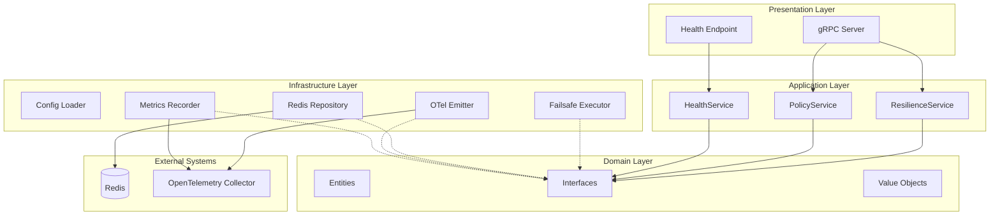

# Design Document: Resilience Service Architecture 2025

## Overview

This design document describes the state-of-the-art modernization of the `platform/resilience-service`. The modernization eliminates redundancies, centralizes logic, adopts Go 1.25+ patterns, and achieves clean architecture with strict separation between source code and tests.

The target architecture uses:
- **failsafe-go** as the single resilience implementation library
- **uber-go/fx** for dependency injection
- **OpenTelemetry** for observability
- **viper** for configuration management
- **go-redis/v9** for Redis connectivity

## Architecture

### High-Level Architecture



### Directory Structure (After Modernization)

```
platform/resilience-service/
├── cmd/
│   └── server/
│       └── main.go                    # Entry point with fx.New()
├── internal/
│   ├── application/
│   │   ├── fx_module.go               # fx module definitions
│   │   └── services/
│   │       ├── health_service.go
│   │       ├── policy_service.go
│   │       └── resilience_service.go
│   ├── domain/
│   │   ├── entities/
│   │   │   ├── configs.go             # Config entities (uses libs/go types)
│   │   │   └── policy.go              # Policy entity
│   │   ├── interfaces/
│   │   │   └── resilience.go          # Domain interfaces
│   │   └── valueobjects/
│   │       └── events.go              # Value objects
│   ├── infrastructure/
│   │   ├── config/
│   │   │   └── config.go              # Viper-based config loader
│   │   ├── observability/
│   │   │   ├── otel_emitter.go        # OpenTelemetry event emitter
│   │   │   ├── otel_setup.go          # OTel initialization
│   │   │   └── metrics_recorder.go    # Metrics recording
│   │   ├── repositories/
│   │   │   └── redis_repository.go    # Redis policy repository
│   │   └── resilience/
│   │       └── failsafe_executor.go   # Failsafe-go executor
│   └── presentation/
│       └── grpc/
│           ├── server.go              # gRPC server
│           └── handlers.go            # Request handlers
├── tests/
│   ├── benchmark/
│   │   └── *.go                       # Benchmark tests
│   ├── integration/
│   │   └── *.go                       # Integration tests
│   ├── property/
│   │   └── *.go                       # Property-based tests
│   ├── unit/
│   │   └── *.go                       # Unit tests
│   └── testutil/
│       ├── helpers.go                 # Test helpers
│       └── mocks.go                   # Shared mocks
├── go.mod
├── go.sum
└── README.md
```

### Files to Remove

The following files/directories will be removed as part of deduplication:

1. `internal/config/` - Duplicate of `internal/infrastructure/config/`
2. `internal/infra/` - Duplicate of `internal/infrastructure/`
3. `internal/bulkhead/` - Replaced by failsafe-go
4. `internal/retry/` - Replaced by failsafe-go
5. `internal/ratelimit/` - Replaced by failsafe-go
6. `internal/timeout/` - Replaced by failsafe-go
7. `internal/circuitbreaker/` - Replaced by failsafe-go
8. `internal/health/` - Consolidated into application/services
9. `internal/policy/` - Consolidated into application/services
10. `internal/domain/circuit_breaker.go` - Uses libs/go directly
11. `internal/domain/errors.go` - Uses libs/go directly
12. `internal/domain/correlation.go` - Uses libs/go directly
13. `internal/domain/uuid.go` - Uses libs/go directly
14. `internal/domain/event_builder.go` - Uses libs/go directly
15. `internal/domain/events.go` - Uses libs/go directly
16. `internal/domain/policy_events.go` - Uses libs/go directly
17. All `*_prop_test.go` files in `internal/` - Moved to `tests/property/`
18. All `.gitkeep` files in directories with content

## Components and Interfaces

### Domain Interfaces

```go
// Package interfaces defines core domain interfaces with no external dependencies.
package interfaces

import (
    "context"
    "github.com/authcorp/libs/go/src/functional"
    "github.com/authcorp/libs/go/src/resilience"
    "github.com/auth-platform/platform/resilience-service/internal/domain/entities"
    "github.com/auth-platform/platform/resilience-service/internal/domain/valueobjects"
)

// PolicyRepository manages policy persistence and retrieval with type-safe returns.
type PolicyRepository interface {
    // Get retrieves a policy by name, returning Option for type-safe null handling.
    Get(ctx context.Context, name string) functional.Option[*entities.Policy]
    
    // Save persists a policy and returns Result for error handling.
    Save(ctx context.Context, policy *entities.Policy) functional.Result[*entities.Policy]
    
    // Delete removes a policy by name.
    Delete(ctx context.Context, name string) error
    
    // List returns all policies.
    List(ctx context.Context) functional.Result[[]*entities.Policy]
    
    // Exists checks if a policy exists.
    Exists(ctx context.Context, name string) bool
    
    // Watch returns a channel for policy change events.
    Watch(ctx context.Context) (<-chan valueobjects.PolicyEvent, error)
}

// ResilienceExecutor applies resilience patterns to operations.
// Extends the generic executor from libs/go with service-specific methods.
type ResilienceExecutor interface {
    // Execute runs an operation with resilience patterns.
    Execute(ctx context.Context, policyName string, operation func() error) error
    
    // ExecuteWithResult runs an operation returning a typed result.
    ExecuteWithResult(ctx context.Context, policyName string, operation func() (any, error)) functional.Result[any]
    
    // RegisterPolicy registers a policy with the executor.
    RegisterPolicy(policy *entities.Policy) error
    
    // UnregisterPolicy removes a policy from the executor.
    UnregisterPolicy(policyName string)
    
    // GetPolicyNames returns all registered policy names.
    GetPolicyNames() []string
}

// TypedResilienceExecutor is a generic executor for type-safe operations.
type TypedResilienceExecutor[T any] interface {
    resilience.ResilienceExecutor[T]
}

// HealthChecker provides health status for components.
type HealthChecker interface {
    Check(ctx context.Context) valueobjects.HealthStatus
    Name() string
}

// EventEmitter publishes domain events with type safety.
type EventEmitter interface {
    Emit(ctx context.Context, event valueobjects.DomainEvent) error
    EmitPolicyEvent(ctx context.Context, event valueobjects.PolicyEvent) error
}

// PolicyValidator validates policy configurations.
type PolicyValidator interface {
    Validate(policy *entities.Policy) functional.Result[*entities.Policy]
    ValidateCircuitBreaker(config *entities.CircuitBreakerConfig) functional.Result[*entities.CircuitBreakerConfig]
    ValidateRetry(config *entities.RetryConfig) functional.Result[*entities.RetryConfig]
    ValidateTimeout(config *entities.TimeoutConfig) functional.Result[*entities.TimeoutConfig]
    ValidateRateLimit(config *entities.RateLimitConfig) functional.Result[*entities.RateLimitConfig]
    ValidateBulkhead(config *entities.BulkheadConfig) functional.Result[*entities.BulkheadConfig]
}

// MetricsRecorder records resilience execution metrics.
// Extends the shared MetricsRecorder from libs/go.
type MetricsRecorder interface {
    resilience.MetricsRecorder
    
    // RecordCacheStats records cache statistics.
    RecordCacheStats(ctx context.Context, hits, misses, evictions int64)
}

// Logger provides structured logging interface.
type Logger interface {
    Debug(ctx context.Context, msg string, fields map[string]any)
    Info(ctx context.Context, msg string, fields map[string]any)
    Warn(ctx context.Context, msg string, fields map[string]any)
    Error(ctx context.Context, msg string, err error, fields map[string]any)
}

// Tracer provides distributed tracing interface.
type Tracer interface {
    StartSpan(ctx context.Context, name string) (context.Context, func())
    AddEvent(ctx context.Context, name string, attributes map[string]any)
    RecordError(ctx context.Context, err error)
    Name() string
}

// PolicyValidator validates policy configurations.
type PolicyValidator interface {
    Validate(policy *entities.Policy) error
}
```

### Failsafe Executor Implementation

```go
// Package resilience provides failsafe-go based resilience implementations.
package resilience

import (
    "context"
    "fmt"
    "log/slog"
    "sync"
    
    "github.com/auth-platform/platform/resilience-service/internal/domain/entities"
    "github.com/auth-platform/platform/resilience-service/internal/domain/interfaces"
    "github.com/failsafe-go/failsafe-go"
    "github.com/failsafe-go/failsafe-go/bulkhead"
    "github.com/failsafe-go/failsafe-go/circuitbreaker"
    "github.com/failsafe-go/failsafe-go/ratelimiter"
    "github.com/failsafe-go/failsafe-go/retrypolicy"
    "github.com/failsafe-go/failsafe-go/timeout"
)

// FailsafeExecutor implements ResilienceExecutor using failsafe-go.
type FailsafeExecutor struct {
    policies map[string]failsafe.Executor[any]
    metrics  interfaces.MetricsRecorder
    logger   *slog.Logger
    mu       sync.RWMutex
}

// NewFailsafeExecutor creates a new failsafe-go based executor.
func NewFailsafeExecutor(
    metrics interfaces.MetricsRecorder,
    logger *slog.Logger,
) *FailsafeExecutor {
    return &FailsafeExecutor{
        policies: make(map[string]failsafe.Executor[any]),
        metrics:  metrics,
        logger:   logger,
    }
}

// RegisterPolicy creates failsafe-go policies from a domain policy.
func (f *FailsafeExecutor) RegisterPolicy(policy *entities.Policy) error {
    var policies []failsafe.Policy[any]
    
    // Add circuit breaker if configured
    if cb := policy.CircuitBreaker(); cb != nil {
        cbPolicy := circuitbreaker.Builder[any]().
            WithFailureThreshold(uint(cb.FailureThreshold)).
            WithSuccessThreshold(uint(cb.SuccessThreshold)).
            WithDelay(cb.Timeout).
            Build()
        policies = append(policies, cbPolicy)
    }
    
    // Add retry if configured
    if retry := policy.Retry(); retry != nil {
        retryPolicy := retrypolicy.Builder[any]().
            WithMaxAttempts(retry.MaxAttempts).
            WithBackoff(retry.BaseDelay, retry.MaxDelay).
            Build()
        policies = append(policies, retryPolicy)
    }
    
    // Add timeout if configured
    if to := policy.Timeout(); to != nil {
        timeoutPolicy := timeout.With[any](to.Default)
        policies = append(policies, timeoutPolicy)
    }
    
    // Add rate limiter if configured
    if rl := policy.RateLimit(); rl != nil {
        rateLimiter := ratelimiter.SmoothBuilder[any](uint(rl.Limit), rl.Window).Build()
        policies = append(policies, rateLimiter)
    }
    
    // Add bulkhead if configured
    if bh := policy.Bulkhead(); bh != nil {
        bulkheadPolicy := bulkhead.Builder[any](uint(bh.MaxConcurrent)).
            WithMaxWaitTime(bh.QueueTimeout).
            Build()
        policies = append(policies, bulkheadPolicy)
    }
    
    if len(policies) == 0 {
        return fmt.Errorf("policy '%s' has no resilience patterns", policy.Name())
    }
    
    f.mu.Lock()
    f.policies[policy.Name()] = failsafe.NewExecutor[any](policies...)
    f.mu.Unlock()
    
    return nil
}
```

### Configuration with Viper

```go
// Package config provides centralized configuration management.
package config

import (
    "fmt"
    "strings"
    "time"
    
    "github.com/go-playground/validator/v10"
    "github.com/spf13/viper"
)

// Config represents the complete service configuration.
type Config struct {
    Server        ServerConfig        `mapstructure:"server" validate:"required"`
    Redis         RedisConfig         `mapstructure:"redis" validate:"required"`
    OpenTelemetry OTelConfig          `mapstructure:"opentelemetry" validate:"required"`
    Logging       LoggingConfig       `mapstructure:"logging" validate:"required"`
    Policies      PoliciesConfig      `mapstructure:"policies" validate:"required"`
    Defaults      DefaultsConfig      `mapstructure:"defaults" validate:"required"`
}

// Load loads configuration from file and environment variables.
func Load() (*Config, error) {
    v := viper.New()
    setDefaults(v)
    
    v.SetConfigName("config")
    v.SetConfigType("yaml")
    v.AddConfigPath(".")
    v.AddConfigPath("./configs")
    v.AddConfigPath("/etc/resilience")
    
    v.AutomaticEnv()
    v.SetEnvPrefix("RESILIENCE")
    v.SetEnvKeyReplacer(strings.NewReplacer(".", "_"))
    
    if err := v.ReadInConfig(); err != nil {
        if _, ok := err.(viper.ConfigFileNotFoundError); !ok {
            return nil, fmt.Errorf("read config: %w", err)
        }
    }
    
    var config Config
    if err := v.Unmarshal(&config); err != nil {
        return nil, fmt.Errorf("unmarshal config: %w", err)
    }
    
    if err := Validate(&config); err != nil {
        return nil, fmt.Errorf("validate config: %w", err)
    }
    
    return &config, nil
}
```

### FX Module Wiring

```go
// Package application provides fx module definitions.
package application

import (
    "github.com/auth-platform/platform/resilience-service/internal/application/services"
    "github.com/auth-platform/platform/resilience-service/internal/domain/interfaces"
    "github.com/auth-platform/platform/resilience-service/internal/infrastructure/config"
    "github.com/auth-platform/platform/resilience-service/internal/infrastructure/observability"
    "github.com/auth-platform/platform/resilience-service/internal/infrastructure/repositories"
    "github.com/auth-platform/platform/resilience-service/internal/infrastructure/resilience"
    "go.uber.org/fx"
)

// Module provides all application dependencies.
var Module = fx.Options(
    // Configuration
    fx.Provide(config.Load),
    
    // Infrastructure
    fx.Provide(
        fx.Annotate(
            resilience.NewFailsafeExecutor,
            fx.As(new(interfaces.ResilienceExecutor)),
        ),
        fx.Annotate(
            repositories.NewRedisRepository,
            fx.As(new(interfaces.PolicyRepository)),
        ),
        fx.Annotate(
            observability.NewOTelEmitter,
            fx.As(new(interfaces.EventEmitter)),
        ),
        fx.Annotate(
            observability.NewMetricsRecorder,
            fx.As(new(interfaces.MetricsRecorder)),
        ),
    ),
    
    // Application services
    fx.Provide(
        services.NewResilienceService,
        services.NewPolicyService,
        services.NewHealthService,
    ),
)
```

## Data Models

### Policy Entity

```go
// Policy represents a resilience policy configuration.
type Policy struct {
    name           string
    version        int
    circuitBreaker *CircuitBreakerConfig
    retry          *RetryConfig
    timeout        *TimeoutConfig
    rateLimit      *RateLimitConfig
    bulkhead       *BulkheadConfig
    createdAt      time.Time
    updatedAt      time.Time
}
```

### Configuration Types (from libs/go)

The service uses configuration types from `libs/go/src/resilience`:

```go
// CircuitBreakerConfig from libs/go/src/resilience
type CircuitBreakerConfig struct {
    FailureThreshold int
    SuccessThreshold int
    Timeout          time.Duration
    ProbeCount       int
}

// RetryConfig from libs/go/src/resilience
type RetryConfig struct {
    MaxAttempts   int
    BaseDelay     time.Duration
    MaxDelay      time.Duration
    Multiplier    float64
    JitterPercent float64
}

// TimeoutConfig from libs/go/src/resilience
type TimeoutConfig struct {
    Default time.Duration
    Max     time.Duration
}

// RateLimitConfig from libs/go/src/resilience
type RateLimitConfig struct {
    Algorithm string
    Limit     int
    Window    time.Duration
    BurstSize int
}

// BulkheadConfig from libs/go/src/resilience
type BulkheadConfig struct {
    MaxConcurrent int
    MaxQueue      int
    QueueTimeout  time.Duration
}
```

## Correctness Properties

*A property is a characteristic or behavior that should hold true across all valid executions of a system—essentially, a formal statement about what the system should do. Properties serve as the bridge between human-readable specifications and machine-verifiable correctness guarantees.*

### Property 1: Configuration Validation Correctness

*For any* configuration struct, validation SHALL correctly identify invalid configurations and enforce production security requirements (TLS for Redis, no insecure OTel).

**Validates: Requirements 2.2, 2.5, 12.1**

### Property 2: Event Emitter Correctness

*For any* event emission call, the emitter SHALL:
- Use OpenTelemetry for tracing/metrics
- Include correlation IDs in audit events
- Handle nil emitter gracefully without panics
- Support both resilience and audit events through unified interface

**Validates: Requirements 3.2, 3.4, 3.5, 3.6**

### Property 3: Failsafe Policy Creation

*For any* valid policy configuration with one or more resilience patterns (circuit breaker, retry, timeout, rate limit, bulkhead), the FailsafeExecutor SHALL create corresponding failsafe-go policies and compose them into a single executor.

**Validates: Requirements 4.2, 4.3, 4.4, 4.5, 4.6, 4.8**

### Property 4: Test File Location Compliance

*For any* test file in the repository, it SHALL be located under the `tests/` directory, not in `internal/` subdirectories.

**Validates: Requirements 6.1, 6.3**

### Property 5: Architecture Dependency Direction

*For any* source file in the domain layer, it SHALL have no imports from infrastructure or presentation layers. Dependencies SHALL flow inward: presentation → application → domain ← infrastructure.

**Validates: Requirements 8.1, 8.5**

### Property 6: Policy Engine Correctness

*For any* policy operation (load, save, delete), the PolicyEngine SHALL:
- Support both YAML and JSON formats for loading
- Emit corresponding events (Created, Updated, Deleted)
- Validate policies before persisting
- Prevent path traversal attacks when loading files
- Support hot-reload when enabled

**Validates: Requirements 9.2, 9.3, 9.4, 9.5, 9.6**

### Property 7: Health Aggregation Correctness

*For any* set of health checkers, the HealthAggregator SHALL:
- Query all registered checkers
- Report overall unhealthy if any checker is unhealthy
- Return detailed status per component
- Report degraded status on timeout

**Validates: Requirements 10.1, 10.2, 10.4, 10.6**

### Property 8: Metrics Recording Completeness

*For any* resilience operation execution, the MetricsRecorder SHALL record:
- Execution duration and success/failure
- Circuit breaker state changes
- Retry attempt counts
- Rate limit events
- Bulkhead queue depth

**Validates: Requirements 11.1, 11.2, 11.3, 11.4, 11.5**

### Property 9: File Size Compliance

*For any* source or test file in the repository, the non-blank line count SHALL not exceed 400 lines.

**Validates: Requirements 13.1, 13.3**

### Property 10: Legacy Code Removal

*For any* source file in the repository:
- No backward-compatibility re-export patterns SHALL exist
- No git merge conflict markers (<<<<<<, >>>>>>) SHALL exist
- No .gitkeep files SHALL exist in directories with content

**Validates: Requirements 14.1, 14.2, 14.3**

## Error Handling

### Error Categories

1. **Configuration Errors**: Invalid config values, missing required fields
   - Return descriptive error with field name and constraint
   - Fail fast at startup

2. **Policy Errors**: Invalid policy configuration, policy not found
   - Return domain error with policy name
   - Log at WARN level

3. **Execution Errors**: Circuit open, rate limited, timeout, bulkhead full
   - Return typed error from failsafe-go
   - Record metrics
   - Emit event

4. **Infrastructure Errors**: Redis connection, OTel export failures
   - Retry with backoff
   - Log at ERROR level
   - Report degraded health

### Error Response Pattern

```go
// ResilienceError wraps execution errors with context.
type ResilienceError struct {
    Code       string
    Message    string
    PolicyName string
    Cause      error
}

func (e *ResilienceError) Error() string {
    return fmt.Sprintf("[%s] %s: %s", e.Code, e.PolicyName, e.Message)
}

func (e *ResilienceError) Unwrap() error {
    return e.Cause
}
```

## Testing Strategy

### Test Organization

```
tests/
├── benchmark/           # Performance benchmarks
│   ├── executor_bench_test.go
│   └── policy_bench_test.go
├── integration/         # Integration tests (Redis, gRPC)
│   ├── redis_test.go
│   └── grpc_test.go
├── property/            # Property-based tests (gopter)
│   ├── config_prop_test.go
│   ├── executor_prop_test.go
│   ├── policy_prop_test.go
│   ├── health_prop_test.go
│   ├── metrics_prop_test.go
│   ├── structure_prop_test.go
│   └── security_prop_test.go
├── unit/                # Unit tests
│   ├── services/
│   └── infrastructure/
└── testutil/            # Shared test utilities
    ├── helpers.go
    └── mocks.go
```

### Property-Based Testing Configuration

- **Library**: github.com/leanovate/gopter
- **Minimum iterations**: 100 per property
- **Tag format**: `Feature: resilience-service-architecture-2025, Property N: <description>`

### Unit Test Guidelines

- Test specific examples and edge cases
- Use table-driven tests for multiple scenarios
- Mock external dependencies (Redis, OTel)
- Co-locate with source when under 400 lines total

### Integration Test Guidelines

- Use testcontainers for Redis
- Test actual gRPC server startup
- Verify OTel span creation
- Test hot-reload behavior

### Test Commands

```bash
# Run all tests
go test ./tests/...

# Run property tests with verbose output
go test ./tests/property/... -v -count=1

# Run benchmarks
go test ./tests/benchmark/... -bench=. -benchmem

# Run with coverage
go test ./tests/... -coverprofile=coverage.out
go tool cover -html=coverage.out
```
