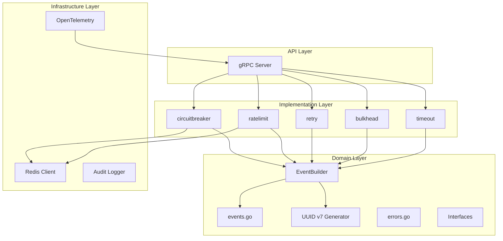

# Design Document: Resilience Service Modernization

## Overview

This design document outlines the modernization of the `platform/resilience-service` Go microservice to December 2025 standards. The modernization focuses on:

1. **Dependency upgrades** to latest stable versions (Go 1.25+, go-redis v9.17.0+, OpenTelemetry v1.39.0+, grpc-go v1.77.0+)
2. **Code redundancy elimination** by centralizing duplicate functions (generateEventID, correlation defaults)
3. **UUID v7 adoption** for time-ordered, cryptographically secure event IDs
4. **Centralized event emission** via an EventBuilder pattern
5. **Security hardening** addressing CVE-2025-29923 and using crypto/rand

## Architecture

The modernized architecture maintains the existing layered structure while introducing centralized utilities:



### Key Architectural Changes

1. **Centralized Event Generation**: All event ID generation moves to `domain/uuid.go`
2. **EventBuilder Pattern**: New `domain/event_builder.go` handles event construction
3. **Correlation Factory**: Single `domain/correlation.go` provides default correlation functions
4. **Dependency Injection**: All components receive dependencies via Config structs

## Components and Interfaces

### 1. UUID v7 Generator (`domain/uuid.go`)

```go
// GenerateEventID generates a UUID v7 compliant event ID.
// UUID v7 provides time-ordered, cryptographically random identifiers.
func GenerateEventID() string

// ParseUUIDv7Timestamp extracts the timestamp from a UUID v7.
func ParseUUIDv7Timestamp(id string) (time.Time, error)
```

**Implementation Details:**
- Uses 48-bit Unix timestamp in milliseconds (bits 0-47)
- Version nibble set to 7 (bits 48-51)
- Variant bits set to RFC 4122 (bits 64-65)
- Remaining 62 bits from `crypto/rand`
- Output format: `xxxxxxxx-xxxx-7xxx-yxxx-xxxxxxxxxxxx`

### 2. EventBuilder (`domain/event_builder.go`)

```go
// EventBuilder constructs resilience events with automatic field population.
type EventBuilder struct {
    emitter       EventEmitter
    serviceName   string
    correlationFn func() string
}

// NewEventBuilder creates a new EventBuilder.
func NewEventBuilder(emitter EventEmitter, serviceName string, correlationFn func() string) *EventBuilder

// Build creates a ResilienceEvent with automatic ID, Timestamp, and Type.
func (b *EventBuilder) Build(eventType ResilienceEventType, metadata map[string]any) ResilienceEvent

// Emit builds and emits an event. Safe to call with nil emitter.
func (b *EventBuilder) Emit(eventType ResilienceEventType, metadata map[string]any)
```

### 3. Correlation Factory (`domain/correlation.go`)

```go
// DefaultCorrelationFn returns a no-op correlation function.
func DefaultCorrelationFn() func() string

// NewCorrelationFn creates a correlation function with fallback to default.
func NewCorrelationFn(fn func() string) func() string
```

### 4. Updated Component Configs

All resilience components will use the EventBuilder instead of direct event emission:

```go
// Example: Updated CircuitBreaker Config
type Config struct {
    ServiceName   string
    Config        domain.CircuitBreakerConfig
    EventBuilder  *domain.EventBuilder  // Replaces EventEmitter + CorrelationFn
}
```

## Data Models

### UUID v7 Structure (RFC 9562)

```
 0                   1                   2                   3
 0 1 2 3 4 5 6 7 8 9 0 1 2 3 4 5 6 7 8 9 0 1 2 3 4 5 6 7 8 9 0 1
+-+-+-+-+-+-+-+-+-+-+-+-+-+-+-+-+-+-+-+-+-+-+-+-+-+-+-+-+-+-+-+-+
|                         unix_ts_ms (32 bits)                  |
+-+-+-+-+-+-+-+-+-+-+-+-+-+-+-+-+-+-+-+-+-+-+-+-+-+-+-+-+-+-+-+-+
|          unix_ts_ms (16 bits) |  ver  |   rand_a (12 bits)    |
+-+-+-+-+-+-+-+-+-+-+-+-+-+-+-+-+-+-+-+-+-+-+-+-+-+-+-+-+-+-+-+-+
|var|                       rand_b (62 bits)                    |
+-+-+-+-+-+-+-+-+-+-+-+-+-+-+-+-+-+-+-+-+-+-+-+-+-+-+-+-+-+-+-+-+
|                       rand_b (continued)                      |
+-+-+-+-+-+-+-+-+-+-+-+-+-+-+-+-+-+-+-+-+-+-+-+-+-+-+-+-+-+-+-+-+
```

### ResilienceEvent (unchanged structure for backward compatibility)

```go
type ResilienceEvent struct {
    ID            string              `json:"id"`            // Now UUID v7
    Type          ResilienceEventType `json:"type"`
    ServiceName   string              `json:"service_name"`
    Timestamp     time.Time           `json:"timestamp"`
    CorrelationID string              `json:"correlation_id"`
    TraceID       string              `json:"trace_id,omitempty"`
    SpanID        string              `json:"span_id,omitempty"`
    Metadata      map[string]any      `json:"metadata,omitempty"`
}
```

## Correctness Properties

*A property is a characteristic or behavior that should hold true across all valid executions of a system-essentially, a formal statement about what the system should do. Properties serve as the bridge between human-readable specifications and machine-verifiable correctness guarantees.*

Based on the prework analysis, the following correctness properties have been identified:

### Property 1: UUID v7 Format Compliance

*For any* generated event ID, the ID SHALL conform to UUID v7 format: 36 characters with hyphens at positions 8, 13, 18, 23; version nibble (position 14) SHALL be '7'; variant bits (position 19) SHALL be '8', '9', 'a', or 'b'; and the embedded timestamp SHALL be within 1 second of generation time.

**Validates: Requirements 3.1, 3.2, 3.3, 3.5**

### Property 2: UUID v7 Chronological Ordering

*For any* two event IDs generated at different times (with at least 1ms separation), lexicographic comparison of the IDs SHALL produce the same ordering as chronological comparison of their generation times.

**Validates: Requirements 3.4**

### Property 3: Centralized Event Emission

*For any* resilience event emitted by any component (circuit breaker, rate limiter, retry handler, bulkhead, timeout), the event SHALL be constructed using the centralized EventBuilder, ensuring consistent ID generation and field population.

**Validates: Requirements 2.1, 2.2, 2.3, 4.1**

### Property 4: EventBuilder Automatic Field Population

*For any* event built using EventBuilder, the ID field SHALL be a valid UUID v7, the Timestamp field SHALL be within 1 second of build time, the Type field SHALL match the requested event type, and the ServiceName and CorrelationID fields SHALL be populated from the builder's configuration.

**Validates: Requirements 4.2, 4.4**

### Property 5: Nil Emitter Safety

*For any* EventBuilder with a nil emitter, calling Emit() SHALL NOT panic and SHALL be a no-op.

**Validates: Requirements 4.3**

### Property 6: Structured JSON Logging

*For any* log entry produced by the service, the output SHALL be valid JSON parseable by the standard library json.Unmarshal.

**Validates: Requirements 5.3**

### Property 7: Trace Context Propagation

*For any* resilience operation that receives a context with trace information, the emitted events SHALL include the TraceID and SpanID from the context.

**Validates: Requirements 7.4**

### Property 8: Event Serialization Backward Compatibility

*For any* ResilienceEvent, JSON serialization SHALL produce output that can be deserialized by consumers expecting the previous event format (all existing fields present with same types).

**Validates: Requirements 10.2**

## Error Handling

### Error Types (unchanged)

The existing error types in `domain/errors.go` remain unchanged for backward compatibility:

- `ErrCircuitOpen` - Circuit breaker is open
- `ErrRateLimitExceeded` - Rate limit exceeded
- `ErrTimeout` - Operation timed out
- `ErrBulkheadFull` - Bulkhead capacity exceeded
- `ErrRetryExhausted` - Retry attempts exhausted
- `ErrInvalidPolicy` - Invalid policy configuration

### New Error Types

```go
// ErrInvalidUUID indicates a malformed UUID string.
ErrInvalidUUID ErrorCode = "INVALID_UUID"

// NewInvalidUUIDError creates an invalid UUID error.
func NewInvalidUUIDError(id string) *ResilienceError
```

## Testing Strategy

### Dual Testing Approach

The modernization requires both unit tests and property-based tests:

1. **Unit Tests**: Verify specific examples, edge cases, and integration points
2. **Property-Based Tests**: Verify universal properties across all inputs using gopter

### Property-Based Testing Framework

- **Library**: gopter v0.2.11 (existing dependency)
- **Minimum Iterations**: 100 per property
- **Race Detection**: All tests run with `-race` flag

### Test Organization

```
platform/resilience-service/
├── internal/
│   ├── domain/
│   │   ├── uuid.go
│   │   ├── uuid_prop_test.go          # Properties 1, 2
│   │   ├── event_builder.go
│   │   ├── event_builder_prop_test.go # Properties 3, 4, 5, 8
│   │   └── correlation.go
│   ├── circuitbreaker/
│   │   ├── breaker.go
│   │   └── breaker_prop_test.go       # Updated to use EventBuilder
│   ├── ratelimit/
│   │   └── ratelimit_prop_test.go     # Updated to use EventBuilder
│   ├── retry/
│   │   └── handler_prop_test.go       # Updated to use EventBuilder
│   └── bulkhead/
│       └── bulkhead_prop_test.go      # Updated to use EventBuilder
```

### Property Test Annotations

Each property-based test MUST include a comment referencing the correctness property:

```go
// **Feature: resilience-service-modernization, Property 1: UUID v7 Format Compliance**
// **Validates: Requirements 3.1, 3.2, 3.3, 3.5**
func TestUUIDv7FormatCompliance(t *testing.T) {
    // ...
}
```

### Coverage Requirements

- Critical paths: 80%+ coverage
- UUID generation: 100% coverage
- EventBuilder: 100% coverage
- Error handling: 90%+ coverage
