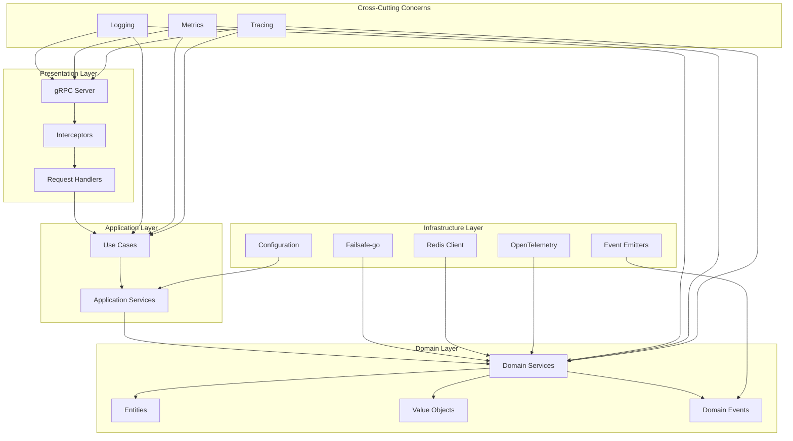

# Design Document

## Overview

The resilience-service modernization transforms the existing service into a state-of-the-art Go 1.23 microservice that exemplifies modern architectural patterns, zero redundancy, and comprehensive observability. The design eliminates all legacy patterns and custom implementations in favor of industry-standard libraries, implements clean architecture with proper separation of concerns, and provides comprehensive fault tolerance using the failsafe-go library.

Key modernization principles:
- **State of Art Only**: Latest stable technologies and patterns from December 2024
- **Zero Redundancy**: Every behavior exists in exactly one authoritative location
- **Extreme Centralization**: Business rules, validations, and cross-cutting concerns unified
- **Modern Observability**: OpenTelemetry 1.32+ with structured logging and distributed tracing
- **Security First**: Secure defaults, input validation, and hardened configurations
- **Clean Architecture**: Domain-driven design with clear layer boundaries

## Architecture

The modernized service follows clean architecture principles with clear separation between domain, application, and infrastructure layers:



### Layer Responsibilities

**Presentation Layer (cmd/, internal/handlers/)**
- gRPC server setup and lifecycle management
- Request/response handling and validation
- Interceptor chain for cross-cutting concerns
- Protocol buffer message conversion

**Application Layer (internal/application/)**
- Use case orchestration and business workflows
- Application services coordinating domain operations
- Transaction boundaries and error handling
- Integration with external services

**Domain Layer (internal/domain/)**
- Core business logic and rules
- Domain entities and value objects
- Domain events and specifications
- Pure functions with no external dependencies

**Infrastructure Layer (internal/infrastructure/)**
- External service integrations (Redis, OpenTelemetry)
- Configuration management and validation
- Event emission and observability
- Resilience pattern implementations using failsafe-go

## Components and Interfaces

### Core Domain Interfaces

```go
// ResiliencePolicy represents a complete resilience configuration
type ResiliencePolicy interface {
    Name() string
    Version() int
    Execute(ctx context.Context, fn func() error) error
    Validate() error
}

// PolicyRepository manages policy persistence and retrieval
type PolicyRepository interface {
    Get(ctx context.Context, name string) (ResiliencePolicy, error)
    Save(ctx context.Context, policy ResiliencePolicy) error
    Delete(ctx context.Context, name string) error
    List(ctx context.Context) ([]ResiliencePolicy, error)
    Watch(ctx context.Context) (<-chan PolicyEvent, error)
}

// ResilienceExecutor applies resilience patterns to operations
type ResilienceExecutor interface {
    Execute(ctx context.Context, policyName string, operation func() error) error
    ExecuteWithResult[T any](ctx context.Context, policyName string, operation func() (T, error)) (T, error)
}

// HealthChecker provides health status for components
type HealthChecker interface {
    Check(ctx context.Context) HealthStatus
    Name() string
}

// EventEmitter publishes domain events
type EventEmitter interface {
    Emit(ctx context.Context, event DomainEvent) error
}
```

### Application Services

```go
// ResilienceService orchestrates resilience operations
type ResilienceService struct {
    executor   ResilienceExecutor
    repository PolicyRepository
    emitter    EventEmitter
    logger     *slog.Logger
    tracer     trace.Tracer
}

// PolicyService manages policy lifecycle
type PolicyService struct {
    repository PolicyRepository
    validator  PolicyValidator
    emitter    EventEmitter
    logger     *slog.Logger
}

// HealthService aggregates health status
type HealthService struct {
    checkers []HealthChecker
    logger   *slog.Logger
}
```

### Infrastructure Components

```go
// FailsafeExecutor implements ResilienceExecutor using failsafe-go
type FailsafeExecutor struct {
    policies map[string]failsafe.Policy
    metrics  *MetricsRecorder
    logger   *slog.Logger
}

// RedisRepository implements PolicyRepository using Redis
type RedisRepository struct {
    client  *redis.Client
    logger  *slog.Logger
    metrics *MetricsRecorder
}

// OTelEmitter implements EventEmitter using OpenTelemetry
type OTelEmitter struct {
    tracer  trace.Tracer
    meter   metric.Meter
    logger  *slog.Logger
}
```

## Data Models

### Domain Entities

```go
// Policy represents a resilience policy configuration
type Policy struct {
    name         string
    version      int
    circuitBreaker *CircuitBreakerConfig
    retry        *RetryConfig
    timeout      *TimeoutConfig
    rateLimit    *RateLimitConfig
    bulkhead     *BulkheadConfig
    createdAt    time.Time
    updatedAt    time.Time
}

// CircuitBreakerConfig defines circuit breaker parameters
type CircuitBreakerConfig struct {
    FailureThreshold int           `json:"failure_threshold" validate:"min=1,max=100"`
    SuccessThreshold int           `json:"success_threshold" validate:"min=1,max=10"`
    Timeout          time.Duration `json:"timeout" validate:"min=1s,max=5m"`
    ProbeCount       int           `json:"probe_count" validate:"min=1,max=10"`
}

// RetryConfig defines retry behavior parameters
type RetryConfig struct {
    MaxAttempts   int           `json:"max_attempts" validate:"min=1,max=10"`
    BaseDelay     time.Duration `json:"base_delay" validate:"min=1ms,max=10s"`
    MaxDelay      time.Duration `json:"max_delay" validate:"min=1s,max=5m"`
    Multiplier    float64       `json:"multiplier" validate:"min=1.0,max=10.0"`
    JitterPercent float64       `json:"jitter_percent" validate:"min=0.0,max=1.0"`
}

// TimeoutConfig defines timeout parameters
type TimeoutConfig struct {
    Default time.Duration `json:"default" validate:"min=100ms,max=5m"`
    Max     time.Duration `json:"max" validate:"min=1s,max=10m"`
}

// RateLimitConfig defines rate limiting parameters
type RateLimitConfig struct {
    Algorithm string        `json:"algorithm" validate:"oneof=token_bucket sliding_window"`
    Limit     int           `json:"limit" validate:"min=1,max=100000"`
    Window    time.Duration `json:"window" validate:"min=1s,max=1h"`
    BurstSize int           `json:"burst_size" validate:"min=1,max=10000"`
}

// BulkheadConfig defines bulkhead isolation parameters
type BulkheadConfig struct {
    MaxConcurrent int           `json:"max_concurrent" validate:"min=1,max=10000"`
    MaxQueue      int           `json:"max_queue" validate:"min=0,max=10000"`
    QueueTimeout  time.Duration `json:"queue_timeout" validate:"min=1ms,max=30s"`
}
```

### Value Objects

```go
// HealthStatus represents component health state
type HealthStatus struct {
    Status    HealthState       `json:"status"`
    Message   string           `json:"message"`
    Details   map[string]any   `json:"details,omitempty"`
    Timestamp time.Time        `json:"timestamp"`
}

// PolicyEvent represents policy lifecycle events
type PolicyEvent struct {
    ID         string           `json:"id"`
    Type       PolicyEventType  `json:"type"`
    PolicyName string          `json:"policy_name"`
    Version    int             `json:"version"`
    Timestamp  time.Time       `json:"timestamp"`
    Metadata   map[string]any  `json:"metadata,omitempty"`
}

// ExecutionMetrics captures resilience execution statistics
type ExecutionMetrics struct {
    PolicyName      string        `json:"policy_name"`
    ExecutionTime   time.Duration `json:"execution_time"`
    Success         bool          `json:"success"`
    CircuitState    string        `json:"circuit_state,omitempty"`
    RetryAttempts   int           `json:"retry_attempts,omitempty"`
    RateLimited     bool          `json:"rate_limited,omitempty"`
    BulkheadQueued  bool          `json:"bulkhead_queued,omitempty"`
}
```

### Configuration Models

```go
// Config represents complete service configuration
type Config struct {
    Server      ServerConfig      `mapstructure:"server"`
    Redis       RedisConfig       `mapstructure:"redis"`
    OpenTelemetry OTelConfig      `mapstructure:"opentelemetry"`
    Logging     LoggingConfig     `mapstructure:"logging"`
    Policies    PoliciesConfig    `mapstructure:"policies"`
    Defaults    DefaultsConfig    `mapstructure:"defaults"`
}

// ServerConfig defines gRPC server settings
type ServerConfig struct {
    Host            string        `mapstructure:"host" validate:"required"`
    Port            int           `mapstructure:"port" validate:"min=1024,max=65535"`
    ShutdownTimeout time.Duration `mapstructure:"shutdown_timeout" validate:"min=1s,max=5m"`
    MaxRecvMsgSize  int           `mapstructure:"max_recv_msg_size" validate:"min=1024,max=67108864"`
    MaxSendMsgSize  int           `mapstructure:"max_send_msg_size" validate:"min=1024,max=67108864"`
}

// RedisConfig defines Redis connection settings
type RedisConfig struct {
    URL              string        `mapstructure:"url" validate:"required,url"`
    DB               int           `mapstructure:"db" validate:"min=0,max=15"`
    Password         string        `mapstructure:"password"`
    TLSEnabled       bool          `mapstructure:"tls_enabled"`
    TLSSkipVerify    bool          `mapstructure:"tls_skip_verify"`
    ConnectTimeout   time.Duration `mapstructure:"connect_timeout" validate:"min=1s,max=30s"`
    ReadTimeout      time.Duration `mapstructure:"read_timeout" validate:"min=1s,max=30s"`
    WriteTimeout     time.Duration `mapstructure:"write_timeout" validate:"min=1s,max=30s"`
    MaxRetries       int           `mapstructure:"max_retries" validate:"min=0,max=10"`
    PoolSize         int           `mapstructure:"pool_size" validate:"min=1,max=100"`
}

// OTelConfig defines OpenTelemetry settings
type OTelConfig struct {
    Endpoint     string            `mapstructure:"endpoint" validate:"required,url"`
    ServiceName  string            `mapstructure:"service_name" validate:"required"`
    ServiceVersion string          `mapstructure:"service_version" validate:"required"`
    Environment  string            `mapstructure:"environment" validate:"required"`
    Insecure     bool              `mapstructure:"insecure"`
    Headers      map[string]string `mapstructure:"headers"`
    Timeout      time.Duration     `mapstructure:"timeout" validate:"min=1s,max=30s"`
}
```

## Correctness Properties

*A property is a characteristic or behavior that should hold true across all valid executions of a system-essentially, a formal statement about what the system should do. Properties serve as the bridge between human-readable specifications and machine-verifiable correctness guarantees.*

### Property Reflection

After analyzing all acceptance criteria, several properties can be consolidated to eliminate redundancy:

- **Failsafe-go Integration Properties**: Properties 1.3, 6.1, 6.2, 6.3, 6.4, 6.5 can be combined into a comprehensive failsafe-go usage property
- **Observability Properties**: Properties 1.5, 4.1, 4.2, 4.3, 4.4, 4.5 can be consolidated into unified observability compliance
- **Centralization Properties**: Properties 2.1, 2.2, 2.4, 2.5 address the same core concern of zero redundancy
- **Dependency Injection Properties**: Properties 3.1, 3.2, 3.5 all validate fx usage patterns
- **Security Properties**: Properties 5.1, 5.2, 5.3, 5.4, 5.5 can be unified into comprehensive security compliance
- **Testing Properties**: Properties 8.1, 8.2, 8.3, 8.4, 8.5 address different aspects of the same testing framework requirements
- **Configuration Properties**: Properties 9.1, 9.2, 9.3, 9.4, 9.5 all validate viper configuration management
- **Architecture Properties**: Properties 10.1, 10.2, 10.3, 10.4, 10.5 validate clean architecture compliance

### Core Correctness Properties

**Property 1: Failsafe-go Resilience Integration**
*For any* resilience operation (circuit breaker, retry, timeout, rate limit, bulkhead), the implementation should use failsafe-go library types and policies rather than custom implementations
**Validates: Requirements 1.3, 6.1, 6.2, 6.3, 6.4, 6.5**

**Property 2: Zero Redundancy Enforcement**
*For any* business logic, validation, or transformation, there should exist exactly one authoritative implementation with all other usages being references to that single source
**Validates: Requirements 2.1, 2.2, 2.4, 2.5**

**Property 3: Uber Fx Dependency Injection**
*For any* application component, dependencies should be provided through fx.Provide functions and lifecycle managed through fx hooks with no global variables
**Validates: Requirements 3.1, 3.2, 3.5**

**Property 4: Graceful Shutdown Compliance**
*For any* service shutdown, all components should register fx OnStop hooks that properly clean up resources within the configured timeout
**Validates: Requirements 3.3, 7.4**

**Property 5: Viper Configuration Management**
*For any* configuration value, it should be loaded through viper with environment variable override support and comprehensive validation
**Validates: Requirements 3.4, 9.1, 9.2, 9.3, 9.4, 9.5**

**Property 6: OpenTelemetry Observability**
*For any* operation, traces should use OpenTelemetry spans, metrics should use OpenTelemetry meters, and logs should use structured slog with correlation IDs
**Validates: Requirements 1.5, 4.1, 4.2, 4.3, 4.4, 4.5**

**Property 7: Security Hardening Compliance**
*For any* security-sensitive operation (file paths, secrets, connections, inputs, logging), the implementation should follow secure patterns with proper validation and no sensitive data exposure
**Validates: Requirements 5.1, 5.2, 5.3, 5.4, 5.5**

**Property 8: gRPC Middleware Integration**
*For any* gRPC request processing, the server should use grpc-ecosystem/go-grpc-middleware/v2 interceptors for authentication, logging, metrics, and error handling
**Validates: Requirements 7.1, 7.2, 7.3, 7.5**

**Property 9: Modern Testing Framework Usage**
*For any* test implementation, property tests should use pgregory.net/rapid with 100+ iterations, unit tests should use testify/suite, and integration tests should use testcontainers
**Validates: Requirements 8.1, 8.2, 8.3, 8.4, 8.5**

**Property 10: Clean Architecture Layer Separation**
*For any* code organization, domain interfaces should be pure with no external dependencies, application services should coordinate through dependency injection, and infrastructure should be isolated in dedicated packages
**Validates: Requirements 10.1, 10.2, 10.3, 10.4, 10.5**

## Error Handling

The modernized service implements centralized error handling with consistent patterns:

### Error Types Hierarchy

```go
// DomainError represents business logic errors
type DomainError struct {
    Code    string            `json:"code"`
    Message string            `json:"message"`
    Details map[string]any    `json:"details,omitempty"`
    Cause   error             `json:"-"`
}

// ValidationError represents input validation failures
type ValidationError struct {
    Field   string `json:"field"`
    Value   any    `json:"value"`
    Rule    string `json:"rule"`
    Message string `json:"message"`
}

// InfrastructureError represents external system failures
type InfrastructureError struct {
    Service string            `json:"service"`
    Operation string          `json:"operation"`
    Code    string            `json:"code"`
    Message string            `json:"message"`
    Details map[string]any    `json:"details,omitempty"`
    Cause   error             `json:"-"`
}
```

### Error Handling Patterns

```go
// Centralized error creation functions
func NewDomainError(code, message string, cause error) *DomainError
func NewValidationError(field, rule, message string, value any) *ValidationError
func NewInfrastructureError(service, operation, code, message string, cause error) *InfrastructureError

// Error wrapping with context preservation
func WrapError(err error, message string) error
func WrapErrorWithContext(ctx context.Context, err error, message string) error

// gRPC error mapping
func ToGRPCError(err error) error
func FromGRPCError(err error) error
```

### Error Logging Strategy

- **Structured Logging**: All errors logged with structured context using slog
- **Correlation IDs**: Every error includes correlation ID for request tracing
- **Stack Traces**: Development environments include full stack traces
- **Sensitive Data**: Production logs never contain sensitive information
- **Error Codes**: Consistent error codes for client error handling

## Testing Strategy

The modernized service implements comprehensive testing with both unit and property-based approaches:

### Dual Testing Approach

**Unit Testing Requirements:**
- Use testify/suite for organized test suites with setup/teardown
- Test specific examples, edge cases, and error conditions
- Focus on integration points between components
- Maintain clear test organization mirroring source structure
- Use testcontainers for isolated integration tests

**Property-Based Testing Requirements:**
- Use pgregory.net/rapid library for all property tests
- Configure minimum 100 iterations per property test
- Tag each property test with design document reference using format: `**Feature: resilience-service-state-of-art-2025, Property {number}: {property_text}**`
- Implement each correctness property as a single property-based test
- Generate smart test data that constrains to valid input spaces

### Testing Framework Configuration

```go
// Property test configuration
func TestResilienceProperties(t *testing.T) {
    rapid.Check(t, func(t *rapid.T) {
        // **Feature: resilience-service-state-of-art-2025, Property 1: Failsafe-go Resilience Integration**
        policy := generateResiliencePolicy(t)
        executor := createFailsafeExecutor(policy)
        
        // Verify failsafe-go types are used
        assert.IsType(t, &failsafe.Policy{}, executor.GetPolicy())
    })
}

// Unit test suite organization
type ResilienceServiceSuite struct {
    suite.Suite
    container testcontainers.Container
    service   *ResilienceService
}

func (s *ResilienceServiceSuite) SetupSuite() {
    // Setup test containers and dependencies
}

func (s *ResilienceServiceSuite) TestExecuteWithPolicy() {
    // Test specific policy execution scenarios
}
```

### Test Coverage Requirements

- **Minimum 80% coverage** for all packages
- **100% coverage** for domain logic and critical paths
- **Property tests** for all correctness properties
- **Integration tests** for external dependencies
- **Benchmark tests** for performance-critical operations

### Test Data Generation

```go
// Smart generators for property tests
func generateValidPolicy(t *rapid.T) *Policy {
    return &Policy{
        Name:    rapid.StringMatching(`^[a-zA-Z][a-zA-Z0-9_-]*$`).Draw(t, "name"),
        Version: rapid.IntRange(1, 1000).Draw(t, "version"),
        CircuitBreaker: &CircuitBreakerConfig{
            FailureThreshold: rapid.IntRange(1, 100).Draw(t, "failure_threshold"),
            SuccessThreshold: rapid.IntRange(1, 10).Draw(t, "success_threshold"),
            Timeout:          rapid.DurationRange(time.Second, 5*time.Minute).Draw(t, "timeout"),
        },
    }
}

func generateInvalidPolicy(t *rapid.T) *Policy {
    return &Policy{
        Name:    rapid.OneOf(rapid.Just(""), rapid.StringMatching(`^[^a-zA-Z].*`)).Draw(t, "invalid_name"),
        Version: rapid.IntRange(-1000, 0).Draw(t, "invalid_version"),
    }
}
```