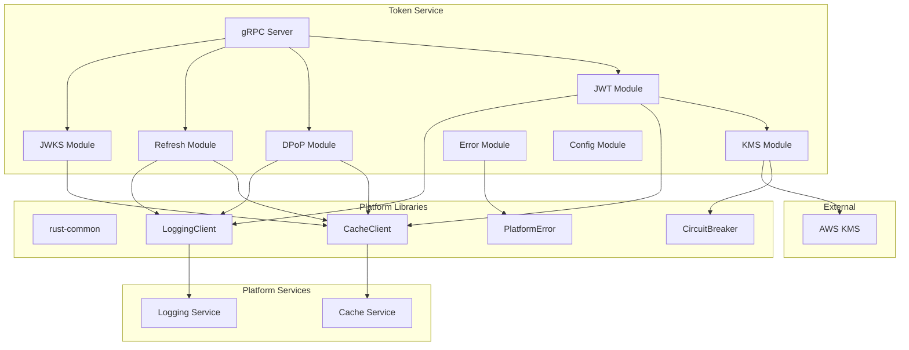

# Design Document: Token Service Modernization 2025

## Overview

This design modernizes the Token Service to state-of-the-art December 2025 standards, eliminating redundancy, integrating with platform shared libraries (`libs/rust/rust-common`), and ensuring production-ready quality with comprehensive property-based testing.

The modernization transforms the Token Service from a standalone implementation to a fully integrated platform component using:
- Rust 2024 edition with workspace dependencies
- Centralized caching via `rust-common::CacheClient` → `platform/cache-service`
- Centralized logging via `rust-common::LoggingClient` → `platform/logging-service`
- Unified error handling extending `rust-common::PlatformError`
- Circuit breaker resilience via `rust-common::CircuitBreaker`

## Architecture



### Directory Structure

```
services/token/
├── Cargo.toml              # Workspace member, uses libs/rust dependencies
├── build.rs                # Proto compilation
├── src/
│   ├── main.rs             # Entry point with graceful shutdown
│   ├── config.rs           # Centralized configuration
│   ├── error.rs            # TokenError extending PlatformError
│   ├── grpc/
│   │   └── mod.rs          # gRPC service implementation
│   ├── jwt/
│   │   ├── mod.rs          # JWT module exports
│   │   ├── claims.rs       # Claims struct with DPoP binding
│   │   ├── builder.rs      # JWT builder pattern
│   │   └── signer.rs       # KMS-backed signing
│   ├── dpop/
│   │   ├── mod.rs          # DPoP module exports
│   │   ├── proof.rs        # DPoP proof parsing
│   │   ├── validator.rs    # RFC 9449 validation
│   │   └── thumbprint.rs   # RFC 7638 JWK thumbprint
│   ├── refresh/
│   │   ├── mod.rs          # Refresh module exports
│   │   ├── family.rs       # Token family management
│   │   └── rotator.rs      # Rotation with replay detection
│   ├── jwks/
│   │   ├── mod.rs          # JWKS module exports
│   │   └── publisher.rs    # JWKS endpoint
│   └── kms/
│       ├── mod.rs          # KMS trait and factory
│       ├── aws.rs          # AWS KMS implementation
│       └── mock.rs         # Mock for testing
└── tests/
    ├── property_tests.rs   # JWT property tests
    ├── dpop_property_tests.rs  # DPoP property tests
    └── refresh_property_tests.rs  # Refresh token property tests
```

## Components and Interfaces

### 1. Error Module (`src/error.rs`)

Centralized error handling extending `rust-common::PlatformError`:

```rust
use rust_common::PlatformError;
use thiserror::Error;
use tonic::Status;

#[derive(Error, Debug)]
pub enum TokenError {
    #[error("Platform error: {0}")]
    Platform(#[from] PlatformError),
    
    #[error("JWT encoding failed: {0}")]
    JwtEncoding(String),
    
    #[error("JWT decoding failed: {0}")]
    JwtDecoding(String),
    
    #[error("DPoP validation failed: {0}")]
    DpopValidation(String),
    
    #[error("DPoP replay detected: jti={0}")]
    DpopReplay(String),
    
    #[error("Refresh token invalid")]
    RefreshInvalid,
    
    #[error("Refresh token expired")]
    RefreshExpired,
    
    #[error("Refresh token replay detected - family revoked")]
    RefreshReplay,
    
    #[error("Token family revoked")]
    FamilyRevoked,
    
    #[error("KMS operation failed: {0}")]
    Kms(String),
    
    #[error("Configuration error: {0}")]
    Config(String),
}

impl TokenError {
    pub fn is_retryable(&self) -> bool {
        match self {
            Self::Platform(e) => e.is_retryable(),
            Self::Kms(_) => true,
            _ => false,
        }
    }
    
    pub fn correlation_id(&self) -> Option<&str> {
        None // Set via context
    }
}

impl From<TokenError> for Status {
    fn from(err: TokenError) -> Self {
        match err {
            TokenError::RefreshInvalid | TokenError::RefreshExpired => {
                Status::unauthenticated(err.to_string())
            }
            TokenError::RefreshReplay | TokenError::FamilyRevoked => {
                Status::permission_denied("TOKEN_REVOKED")
            }
            TokenError::DpopValidation(_) | TokenError::DpopReplay(_) => {
                Status::invalid_argument(err.to_string())
            }
            TokenError::Kms(_) if err.is_retryable() => {
                Status::unavailable("KMS_UNAVAILABLE")
            }
            _ => Status::internal("INTERNAL_ERROR"),
        }
    }
}
```

### 2. Configuration Module (`src/config.rs`)

Single centralized configuration struct:

```rust
use rust_common::{CacheClientConfig, LoggingClientConfig, CircuitBreakerConfig};
use std::time::Duration;

#[derive(Debug, Clone)]
pub struct Config {
    // Server
    pub host: String,
    pub port: u16,
    
    // JWT
    pub jwt_issuer: String,
    pub jwt_algorithm: JwtAlgorithm,
    pub access_token_ttl: Duration,
    pub refresh_token_ttl: Duration,
    
    // KMS
    pub kms_provider: KmsProvider,
    pub kms_key_id: String,
    pub kms_fallback_enabled: bool,
    pub kms_fallback_timeout: Duration,
    
    // DPoP
    pub dpop_clock_skew: Duration,
    pub dpop_jti_ttl: Duration,
    
    // Platform integration
    pub cache: CacheClientConfig,
    pub logging: LoggingClientConfig,
    pub circuit_breaker: CircuitBreakerConfig,
    
    // Security
    pub encryption_key: [u8; 32],
}

#[derive(Debug, Clone, Copy)]
pub enum JwtAlgorithm {
    RS256,
    PS256,
    ES256,
}

#[derive(Debug, Clone)]
pub enum KmsProvider {
    Aws { region: String },
    Mock,
}

impl Config {
    pub fn from_env() -> Result<Self, TokenError> {
        // Load from environment with validation
    }
}
```

### 3. JWT Module

#### Claims (`src/jwt/claims.rs`)

```rust
use serde::{Deserialize, Serialize};
use std::collections::HashMap;

#[derive(Debug, Clone, Serialize, Deserialize, PartialEq)]
pub struct Confirmation {
    pub jkt: String,
}

#[derive(Debug, Clone, Serialize, Deserialize, PartialEq)]
pub struct Claims {
    pub iss: String,
    pub sub: String,
    pub aud: Vec<String>,
    pub exp: i64,
    pub iat: i64,
    #[serde(skip_serializing_if = "Option::is_none")]
    pub nbf: Option<i64>,
    pub jti: String,
    
    #[serde(skip_serializing_if = "Option::is_none")]
    pub cnf: Option<Confirmation>,
    
    #[serde(flatten)]
    pub custom: HashMap<String, serde_json::Value>,
}

impl Claims {
    pub fn new(issuer: &str, subject: &str, audience: Vec<String>, ttl_seconds: i64) -> Self {
        let now = chrono::Utc::now().timestamp();
        Self {
            iss: issuer.to_string(),
            sub: subject.to_string(),
            aud: audience,
            exp: now + ttl_seconds,
            iat: now,
            nbf: Some(now),
            jti: uuid::Uuid::new_v4().to_string(),
            cnf: None,
            custom: HashMap::new(),
        }
    }
    
    pub fn with_dpop_binding(mut self, jkt: String) -> Self {
        self.cnf = Some(Confirmation { jkt });
        self
    }
}
```

#### Signer Trait (`src/jwt/signer.rs`)

```rust
use crate::error::TokenError;

pub trait JwtSigner: Send + Sync {
    async fn sign(&self, header: &[u8], payload: &[u8]) -> Result<Vec<u8>, TokenError>;
    fn algorithm(&self) -> &str;
    fn key_id(&self) -> &str;
}
```

### 4. DPoP Module

#### Validator (`src/dpop/validator.rs`)

```rust
use crate::error::TokenError;
use rust_common::CacheClient;
use std::sync::Arc;
use std::time::Duration;

const MAX_CLOCK_SKEW: Duration = Duration::from_secs(60);
const JTI_TTL: Duration = Duration::from_secs(300);

pub struct DpopValidator {
    cache: Arc<CacheClient>,
}

impl DpopValidator {
    pub fn new(cache: Arc<CacheClient>) -> Self {
        Self { cache }
    }
    
    pub async fn validate(
        &self,
        proof: &DpopProof,
        expected_method: &str,
        expected_uri: &str,
    ) -> Result<ValidationResult, TokenError> {
        // 1. Validate typ header
        if proof.header.typ != "dpop+jwt" {
            return Err(TokenError::DpopValidation("Invalid typ".into()));
        }
        
        // 2. Validate alg
        if !matches!(proof.header.alg.as_str(), "ES256" | "RS256") {
            return Err(TokenError::DpopValidation("Invalid alg".into()));
        }
        
        // 3. Validate htm
        if !proof.claims.htm.eq_ignore_ascii_case(expected_method) {
            return Err(TokenError::DpopValidation("htm mismatch".into()));
        }
        
        // 4. Validate htu
        if !self.validate_htu(&proof.claims.htu, expected_uri) {
            return Err(TokenError::DpopValidation("htu mismatch".into()));
        }
        
        // 5. Validate iat within clock skew
        let now = chrono::Utc::now().timestamp();
        let skew = MAX_CLOCK_SKEW.as_secs() as i64;
        if proof.claims.iat > now + skew || proof.claims.iat < now - skew - JTI_TTL.as_secs() as i64 {
            return Err(TokenError::DpopValidation("iat out of range".into()));
        }
        
        // 6. Check jti uniqueness (replay prevention)
        if !self.check_and_store_jti(&proof.claims.jti).await? {
            return Err(TokenError::DpopReplay(proof.claims.jti.clone()));
        }
        
        // 7. Compute thumbprint
        let thumbprint = JwkThumbprint::compute(&proof.header.jwk);
        
        Ok(ValidationResult { thumbprint })
    }
    
    async fn check_and_store_jti(&self, jti: &str) -> Result<bool, TokenError> {
        let key = format!("dpop:jti:{}", jti);
        
        // Use cache with TTL for atomic check-and-set
        if self.cache.exists(&key).await? {
            return Ok(false);
        }
        
        self.cache.set(&key, b"1", Some(JTI_TTL)).await?;
        Ok(true)
    }
    
    fn validate_htu(&self, htu: &str, expected: &str) -> bool {
        htu.trim_end_matches('/').eq_ignore_ascii_case(expected.trim_end_matches('/'))
    }
}
```

#### Thumbprint (`src/dpop/thumbprint.rs`)

```rust
use sha2::{Sha256, Digest};
use subtle::ConstantTimeEq;

pub struct JwkThumbprint;

impl JwkThumbprint {
    pub fn compute(jwk: &Jwk) -> String {
        let canonical = Self::canonical_json(jwk);
        let hash = Sha256::digest(canonical.as_bytes());
        base64::engine::general_purpose::URL_SAFE_NO_PAD.encode(hash)
    }
    
    pub fn verify(jwk: &Jwk, expected: &str) -> bool {
        let computed = Self::compute(jwk);
        computed.as_bytes().ct_eq(expected.as_bytes()).into()
    }
    
    fn canonical_json(jwk: &Jwk) -> String {
        match jwk.kty.as_str() {
            "EC" => serde_json::json!({
                "crv": jwk.crv.as_deref().unwrap_or(""),
                "kty": "EC",
                "x": jwk.x.as_deref().unwrap_or(""),
                "y": jwk.y.as_deref().unwrap_or("")
            }).to_string(),
            "RSA" => serde_json::json!({
                "e": jwk.e.as_deref().unwrap_or(""),
                "kty": "RSA",
                "n": jwk.n.as_deref().unwrap_or("")
            }).to_string(),
            _ => serde_json::to_string(jwk).unwrap_or_default(),
        }
    }
}
```

### 5. Refresh Token Module

#### Token Family (`src/refresh/family.rs`)

```rust
use chrono::{DateTime, Utc};
use serde::{Deserialize, Serialize};

#[derive(Debug, Clone, Serialize, Deserialize)]
pub struct TokenFamily {
    pub family_id: String,
    pub user_id: String,
    pub session_id: String,
    pub current_token_hash: String,
    pub rotation_count: u32,
    pub created_at: DateTime<Utc>,
    pub revoked: bool,
    pub revoked_at: Option<DateTime<Utc>>,
}

impl TokenFamily {
    pub fn new(family_id: String, user_id: String, session_id: String, token_hash: String) -> Self {
        Self {
            family_id,
            user_id,
            session_id,
            current_token_hash: token_hash,
            rotation_count: 0,
            created_at: Utc::now(),
            revoked: false,
            revoked_at: None,
        }
    }
    
    pub fn rotate(&mut self, new_token_hash: String) {
        self.current_token_hash = new_token_hash;
        self.rotation_count += 1;
    }
    
    pub fn revoke(&mut self) {
        self.revoked = true;
        self.revoked_at = Some(Utc::now());
    }
    
    pub fn is_valid_token(&self, token_hash: &str) -> bool {
        !self.revoked && self.current_token_hash == token_hash
    }
    
    pub fn is_replay(&self, token_hash: &str) -> bool {
        !self.revoked && self.current_token_hash != token_hash
    }
}
```

#### Rotator (`src/refresh/rotator.rs`)

```rust
use crate::error::TokenError;
use crate::refresh::family::TokenFamily;
use rust_common::{CacheClient, LoggingClient, LogEntry, LogLevel};
use sha2::{Sha256, Digest};
use std::sync::Arc;
use std::time::Duration;

pub struct RefreshTokenRotator {
    cache: Arc<CacheClient>,
    logger: Arc<LoggingClient>,
    ttl: Duration,
}

impl RefreshTokenRotator {
    pub fn new(cache: Arc<CacheClient>, logger: Arc<LoggingClient>, ttl: Duration) -> Self {
        Self { cache, logger, ttl }
    }
    
    pub async fn create_family(
        &self,
        user_id: &str,
        session_id: &str,
    ) -> Result<(String, TokenFamily), TokenError> {
        let token = Self::generate_token();
        let token_hash = Self::hash_token(&token);
        let family_id = uuid::Uuid::new_v4().to_string();
        
        let family = TokenFamily::new(
            family_id.clone(),
            user_id.to_string(),
            session_id.to_string(),
            token_hash,
        );
        
        self.store_family(&family).await?;
        
        self.logger.log(LogEntry::new(LogLevel::Info, "Token family created", "token-service")
            .with_metadata("family_id", &family_id)
            .with_metadata("user_id", user_id)).await;
        
        Ok((token, family))
    }
    
    pub async fn rotate(&self, refresh_token: &str) -> Result<(String, TokenFamily), TokenError> {
        let token_hash = Self::hash_token(refresh_token);
        
        let mut family = self.find_family_by_hash(&token_hash).await?
            .ok_or(TokenError::RefreshInvalid)?;
        
        if family.revoked {
            return Err(TokenError::FamilyRevoked);
        }
        
        if family.is_replay(&token_hash) {
            family.revoke();
            self.store_family(&family).await?;
            
            self.logger.log(LogEntry::new(LogLevel::Warn, "Replay attack detected", "token-service")
                .with_metadata("family_id", &family.family_id)
                .with_metadata("user_id", &family.user_id)).await;
            
            return Err(TokenError::RefreshReplay);
        }
        
        let new_token = Self::generate_token();
        let new_hash = Self::hash_token(&new_token);
        
        family.rotate(new_hash);
        self.store_family(&family).await?;
        
        Ok((new_token, family))
    }
    
    pub async fn revoke_family(&self, family_id: &str) -> Result<(), TokenError> {
        let key = format!("token:family:{}", family_id);
        if let Some(data) = self.cache.get(&key).await? {
            let mut family: TokenFamily = serde_json::from_slice(&data)?;
            family.revoke();
            self.store_family(&family).await?;
        }
        Ok(())
    }
    
    async fn store_family(&self, family: &TokenFamily) -> Result<(), TokenError> {
        let key = format!("token:family:{}", family.family_id);
        let data = serde_json::to_vec(family)?;
        self.cache.set(&key, &data, Some(self.ttl)).await?;
        
        // Index by token hash for lookup
        let hash_key = format!("token:hash:{}", family.current_token_hash);
        self.cache.set(&hash_key, family.family_id.as_bytes(), Some(self.ttl)).await?;
        
        Ok(())
    }
    
    async fn find_family_by_hash(&self, token_hash: &str) -> Result<Option<TokenFamily>, TokenError> {
        let hash_key = format!("token:hash:{}", token_hash);
        if let Some(family_id_bytes) = self.cache.get(&hash_key).await? {
            let family_id = String::from_utf8(family_id_bytes)?;
            let key = format!("token:family:{}", family_id);
            if let Some(data) = self.cache.get(&key).await? {
                return Ok(Some(serde_json::from_slice(&data)?));
            }
        }
        Ok(None)
    }
    
    fn generate_token() -> String {
        use rand::RngCore;
        let mut bytes = [0u8; 32];
        rand::thread_rng().fill_bytes(&mut bytes);
        base64::engine::general_purpose::URL_SAFE_NO_PAD.encode(bytes)
    }
    
    fn hash_token(token: &str) -> String {
        let hash = Sha256::digest(token.as_bytes());
        base64::engine::general_purpose::URL_SAFE_NO_PAD.encode(hash)
    }
}
```

### 6. KMS Module

#### Trait and Factory (`src/kms/mod.rs`)

```rust
use crate::error::TokenError;
use rust_common::CircuitBreaker;
use std::sync::Arc;

pub mod aws;
pub mod mock;

pub trait KmsSigner: Send + Sync {
    async fn sign(&self, data: &[u8]) -> Result<Vec<u8>, TokenError>;
    fn algorithm(&self) -> &str;
    fn key_id(&self) -> &str;
}

pub struct KmsFactory;

impl KmsFactory {
    pub async fn create(
        provider: &KmsProvider,
        key_id: &str,
        circuit_breaker: Arc<CircuitBreaker>,
    ) -> Result<Arc<dyn KmsSigner>, TokenError> {
        match provider {
            KmsProvider::Aws { region } => {
                Ok(Arc::new(aws::AwsKmsSigner::new(region, key_id, circuit_breaker).await?))
            }
            KmsProvider::Mock => {
                Ok(Arc::new(mock::MockKmsSigner::new(key_id)))
            }
        }
    }
}
```

## Data Models

### Token Request/Response

```protobuf
message GenerateTokenRequest {
    string subject = 1;
    repeated string audience = 2;
    map<string, string> custom_claims = 3;
    optional string dpop_proof = 4;
    optional string session_id = 5;
}

message GenerateTokenResponse {
    string access_token = 1;
    string refresh_token = 2;
    int64 expires_in = 3;
    string token_type = 4;  // "Bearer" or "DPoP"
}

message RefreshTokenRequest {
    string refresh_token = 1;
    optional string dpop_proof = 2;
}

message RefreshTokenResponse {
    string access_token = 1;
    string refresh_token = 2;
    int64 expires_in = 3;
}

message RevokeTokenRequest {
    oneof target {
        string family_id = 1;
        string user_id = 2;
    }
}

message GetJwksResponse {
    repeated Jwk keys = 1;
}

message Jwk {
    string kty = 1;
    string use = 2;
    string kid = 3;
    string alg = 4;
    optional string n = 5;   // RSA
    optional string e = 6;   // RSA
    optional string crv = 7; // EC
    optional string x = 8;   // EC
    optional string y = 9;   // EC
}
```


## Correctness Properties

*A property is a characteristic or behavior that should hold true across all valid executions of a system—essentially, a formal statement about what the system should do. Properties serve as the bridge between human-readable specifications and machine-verifiable correctness guarantees.*

Based on the prework analysis of acceptance criteria, the following correctness properties have been identified for property-based testing:

### Property 1: JWT Claims Round-Trip Consistency

*For any* valid Claims object with arbitrary standard and custom claims, serializing to JWT format and parsing back SHALL produce an equivalent Claims object with identical values for all fields.

**Validates: Requirements 4.6**

This is a round-trip property essential for JWT correctness. The serialization/deserialization cycle must preserve all claim data.

### Property 2: JWT Structure Completeness

*For any* generated JWT access token, the token SHALL contain all required standard claims (iss, sub, aud, exp, iat, nbf, jti) with valid values, the kid header, and any custom claims provided in the request.

**Validates: Requirements 4.2, 4.3, 4.5**

### Property 3: DPoP Validation Comprehensive

*For any* DPoP proof, validation SHALL:
- Accept proofs with typ="dpop+jwt" and reject all other typ values
- Accept proofs with alg in {ES256, RS256} and reject all other algorithms
- Accept proofs where htm matches expected HTTP method (case-insensitive) and reject mismatches
- Accept proofs where htu matches expected URI (normalized) and reject mismatches
- Accept proofs where iat is within 60 seconds of current time and reject proofs outside this window

**Validates: Requirements 5.1, 5.2, 5.3, 5.4, 5.5, 5.6**

### Property 4: JWK Thumbprint Determinism

*For any* valid JWK (EC or RSA), computing the SHA-256 thumbprint per RFC 7638 twice SHALL produce identical base64url-encoded strings.

**Validates: Requirements 5.10**

This is an idempotence property ensuring thumbprint computation is deterministic.

### Property 5: DPoP Replay Detection

*For any* DPoP proof with a jti value, the first validation attempt SHALL succeed, and all subsequent validation attempts with the same jti SHALL be rejected as replay attacks.

**Validates: Requirements 5.7, 5.11**

### Property 6: DPoP Token Binding

*For any* valid DPoP proof, the resulting access token SHALL contain a cnf.jkt claim with the JWK thumbprint computed per RFC 7638 from the proof's public key.

**Validates: Requirements 5.8, 5.9**

### Property 7: Refresh Token Rotation Invalidation

*For any* refresh token rotation operation, the old refresh token SHALL become invalid immediately, and only the new refresh token SHALL be accepted for subsequent rotations.

**Validates: Requirements 6.2, 6.6**

### Property 8: Refresh Token Replay Detection

*For any* token family, if a rotated (old) refresh token is presented for rotation, the system SHALL detect this as a replay attack and revoke the entire token family, preventing all tokens in that family from being used.

**Validates: Requirements 6.3**

### Property 9: Token Family Uniqueness

*For any* token issuance operation, a new token family SHALL be created with a unique family_id that does not collide with any existing family_id.

**Validates: Requirements 6.1**

### Property 10: Token Family Revocation

*For any* token family that has been revoked, all refresh tokens belonging to that family SHALL be rejected, regardless of whether they are the current token or previously rotated tokens.

**Validates: Requirements 6.7**

### Property 11: JWKS Key Rotation

*For any* key rotation event, the JWKS response SHALL contain both the new signing key and the previous signing key for a configurable grace period, ensuring tokens signed with the old key can still be verified.

**Validates: Requirements 7.2, 7.4, 7.5**

### Property 12: Error Classification and Mapping

*For any* TokenError variant:
- is_retryable() SHALL return a consistent boolean based on error type
- Conversion to gRPC Status SHALL produce appropriate status codes (unauthenticated, permission_denied, invalid_argument, unavailable, internal)
- The gRPC response SHALL NOT expose internal error details, stack traces, or sensitive information

**Validates: Requirements 3.2, 3.4, 3.6**

### Property 13: Cache Encryption Round-Trip

*For any* data stored in the cache via CacheClient with encryption enabled, retrieving the data SHALL return the original plaintext, and the stored ciphertext SHALL differ from the plaintext (encryption is applied).

**Validates: Requirements 12.5**

### Property 14: Observability Completeness

*For any* token operation (issue, refresh, revoke, validate), the system SHALL:
- Include correlation_id, trace_id, and span_id in all log entries
- Increment the corresponding metric counter (tokens_issued_total, tokens_refreshed_total, tokens_revoked_total, dpop_validations_total)
- Record latency in the appropriate histogram

**Validates: Requirements 9.2, 9.4, 9.5**

## Error Handling

### Error Classification

| Error Type | Retryable | gRPC Status | Description |
|------------|-----------|-------------|-------------|
| Platform errors (network, timeout) | Yes | UNAVAILABLE | Transient infrastructure failures |
| KMS errors | Yes | UNAVAILABLE | KMS service temporarily unavailable |
| Cache | Yes | UNAVAILABLE | Cache service temporarily unavailable |
| RateLimited | Yes | RESOURCE_EXHAUSTED | Rate limit exceeded, retry after backoff |
| RefreshInvalid | No | UNAUTHENTICATED | Token not found or malformed |
| RefreshExpired | No | UNAUTHENTICATED | Token TTL exceeded |
| RefreshReplay | No | PERMISSION_DENIED | Replay attack detected |
| FamilyRevoked | No | PERMISSION_DENIED | Token family was revoked |
| DpopValidation | No | INVALID_ARGUMENT | DPoP proof validation failed |
| DpopReplay | No | INVALID_ARGUMENT | DPoP jti already used |
| Config | No | INTERNAL | Configuration error |
| Serialization | No | INTERNAL | JSON/data serialization failed |
| Internal | No | INTERNAL | Unexpected internal error |
| RedisError (deprecated) | Yes | UNAVAILABLE | Legacy Redis error, use Cache instead |

### Error Response Format

```rust
// Internal error with full context for logging
struct InternalError {
    error: TokenError,
    correlation_id: String,
    trace_id: String,
    timestamp: DateTime<Utc>,
    context: HashMap<String, String>,
}

// External error response (sanitized)
struct ErrorResponse {
    code: String,           // e.g., "TOKEN_REVOKED"
    message: String,        // User-safe message
    correlation_id: String, // For support reference
}
```

### Circuit Breaker Strategy

```rust
// KMS circuit breaker configuration
CircuitBreakerConfig {
    failure_threshold: 5,      // Open after 5 consecutive failures
    success_threshold: 2,      // Close after 2 successes in half-open
    timeout: Duration::from_secs(30), // Wait before half-open
    half_open_max_requests: 3, // Test requests in half-open
}
```

## Testing Strategy

### Dual Testing Approach

The Token Service uses both unit tests and property-based tests for comprehensive coverage:

1. **Unit Tests**: Verify specific examples, edge cases, and integration points
2. **Property Tests**: Verify universal properties across all valid inputs using proptest 1.5

### Property-Based Testing Configuration

```rust
use proptest::prelude::*;

// Minimum 100 iterations per property test
proptest! {
    #![proptest_config(ProptestConfig::with_cases(100))]
    
    // Feature: token-service-modernization-2025, Property 1: JWT Claims Round-Trip
    #[test]
    fn prop_jwt_claims_round_trip(claims in arb_claims()) {
        let jwt = JwtBuilder::new(&claims).build(&signer)?;
        let decoded = JwtParser::parse(&jwt, &verifier)?;
        prop_assert_eq!(claims, decoded);
    }
}
```

### Test File Organization

```
services/token/tests/
├── property_tests.rs           # JWT properties (1, 2)
├── dpop_property_tests.rs      # DPoP properties (3, 4, 5, 6)
├── refresh_property_tests.rs   # Refresh token properties (7, 8, 9, 10)
├── jwks_property_tests.rs      # JWKS properties (11)
├── error_property_tests.rs     # Error handling properties (12)
├── cache_property_tests.rs     # Cache properties (13)
├── observability_tests.rs      # Observability properties (14)
└── integration/
    ├── grpc_tests.rs           # gRPC endpoint tests
    └── kms_tests.rs            # KMS integration tests
```

### Generators for Property Tests

```rust
// Claims generator
fn arb_claims() -> impl Strategy<Value = Claims> {
    (
        "[a-z]{5,20}",           // issuer
        "[a-z0-9-]{36}",         // subject (UUID-like)
        prop::collection::vec("[a-z]{3,10}", 1..5), // audience
        60i64..86400i64,         // ttl_seconds
        prop::collection::hash_map("[a-z_]{3,15}", arb_json_value(), 0..5), // custom
    ).prop_map(|(iss, sub, aud, ttl, custom)| {
        let mut claims = Claims::new(&iss, &sub, aud, ttl);
        for (k, v) in custom {
            claims = claims.with_custom_claim(k, v);
        }
        claims
    })
}

// DPoP proof generator
fn arb_dpop_proof() -> impl Strategy<Value = DpopProof> {
    (
        prop_oneof!["ES256", "RS256"],  // alg
        "[A-Za-z0-9-_]{22}",            // jti
        prop_oneof!["GET", "POST", "PUT", "DELETE"], // htm
        "https://[a-z]{5,15}\\.example\\.com/[a-z/]{5,30}", // htu
    ).prop_map(|(alg, jti, htm, htu)| {
        DpopProof::builder()
            .alg(alg)
            .jti(jti)
            .htm(htm)
            .htu(htu)
            .iat(chrono::Utc::now().timestamp())
            .build()
    })
}

// JWK generator
fn arb_jwk() -> impl Strategy<Value = Jwk> {
    prop_oneof![
        // EC key
        (
            Just("EC".to_string()),
            Just(Some("P-256".to_string())),
            "[A-Za-z0-9-_]{43}".prop_map(Some), // x
            "[A-Za-z0-9-_]{43}".prop_map(Some), // y
        ).prop_map(|(kty, crv, x, y)| Jwk { kty, crv, x, y, n: None, e: None }),
        // RSA key
        (
            Just("RSA".to_string()),
            "[A-Za-z0-9-_]{342}".prop_map(Some), // n (2048-bit)
            Just(Some("AQAB".to_string())),      // e
        ).prop_map(|(kty, n, e)| Jwk { kty, crv: None, x: None, y: None, n, e }),
    ]
}

// Token family generator
fn arb_token_family() -> impl Strategy<Value = TokenFamily> {
    (
        "[a-f0-9-]{36}",  // family_id
        "[a-f0-9-]{36}",  // user_id
        "[a-f0-9-]{36}",  // session_id
        "[A-Za-z0-9-_]{43}", // token_hash
    ).prop_map(|(fid, uid, sid, hash)| {
        TokenFamily::new(fid, uid, sid, hash)
    })
}
```

### Test Commands

```bash
# Run all tests
cargo test --workspace

# Run property tests only
cargo test --test property_tests --test dpop_property_tests --test refresh_property_tests

# Run with more iterations for CI
PROPTEST_CASES=1000 cargo test

# Run specific property
cargo test prop_jwt_claims_round_trip

# Check coverage
cargo tarpaulin --out Html
```

## Dependencies (Cargo.toml)

```toml
[package]
name = "token-service"
version = "0.2.0"
edition.workspace = true
rust-version.workspace = true

[dependencies]
# Platform libraries
rust-common = { path = "../../libs/rust/rust-common" }

# Async runtime
tokio.workspace = true

# gRPC
tonic.workspace = true
prost.workspace = true
prost-types.workspace = true

# JWT
jsonwebtoken.workspace = true

# Crypto
sha2 = "0.10"
base64.workspace = true

# Serialization
serde.workspace = true
serde_json.workspace = true

# Time
chrono.workspace = true

# Utilities
uuid.workspace = true

# Error handling
thiserror.workspace = true
anyhow.workspace = true

# Observability
tracing.workspace = true
tracing-subscriber.workspace = true
opentelemetry.workspace = true

# Security
subtle.workspace = true
zeroize.workspace = true

[dev-dependencies]
proptest.workspace = true
tokio-test.workspace = true
wiremock.workspace = true

[build-dependencies]
tonic-build = "0.12"
```

## Migration Notes

### Breaking Changes

1. **Redis Direct Access Removed**: All direct Redis calls replaced with `CacheClient`
2. **Error Type Changed**: `TokenError` now extends `PlatformError`
3. **Logging Changed**: Direct tracing calls replaced with `LoggingClient`
4. **Dependency Versions**: Major version bumps for tonic, prost, thiserror

### Migration Steps

1. Update `Cargo.toml` to use workspace dependencies
2. Replace `redis::Client` with `rust_common::CacheClient`
3. Replace direct tracing with `rust_common::LoggingClient`
4. Update error types to extend `PlatformError`
5. Add circuit breaker to KMS operations
6. Update tests to use proptest 1.5
7. Verify all property tests pass with 100+ iterations
