# Resilience Service - State of Art 2025

Modern, production-ready resilience service built with Go 1.23+, implementing industry-standard patterns using failsafe-go, comprehensive observability with OpenTelemetry 1.32+, and clean architecture principles with zero redundancy.

## 🚀 State of Art Features (December 2024)

- **🔄 Failsafe-go Integration**: Industry-standard resilience patterns using failsafe-go library
- **🏗️ Clean Architecture**: Domain-driven design with pure business logic and clear layer separation
- **📊 OpenTelemetry 1.32+**: Comprehensive observability with traces, metrics, and structured logging
- **⚡ Uber Fx DI**: Modern dependency injection with lifecycle management and graceful shutdown
- **🔒 Security Hardened**: TLS by default, path traversal prevention, secure secret management
- **🧪 Property-Based Testing**: Comprehensive testing using pgregory.net/rapid with 100+ iterations
- **📝 Viper Configuration**: Type-safe configuration with environment variable overrides
- **🌐 Modern gRPC**: grpc-ecosystem/go-grpc-middleware/v2 with interceptor chaining
- **📈 Zero Redundancy**: Every behavior exists in exactly one authoritative location
- **🔍 Structured Logging**: JSON logging with correlation IDs and W3C trace context propagation

## 🔧 Technology Stack (State of Art 2025)

**Go 1.23+** with modern ecosystem:
- **Resilience**: `failsafe-go v0.6.7` - Industry-standard fault tolerance
- **DI Framework**: `uber-go/fx v1.23.0` - Dependency injection and lifecycle
- **Configuration**: `viper v1.19.0` - Type-safe config with validation
- **Observability**: `OpenTelemetry 1.32.0` - Traces, metrics, logs
- **gRPC Middleware**: `grpc-ecosystem/go-grpc-middleware/v2 v2.1.0`
- **Testing**: `pgregory.net/rapid v1.2.0` - Property-based testing
- **Validation**: `go-playground/validator/v10 v10.22.1`
- **Database**: `redis/go-redis/v9 v9.7.0` with TLS support

## 🏗️ Clean Architecture (State of Art 2025)

```mermaid
graph TB
    subgraph "🌐 Presentation Layer"
        A[gRPC Server + Middleware] --> B[Health Checks]
        A --> C[Request Handlers]
    end
    
    subgraph "📋 Application Layer"
        C --> D[Resilience Service]
        C --> E[Policy Service] 
        C --> F[Health Service]
    end
    
    subgraph "🎯 Domain Layer (Pure)"
        D --> G[Policy Entity]
        E --> G
        F --> H[Health Status]
        G --> I[Circuit Breaker Config]
        G --> J[Retry Config]
        G --> K[Value Objects]
    end
    
    subgraph "🔧 Infrastructure Layer"
        L[Failsafe-go Executor] --> G
        M[Redis Repository] --> G
        N[OTel Emitter] --> H
        O[Viper Config] --> D
    end
    
    subgraph "🔍 Cross-Cutting"
        P[OpenTelemetry] --> A
        P --> D
        P --> G
        Q[Structured Logging] --> A
        Q --> D
        Q --> G
    end
```



### 📁 Project Structure
```
platform/resilience-service/
├── cmd/server/                    # 🚀 Application entry point
├── internal/
│   ├── domain/                    # 🎯 Pure business logic
│   │   ├── entities/              # Domain entities
│   │   ├── interfaces/            # Domain contracts
│   │   └── valueobjects/          # Immutable values
│   ├── application/               # 📋 Use cases & orchestration
│   │   └── services/              # Application services
│   ├── infrastructure/            # 🔧 External integrations
│   │   ├── config/                # Viper configuration
│   │   ├── observability/         # OpenTelemetry setup
│   │   ├── repositories/          # Redis persistence
│   │   └── resilience/            # Failsafe-go integration
│   └── presentation/              # 🌐 gRPC handlers
│       └── grpc/                  # gRPC server & middleware
└── tests/                         # 🧪 Comprehensive testing
    ├── property/                  # Property-based tests
    ├── integration/               # Integration tests
    └── benchmark/                 # Performance tests
```

## 📦 Modern Dependencies (Zero Legacy)

**Resilience Patterns** - Industry Standard:
```go
import (
    "github.com/failsafe-go/failsafe-go"
    "github.com/failsafe-go/failsafe-go/circuitbreaker"
    "github.com/failsafe-go/failsafe-go/retrypolicy"
    "github.com/failsafe-go/failsafe-go/timeout"
    "github.com/failsafe-go/failsafe-go/ratelimiter"
    "github.com/failsafe-go/failsafe-go/bulkhead"
)
```

**Dependency Injection** - Modern Lifecycle:
```go
import (
    "go.uber.org/fx"
)
```

**Configuration** - Type-Safe:
```go
import (
    "github.com/spf13/viper"
    "github.com/go-playground/validator/v10"
)
```

**Observability** - OpenTelemetry 1.32+:
```go
import (
    "go.opentelemetry.io/otel"
    "go.opentelemetry.io/otel/trace"
    "go.opentelemetry.io/otel/metric"
)
```

## 🔄 Migration from Legacy (Complete Modernization)

| Legacy Pattern | Modern State of Art | Benefit |
|----------------|-------------------|---------|
| Custom circuit breaker | `failsafe-go/circuitbreaker` | Industry standard, battle-tested |
| Manual DI | `uber-go/fx` | Lifecycle management, graceful shutdown |
| Custom config | `viper + validator` | Type-safe, environment overrides |
| Basic logging | `slog + OpenTelemetry` | Structured, distributed tracing |
| Custom middleware | `grpc-ecosystem/v2` | Standard interceptor chain |
| Manual testing | `pgregory.net/rapid` | Property-based, 100+ iterations |
| Scattered validation | Centralized domain | Zero redundancy, single source |

## 🎯 Domain Layer (Pure Business Logic)

**Zero External Dependencies** - Clean Architecture:

| Package | Purpose | Dependencies |
|---------|---------|--------------|
| `entities/` | Policy, CircuitBreakerConfig, RetryConfig | None (pure Go) |
| `valueobjects/` | HealthStatus, PolicyEvent, DomainEvent | None (pure Go) |
| `interfaces/` | Repository, Executor, EventEmitter, Logger, Tracer contracts | libs/go functional types |

**Note**: `ExecutionMetrics` is imported from `libs/go/src/fault/metrics.go` to avoid duplication and ensure consistency across services.

**Domain Interfaces**:
- `PolicyRepository` - Type-safe policy persistence with `Option[T]` and `Result[T]`
- `ResilienceExecutor` - Applies resilience patterns to operations
- `TypedResilienceExecutor[T]` - Generic executor extending libs/go
- `PolicyValidator` - Validates all config types (CircuitBreaker, Retry, Timeout, RateLimit, Bulkhead)
- `MetricsRecorder` - Extends libs/go MetricsRecorder with cache stats
- `Logger` - Structured logging with context propagation
- `Tracer` - Distributed tracing with span management

**Functional Error Handling**:
Application services use `functional.Result[T]` and `functional.Option[T]` for type-safe error handling:
- `CreatePolicy(ctx, name) Result[*Policy]` - Returns Result with created policy or error
- `UpdatePolicy(ctx, policy) Result[*Policy]` - Returns Result with updated policy or error
- `GetPolicy(ctx, name) Option[*Policy]` - Returns Option (Some/None) for nullable results
- `ListPolicies(ctx) Result[[]*Policy]` - Returns Result with policy list or error
- `DeletePolicy(ctx, name) error` - Standard error for delete operations

**Domain Purity Validation**:
```go
// ✅ Allowed in domain layer
import (
    "context"
    "time" 
    "fmt"
    "errors"
)

// ❌ Forbidden in domain layer  
import (
    "github.com/failsafe-go/failsafe-go"  // Infrastructure concern
    "go.opentelemetry.io/otel"           // Infrastructure concern
    "github.com/redis/go-redis/v9"       // Infrastructure concern
)
```

## ⚙️ Configuration (Type-Safe with Validation)

**Viper + Validator Integration**:
```go
type Config struct {
    Server        ServerConfig        `mapstructure:"server" validate:"required"`
    Redis         RedisConfig         `mapstructure:"redis" validate:"required"`
    OpenTelemetry OTelConfig          `mapstructure:"opentelemetry" validate:"required"`
    Logging       LoggingConfig       `mapstructure:"logging" validate:"required"`
}

// Environment variable override
// RESILIENCE_SERVER_PORT=8080 overrides server.port
// RESILIENCE_REDIS_URL=redis://prod:6379 overrides redis.url
```

**Comprehensive Validation**:
```go
cfg, err := config.Load()  // Loads from file + env vars
if err != nil {
    // Detailed validation errors with field names
    log.Fatal("Config validation failed:", err)
}
```

## 🛡️ Resilience Patterns (Failsafe-go Integration)

**Functional Error Handling**:
The service uses `functional.Result[T]` and `functional.Option[T]` from `libs/go/src/functional` for type-safe error handling:

```go
// Creating a policy returns Result[*Policy]
result := policyService.CreatePolicy(ctx, "api-service")
if result.IsErr() {
    return fmt.Errorf("failed to create policy: %w", result.UnwrapErr())
}
policy := result.Unw
```go
policy, _ := entities.NewPolicy("api-service")
cbConfig, _ := entities.NewCircuitBreakerConfig(5, 3, 30*time.Second, 1)
policy.SetCircuitBreaker(cbConfig)

executor.RegisterPolicy(policy)
err := executor.Execute(ctx, "api-service", func() error {
    return callExternalAPI()
})
```

**Retry with Exponential Backoff**:
```go
retryConfig, _ := entities.NewRetryConfig(3, 100*time.Millisecond, 10*time.Second, 2.0, 0.1)
policy.SetRetry(retryConfig)
```

**Rate Limiting**:
```go
rateLimitConfig, _ := entities.NewRateLimitConfig("token_bucket", 1000, time.Minute, 100)
policy.SetRateLimit(rateLimitConfig)
```

## 📊 Observability (OpenTelemetry 1.32+)

**Distributed Tracing**:
```go
ctx, span := tracer.Start(ctx, "resilience.execute")
defer span.End()

// W3C trace context propagation
span.SetAttributes(
    attribute.String("policy.name", policyName),
    attribute.Bool("execution.success", success),
)
```

**Structured Logging with Correlation**:
```go
logger.InfoContext(ctx, "policy executed",
    slog.String("policy_name", policyName),
    slog.Duration("duration", executionTime),
    slog.String("trace_id", span.SpanContext().TraceID().String()),
)
```

**Metrics Collection**:
```go
executionTimer.Record(ctx, duration.Seconds(),
    metric.WithAttributes(
        attribute.String("policy_name", policyName),
        attribute.Bool("success", success),
    ),
)
```

## 🌐 gRPC API (Modern Middleware Stack)

**Interceptor Chain** (grpc-ecosystem/go-grpc-middleware/v2):
```go
unaryInterceptors := []grpc.UnaryServerInterceptor{
    grpc_recovery.UnaryServerInterceptor(),     // Panic recovery
    grpc_logging.UnaryServerInterceptor(),      // Structured logging  
    grpc_auth.UnaryServerInterceptor(),         // Authentication
    TracingUnaryInterceptor(),                  // OpenTelemetry tracing
    MetricsUnaryInterceptor(),                  // Metrics collection
}
```

**Health Checks** (Standard gRPC Health):
```bash
# Check service health
grpcurl -plaintext localhost:50056 grpc.health.v1.Health/Check

# Watch health status
grpcurl -plaintext localhost:50056 grpc.health.v1.Health/Watch
```

**Service Methods**:
- `ExecuteWithResilience` - Apply resilience policy to operations
- `CreatePolicy` - Create new resilience policy  
- `UpdatePolicy` - Update existing policy
- `GetPolicy` - Retrieve policy configuration
- `ListPolicies` - List all policies
- `GetHealth` - Aggregated health status

## 🔧 Environment Configuration

| Variable | Description | Default | Validation |
|----------|-------------|---------|------------|
| `RESILIENCE_SERVER_HOST` | Service bind address | `0.0.0.0` | hostname_rfc1123\|ip |
| `RESILIENCE_SERVER_PORT` | gRPC port | `50056` | 1024-65535 |
| `RESILIENCE_REDIS_URL` | Redis connection URL | `redis://localhost:6379` | valid URL |
| `RESILIENCE_REDIS_TLS_ENABLED` | Enable Redis TLS | `false` | boolean (**required** in production) |
| `RESILIENCE_OPENTELEMETRY_ENDPOINT` | OTLP endpoint | `http://localhost:4317` | valid URL |
| `RESILIENCE_OPENTELEMETRY_ENVIRONMENT` | Environment | `development` | development\|staging\|production |
| `RESILIENCE_LOGGING_LEVEL` | Log level | `info` | debug\|info\|warn\|error |
| `RESILIENCE_LOGGING_FORMAT` | Log format | `json` | json\|text |

**Production Security** (Enforced):
- TLS **required** for Redis in production (`RESILIENCE_REDIS_TLS_ENABLED=true`)
- TLS verification cannot be skipped in production
- Insecure OTLP disabled in production
- Configuration validation fails if security requirements not met

## 🧪 Testing Strategy (Comprehensive Coverage)

**Property-Based Testing** (pgregory.net/rapid):
```go
// **Feature: resilience-service-state-of-art-2025, Property 1: Failsafe-go Integration**
func TestFailsafeGoIntegrationProperty(t *testing.T) {
    rapid.Check(t, func(t *rapid.T) {
        failureThreshold := rapid.IntRange(1, 10).Draw(t, "failure_threshold")
        // Test with 100+ random inputs
        cb := circuitbreaker.Builder[any]().
            WithFailureThreshold(failureThreshold).Build()
        // Verify behavior across all inputs
    })
}
```

**Test Coverage Requirements**:
- **80%+ coverage** for all packages
- **100% coverage** for domain logic
- **Property tests** for all correctness properties  
- **Integration tests** with testcontainers
- **Benchmark tests** for performance validation

**Testing Commands**:
```bash
# Run all tests
go test ./...

# Property tests only (100+ iterations each)
go test ./tests/property/... -v

# Integration tests with Redis
go test ./tests/integration/... -v

# Benchmarks
go test ./tests/benchmark/... -bench=. -benchmem
```

## 🔒 Security Hardening (Production Ready)

**Path Traversal Prevention**:
```go
func ValidatePolicyPath(path, basePath string) error {
    // Prevent null bytes, parent directory references
    if strings.ContainsRune(path, '\x00') {
        return fmt.Errorf("path contains null bytes")
    }
    if strings.Contains(filepath.Clean(path), "..") {
        return fmt.Errorf("path contains parent directory reference")
    }
    // Ensure path stays within allowed directory
}
```

**TLS Enforcement in Production**:
```go
// Production enforces TLS for Redis - service will not start without it
if isProd() {
    if !config.Redis.TLSEnabled {
        return fmt.Errorf("TLS must be enabled for Redis in production")
    }
    if config.Redis.TLSSkipVerify {
        return fmt.Errorf("TLS verification cannot be skipped in production")
    }
}
```

**Secure Secret Management**:
```go
// Secrets from environment variables only
password := os.Getenv("REDIS_PASSWORD")
// Never hardcoded or logged
```

**Input Validation** (Allowlist Pattern):
```go
validLevels := map[string]bool{
    "debug": true, "info": true, "warn": true, "error": true,
}
if !validLevels[level] {
    return fmt.Errorf("invalid log level: %s", level)
}
```

## 🚀 Quick Start

**Prerequisites**:
- Go 1.23+
- Redis 6.0+ (with TLS for production)
- OpenTelemetry Collector (optional)

**Development Setup**:
```bash
# Clone and build
git clone <repo>
cd platform/resilience-service
go mod download

# Run with default config
go run cmd/server/main.go

# Or with custom config
RESILIENCE_SERVER_PORT=8080 \
RESILIENCE_LOGGING_LEVEL=debug \
go run cmd/server/main.go
```

**Docker Compose** (Development):
```yaml
version: '3.8'
services:
  resilience-service:
    build: .
    ports:
      - "50056:50056"
    environment:
      - RESILIENCE_REDIS_URL=redis://redis:6379
      - RESILIENCE_LOGGING_LEVEL=debug
    depends_on:
      - redis
  
  redis:
    image: redis:7-alpine
    ports:
      - "6379:6379"
```

## 📈 Performance & Monitoring

**Metrics Exported**:
- `resilience_events_total` - Total resilience events
- `resilience_execution_duration_seconds` - Execution latency histogram  
- `resilience_circuit_state_changes_total` - Circuit breaker state changes
- `resilience_retry_attempts_total` - Retry attempt counter

**Health Endpoints**:
```bash
# gRPC health check
grpcurl -plaintext localhost:50056 grpc.health.v1.Health/Check

# Aggregated health with component details
grpcurl -plaintext localhost:50056 resilience.v1.ResilienceService/GetHealth
```

**Observability Stack**:
- **Traces**: Jaeger/Zipkin via OTLP
- **Metrics**: Prometheus via OTLP  
- **Logs**: ELK/Loki with structured JSON
- **Dashboards**: Grafana with OpenTelemetry data sources

## 🏆 State of Art Achievements (2025)

### ✅ Zero Redundancy Compliance
- **Single Source of Truth**: Every behavior exists in exactly one location
- **Centralized Validation**: All validation logic unified in domain entities
- **Unified Error Handling**: Consistent error types and creation functions
- **Shared Configuration**: Single config struct with comprehensive validation

### ✅ Modern Technology Stack  
- **Failsafe-go**: Industry-standard resilience patterns (no custom implementations)
- **Uber Fx**: Modern dependency injection with lifecycle management
- **OpenTelemetry 1.32+**: Comprehensive observability with W3C trace context
- **Viper**: Type-safe configuration with environment variable overrides
- **Rapid**: Property-based testing with 100+ iterations per property

### ✅ Clean Architecture Compliance
- **Pure Domain Layer**: Zero external dependencies in business logic
- **Interface Segregation**: Clear contracts between layers
- **Dependency Inversion**: Infrastructure depends on domain, not vice versa
- **Single Responsibility**: Each component has one clear purpose

### ✅ Security Hardening
- **TLS Mandatory in Production**: Redis TLS enforced, service fails to start without it
- **Path Traversal Prevention**: All file operations validated
- **Allowlist Validation**: Input validation uses allowlist patterns
- **Secret Management**: Environment variables only, never hardcoded

### ✅ Comprehensive Testing
- **Property-Based Tests**: 10 correctness properties with 100+ iterations each
- **Integration Tests**: Real Redis with testcontainers
- **Benchmark Tests**: Performance validation for critical paths
- **80%+ Coverage**: Comprehensive test coverage across all packages

## 📚 Additional Resources

- **Architecture Decision Records**: `docs/adr/`
- **API Documentation**: `docs/api/`
- **Runbooks**: `docs/runbooks/`
- **Performance Benchmarks**: `tests/benchmark/`
- **Property Test Specifications**: `tests/property/`

---

**Built with ❤️ using Go 1.23+ and state-of-the-art practices (December 2024)**
